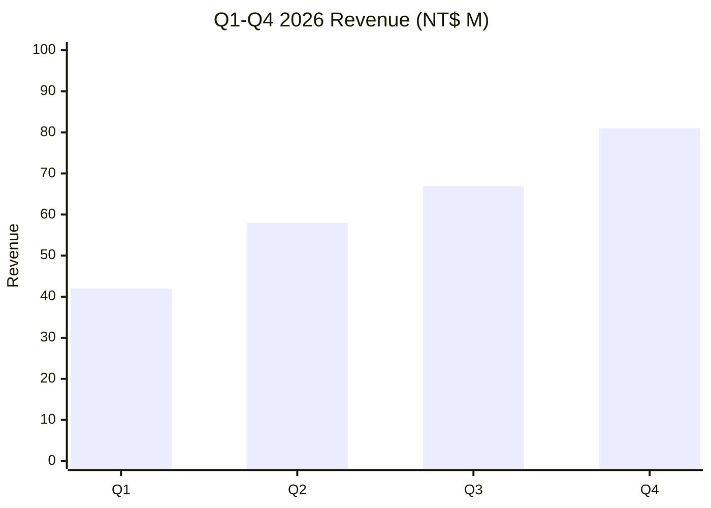
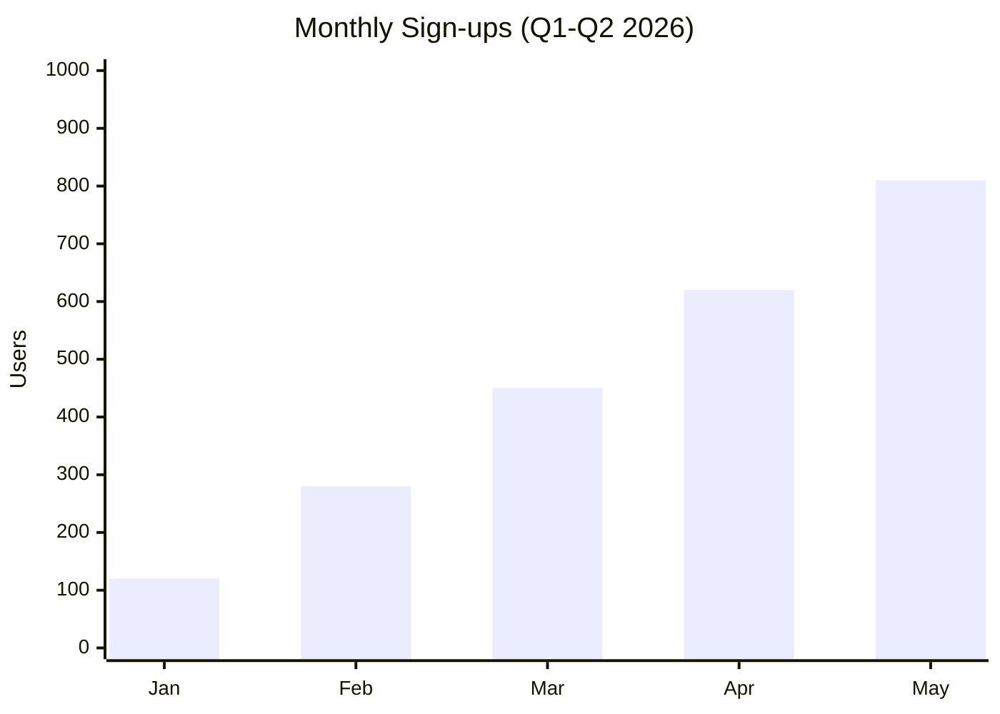
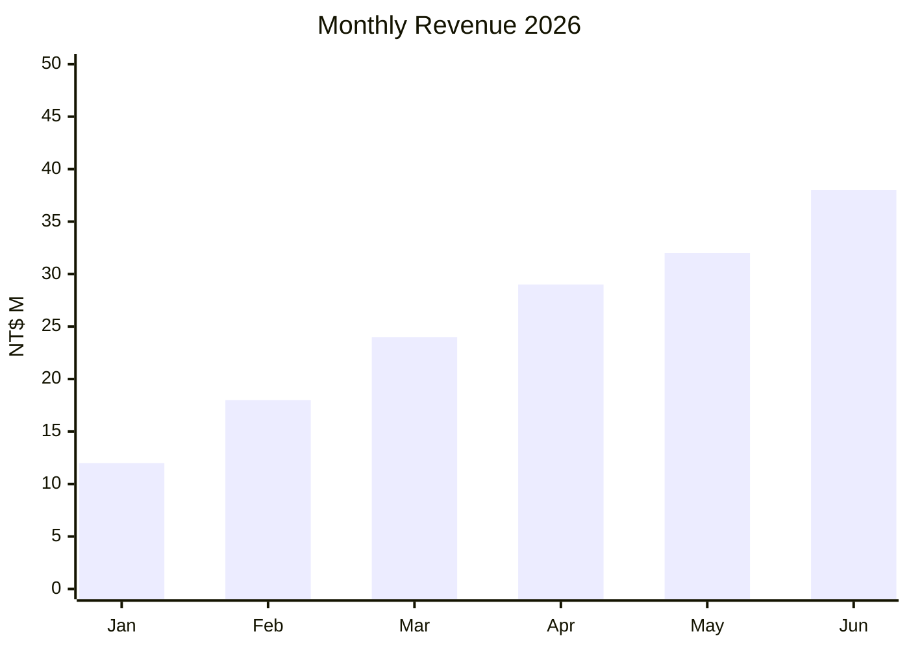
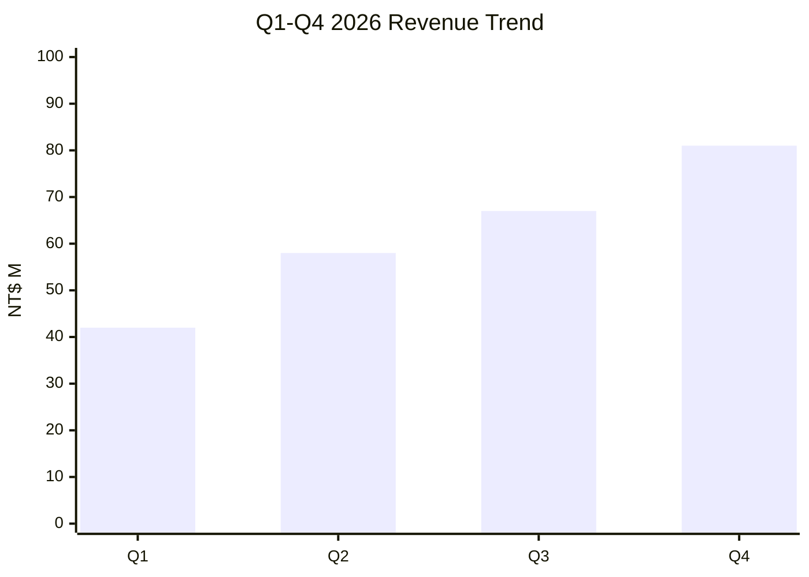

```mermaid
xychart-beta
    title "Product A vs Product B Sales"
    x-axis ["Q1", "Q2", "Q3", "Q4"]
    y-axis "Units sold" 0 --> 500
    bar "Product A" [250, 310, 380, 420]
    bar "Product B" [180, 230, 290, 340]
```

# XY Chart (xychart-beta)

Bar chart for categorical quantitative data. Line chart requested → **auto-fallback to bar** (Obsidian 11.4.1 CSS bug).

## When to use

**Best for**:
- Discrete numeric data across categories (monthly revenue / quarterly counts / per-product sales)
- Comparative quantitative visualization where exact numbers matter
- Trend-like data where you want ordered x-axis even though renderer only supports bar

**User query 關鍵字**:
- Bar: `長條圖` / `bar chart` / `column chart` / `條形圖` / `histogram`
- Line (auto-fallback): `折線圖` / `line chart` / `trend` / `走勢` / `時間序列` / `time series`

**Not for**: proportion of whole (use `data-viz/pie.md`), 2×2 positioning (use `data-viz/quadrant.md`), qualitative comparisons (use `flow/comparison.md`).

## Canonical syntax — bar mode (works in Obsidian 11.4.1)



**Minimum required**:
- `xychart-beta` directive on line 1
- At least one data series (`bar` or `line`)
- x-axis category labels

**Optional but recommended**:
- `title` for context
- `y-axis` label + range
- Multiple data series (two `bar` lines for side-by-side comparison)

## Canonical syntax — line mode (PROBLEMATIC in Obsidian 11.4.1)

```mermaid
xychart-beta
    title "Monthly Sign-ups"
    x-axis [Jan, Feb, Mar, Apr, May]
    y-axis "Users" 0 --> 1000
    line [120, 280, 450, 620, 810]
```

**⚠️ Obsidian 11.4.1 limitation**: `line` renders with `stroke-width: 0`, making lines invisible. Bars in the same chart still display correctly.

**This skill's line chart fallback policy**:

When a user query indicates line-chart intent (words like `折線` / `line chart` / `trend` / `走勢`), produce **bar mode instead** with an inline degrade note:



> ⚠️ Obsidian 11.4.1 native viewer 無法正確渲染折線圖（已知 `stroke-width: 0` CSS bug），已自動降級為長條圖以保證可視化。需真折線請用 Mermaid Live Editor export PNG，或安裝 Mermaid View plugin。

For full policy rationale, see [obsidian-compatibility.md § Line chart fallback policy](../obsidian-compatibility.md).

## Configuration options

### Orientation

```mermaid
xychart-beta horizontal
    title "Horizontal bar chart"
    x-axis [Revenue] 0 --> 100
    y-axis [Q1, Q2, Q3, Q4]
    bar [42, 58, 67, 81]
```

`xychart-beta horizontal` swaps axes. x-axis becomes the value axis (with numeric range), y-axis becomes the category axis.

### Multiple series (side-by-side bars)

```mermaid
xychart-beta
    title "Revenue vs Profit (Q1-Q4)"
    x-axis ["Q1", "Q2", "Q3", "Q4"]
    y-axis "NT$ M" 0 --> 100
    bar [42, 58, 67, 81]
    bar [12, 18, 22, 28]
```



Two `bar [...]` lines render as paired bars per category.

### Y-axis range

```mermaid
y-axis "Label" MIN --> MAX
```

If omitted, Mermaid auto-scales. Explicit ranges force consistent scale across multiple charts (e.g., year-over-year comparisons).

## Obsidian 11.4.1 compatibility

- **Status**:
  - Bar mode: ✅ full
  - Line mode: 🔻 fallback-only (auto-downgrade to bar in this skill)
- **Known quirks**:
  - Line `stroke-width: 0` CSS bug (reported Jan 2024, not resolved in Obsidian's native viewer)
  - Bar styling uses default theme; custom colors via `%%{init: {...}}%%` config block may not fully apply
- **Workaround**: this skill's fallback policy (produce bar + inline note). Users who need true line rendering: install Mermaid View plugin OR export via Mermaid Live Editor.

## Worked examples

### Example 1: Monthly revenue bar chart



### Example 2: Line chart query → auto-fallback to bar with note

**User query**: 「畫折線圖顯示 Q1-Q4 營收走勢」

**Skill output**:



> ⚠️ Obsidian 11.4.1 native viewer 無法正確渲染折線圖（已知 `stroke-width: 0` CSS bug），已自動降級為長條圖以保證可視化。需真折線請用 Mermaid Live Editor export PNG，或安裝 Mermaid View plugin。

### Example 3: Horizontal bar comparing quarters

```mermaid
xychart-beta horizontal
    title "Headcount Growth by Quarter"
    x-axis "Employees" 0 --> 200
    y-axis [Q1, Q2, Q3, Q4]
    bar [85, 120, 155, 188]
```

### Example 4: Two-series comparison



## Error prevention

| ❌ Wrong | ✅ Right | Reason |
|---|---|---|
| `xychart` (no `-beta`) | `xychart-beta` | v11.4.1 uses beta suffix |
| `line [...]` for line chart in Obsidian | Apply this skill's auto-fallback: use `bar [...]` + inline degrade note | Line CSS bug makes lines invisible |
| x-axis array length ≠ data array length | Match lengths exactly: `[Q1,Q2,Q3]` paired with `[a,b,c]` | Mismatch causes render error or wrong labels |
| `y-axis "Label" 0 -> 100` (wrong arrow) | `y-axis "Label" 0 --> 100` | Must use `-->` double-hyphen |
| Missing quotes on title with spaces | `title "Has Spaces"` | Strings with spaces need quotes |
| Using `showDataLabelOutsideBar` or Neo look | These are v11.14.0+ features — not in Obsidian 11.4.1 | Silent feature-ignore |

### Pre-save validation

- [ ] `xychart-beta` declared on line 1 (with `-beta` suffix)
- [ ] x-axis array length matches each data series array length
- [ ] Line-chart intent detected → bar fallback applied + degrade note included
- [ ] Title quoted if contains spaces
- [ ] y-axis uses `-->` double-hyphen arrow syntax
- [ ] No v11.14.0+ features used

See also [obsidian-common-quirks.md](../obsidian-common-quirks.md) and [obsidian-compatibility.md](../obsidian-compatibility.md).
