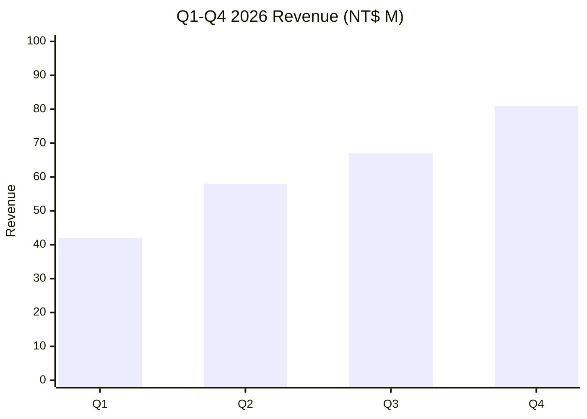
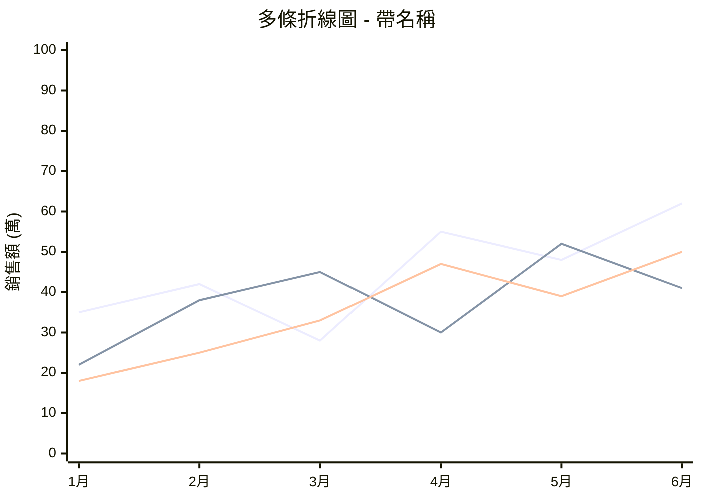
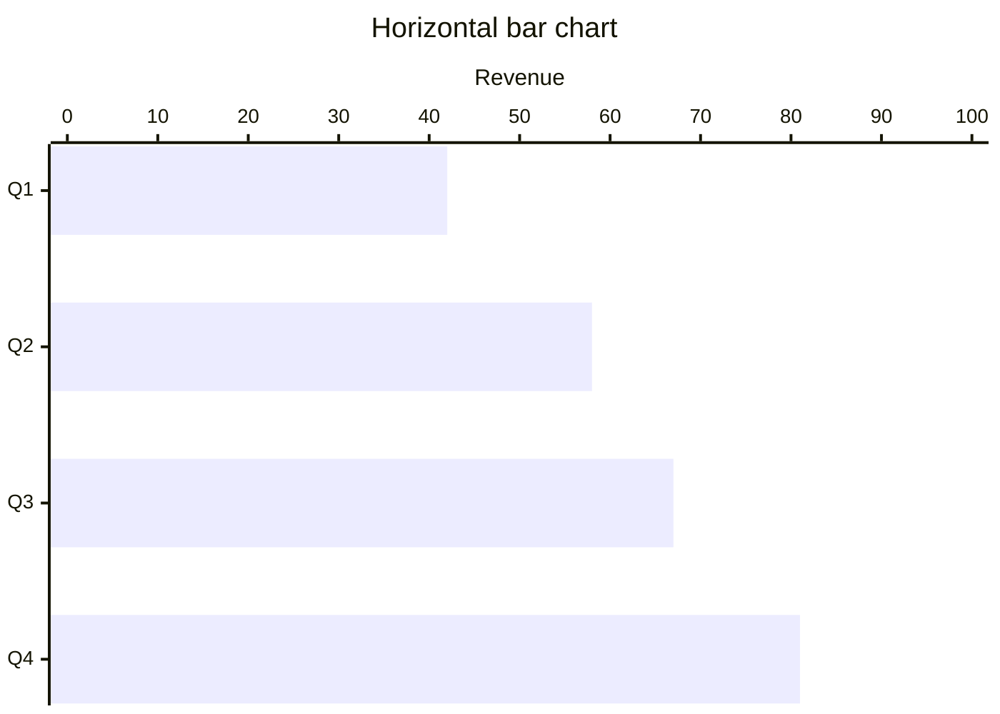
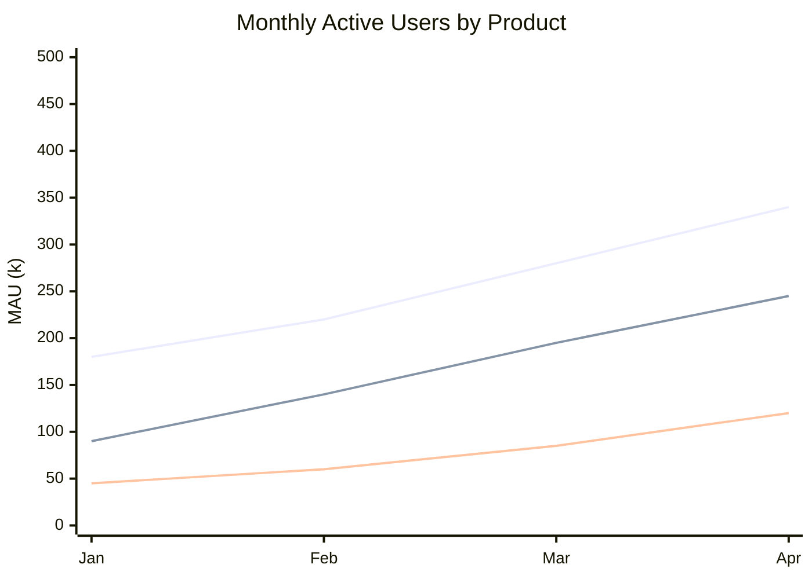
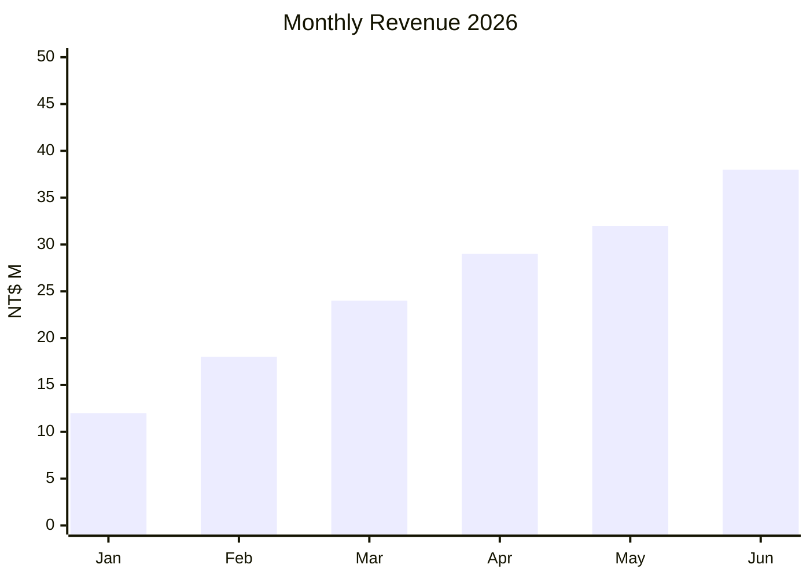
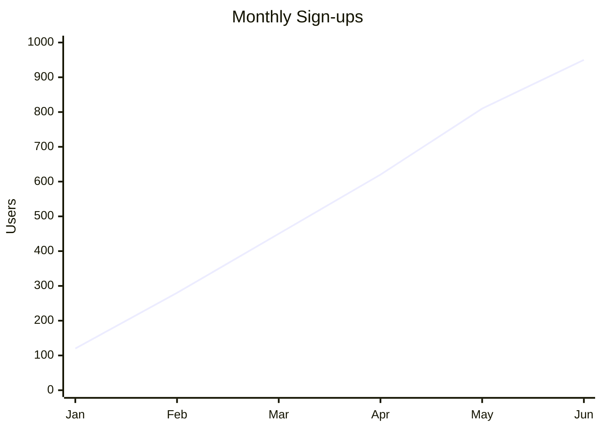
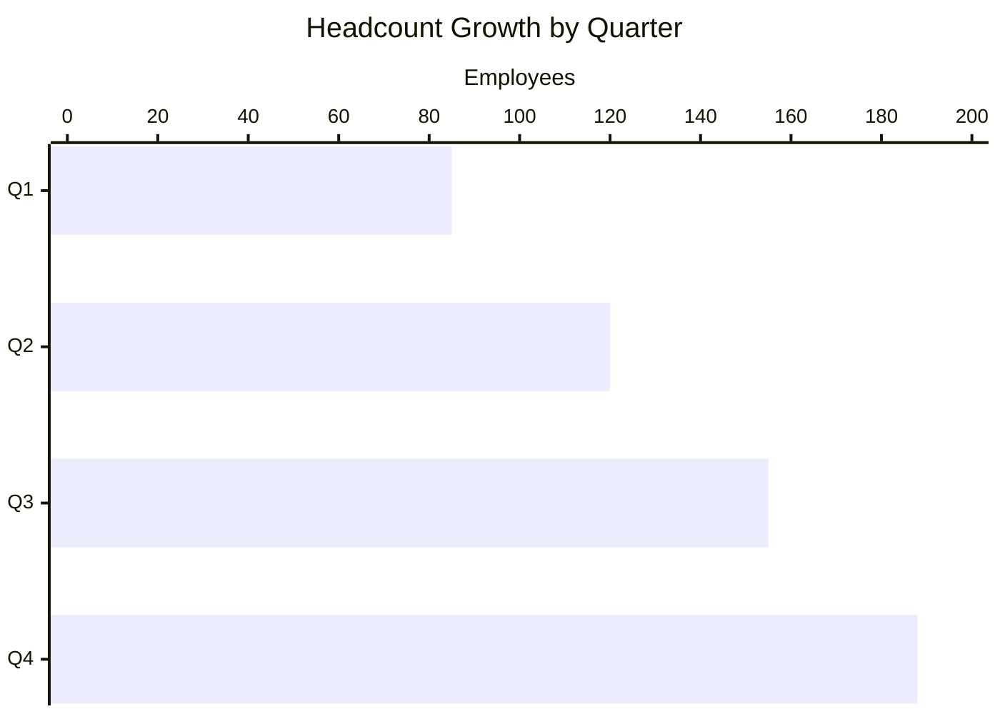
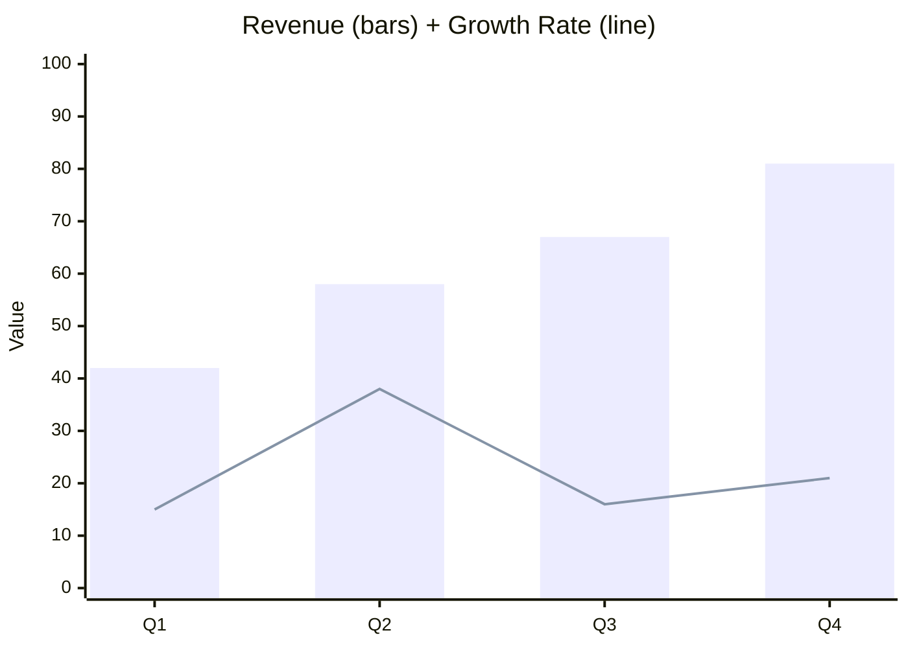

# XY Chart (xychart-beta)

Bar and line charts for categorical / numerical data — revenue trends, signup curves, multi-series comparisons.

## When to use

**Best for**:
- Discrete numeric data across categories (monthly revenue / quarterly counts / per-product sales)
- Trend visualization over time (monthly sign-ups / weekly DAU / daily metrics)
- Multi-series comparison (Product A vs B vs C over same x-axis)
- Any quantitative visualization where exact numbers matter

**User query 關鍵字**:
- Bar: `長條圖` / `bar chart` / `column chart` / `條形圖` / `histogram`
- Line: `折線圖` / `line chart` / `trend` / `走勢` / `時間序列` / `time series`
- Multi-series: `比較` / `comparison` / `A vs B over time` / `multi-line`

**Not for**: proportion of whole (use `data-viz/pie.md`), 2×2 positioning (use `data-viz/quadrant.md`), qualitative comparisons (use `flow/comparison.md`).

## Canonical syntax — bar mode



**Minimum required**:
- `xychart-beta` directive on line 1
- At least one data series (`bar` or `line`)
- x-axis category labels (all categorical labels **must be quoted** — see § Style rule below)

**Optional but recommended**:
- `title` for context
- `y-axis` label + range
- Multiple data series

### Style rule — quote all categorical axis elements

**Pattern**: any non-continuous (categorical) axis element MUST be wrapped in `""` quotes:

```
✅ x-axis ["Q1", "Q2", "Q3", "Q4"]
✅ x-axis ["1月", "2月", "3月"]
✅ x-axis ["Product A", "Product B"]

❌ x-axis [Q1, Q2, Q3, Q4]
❌ x-axis [1月, 2月, 3月]
```

Numeric y-axis ranges (`y-axis "Revenue" 0 --> 100`) don't need quoting — they're continuous.

**Why**: uniform quoting rule prevents ambiguity and edge cases (CJK / special chars / reserved words). Easier to maintain than per-case judgment about when quoting is needed.

## Canonical syntax — line mode (use NAMED-LINE form)

**Named-line syntax works in Obsidian 11.4.1** (user-verified April 2026):



**Default pattern for line charts**: use `line "series name" [values]` — the named form renders correctly in Obsidian's native viewer. Each series shown with distinct color + legend.

### Bare `line [values]` (without name) — may have issues

Earlier Obsidian Forum reports (Jan 2024) indicated the bare `line [values]` form rendered with `stroke-width: 0` (invisible). This was NOT confirmed in April 2026 user testing with the named form.

**Recommendation**: prefer named-line syntax (`line "name" [values]`) even for single-series charts. Gives consistent behavior + labels the line in the legend.

If for some reason named-line doesn't render in your Obsidian vault, use `bar` instead as a fallback (see § Fallback strategy below).

## Configuration options

### Orientation (horizontal bars)



`xychart-beta horizontal` flips rendering direction only — **axis declarations stay the same as vertical** (categories on `x-axis`, numeric values on `y-axis`). The renderer draws horizontal bars extending along the value axis.

**Key point**: don't swap x-axis and y-axis when switching to horizontal. The `horizontal` keyword handles the reorientation; your declarations remain categorical=x, numeric=y.

### Multiple series (side-by-side bars)

```mermaid
xychart-beta
    title "Revenue vs Profit (Q1-Q4)"
    x-axis ["Q1", "Q2", "Q3", "Q4"]
    y-axis "NT$ M" 0 --> 100
    bar [42, 58, 67, 81]
    bar [12, 18, 22, 28]
```



Two `bar [...]` lines render as paired bars per category. Add names for legend labels: `bar "Revenue" [...]`.

### Multi-line (named)



Each named line renders as a distinct colored line with legend entry.

### Bar + line combined


Mixes bar and line on same chart when both quantities share the y-axis range.

### Y-axis range

```mermaid
y-axis "Label" MIN --> MAX
```

If omitted, Mermaid auto-scales. Explicit ranges force consistent scale across multiple charts (e.g., year-over-year comparisons).

## Obsidian 11.4.1 compatibility

- **Status**:
  - Bar mode: ✅ full
  - Line mode (named-line syntax `line "name" [values]`): ✅ full (user-verified April 2026)
  - Line mode (bare `line [values]`): 🟡 possibly buggy per 2024 forum reports; prefer named form
- **Known quirks**:
  - Bar styling uses default theme; custom colors via `%%{init: {...}}%%` config block may not fully apply
  - Very dense multi-series (>4 lines) can get visually crowded
- **Workaround**: use named-line syntax as default; if it fails in a specific environment, fall back to bar chart (see § Fallback strategy below)

## Fallback strategy (optional — only if named-line fails in user's Obsidian)

If a user reports that line charts don't render even with named-line syntax (possible if their Obsidian version / theme / plugins cause an issue), the skill can fall back to bar chart:

1. Produce `xychart-beta` with bar mode preserving data order
2. Include inline note: "折線圖在此 Obsidian 環境未正常渲染，已改用長條圖。請檢查 Obsidian 是否有相容性問題（例如自訂 CSS snippet）或考慮 Mermaid View plugin 取得原生 Mermaid 渲染。"

This fallback is **NOT auto-triggered** — the default path is named-line, which works in standard Obsidian 11.4.1.

## Worked examples

### Example 1: Monthly revenue bar chart



### Example 2: Single-series line chart (named)



### Example 3: Multi-line comparison


### Example 4: Horizontal bar comparing quarters



Note: `horizontal` flips rendering orientation only; axis declarations keep the same structure as vertical mode (categorical labels on x-axis, numeric scale on y-axis).

### Example 5: Two-series bar comparison

```mermaid
xychart-beta
    title "Product A vs Product B Sales"
    x-axis ["Q1", "Q2", "Q3", "Q4"]
    y-axis "Units sold" 0 --> 500
    bar "Product A" [250, 310, 380, 420]
    bar "Product B" [180, 230, 290, 340]
```



### Example 6: Mixed bar + line



## Error prevention

| ❌ Wrong | ✅ Right | Reason |
|---|---|---|
| `xychart` (no `-beta`) | `xychart-beta` | v11.4.1 uses beta suffix |
| `line [1,2,3]` without name (may fail in some Obsidian setups) | `line "SeriesName" [1,2,3]` | Named form has better cross-environment compatibility |
| x-axis array length ≠ data array length | Match lengths exactly: `[Q1,Q2,Q3]` paired with `[a,b,c]` | Mismatch causes render error or wrong labels |
| `y-axis "Label" 0 -> 100` (wrong arrow) | `y-axis "Label" 0 --> 100` | Must use `-->` double-hyphen |
| Missing quotes on title with spaces | `title "Has Spaces"` | Strings with spaces need quotes |
| Using `showDataLabelOutsideBar` or Neo look | These are v11.14.0+ features — not in Obsidian 11.4.1 | Silent feature-ignore |
| Swapping x-axis / y-axis for `horizontal` mode | Keep categorical on x-axis, numeric on y-axis; let `horizontal` flip rendering | `horizontal` reorients visuals; axis declarations stay the same as vertical |
| Unquoted categorical axis elements `[Q1, Q2]` | Quote all categorical labels `["Q1", "Q2"]` | Statutory rule per § Style rule — consistent pattern for any non-continuous axis |

### Pre-save validation

- [ ] `xychart-beta` declared on line 1 (with `-beta` suffix)
- [ ] x-axis array length matches each data series array length
- [ ] **All categorical axis labels quoted** — `["Q1", "Q2"]` not `[Q1, Q2]` (see § Style rule)
- [ ] Line charts use named-line syntax: `line "name" [values]`
- [ ] Title quoted if contains spaces
- [ ] y-axis uses `-->` double-hyphen arrow syntax
- [ ] No v11.14.0+ features used
- [ ] For horizontal mode: axis declarations stay categorical=x, numeric=y (don't swap)

See also [obsidian-common-quirks.md](../obsidian-common-quirks.md) and [obsidian-compatibility.md](../obsidian-compatibility.md).
