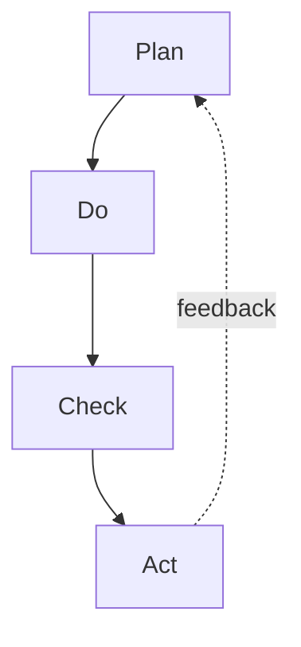
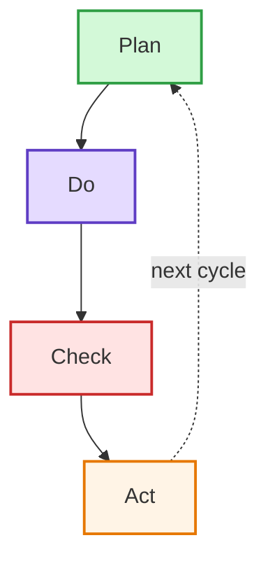
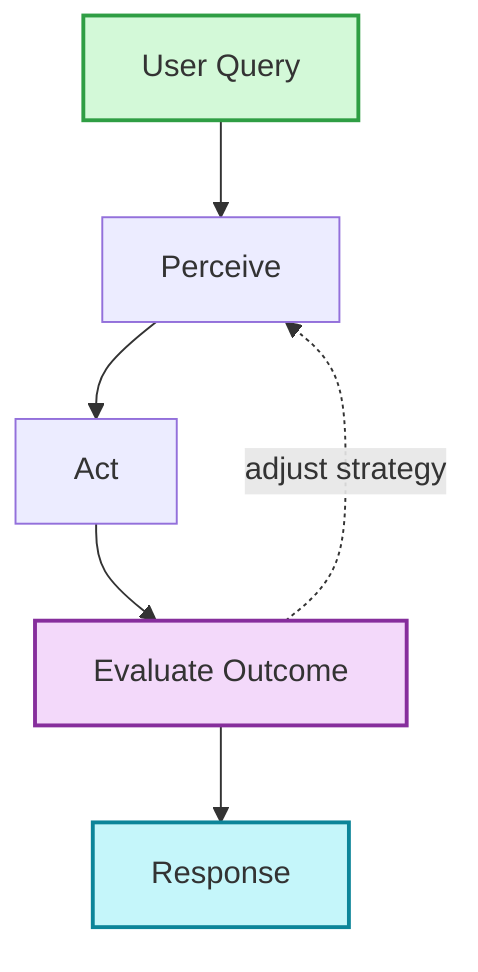
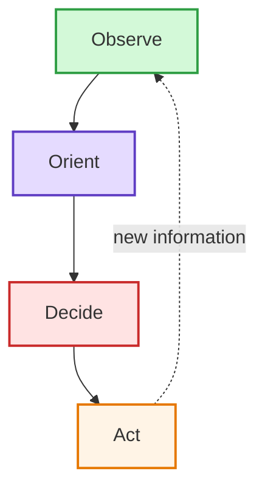

# Circular Flow (graph TD with feedback)

Cyclic processes, continuous improvement loops, iteration-driven systems.

## When to use

**Best for**:
- Cyclic processes (continuous improvement, OODA loops, PDCA)
- Agent feedback systems — action → evaluation → refinement
- Central-hub systems with radiating elements and feedback
- Kaizen / iteration visualizations

**User query 關鍵字**: cyclic / feedback loop / iteration / PDCA / OODA / continuous improvement / 循環 / 反饋 / 迭代

**Not for**: one-way sequential flow (use `flow/flowchart.md`), state machines with discrete transitions (use `flow/state.md`).

## Canonical syntax

Circular flow is a **variant of flowchart** — uses `graph TD/TB` with explicit feedback arrows (`-.->`) that close the loop.

## Configuration options

Inherits all flowchart options (see [flowchart.md § Configuration options](flowchart.md)):
- Layout direction (TD recommended for circular)
- Node shapes
- Arrow types — **dashed feedback arrow `-.->` is the signature of circular flow**
- Styling

**Circular-specific tip**: use `-.->` (dashed) for feedback arrows to visually distinguish the loop-closing edge from forward flow.

## Obsidian 11.4.1 compatibility

- **Status**: ✅ Full support — built on flowchart which is the most stable type
- **Known quirks**: same as flowchart (see [flowchart.md § Obsidian compatibility](flowchart.md))
- **Workaround**: none needed

## Worked examples

### Example 1: PDCA (Plan-Do-Check-Act) cycle

### Example 2: Agent feedback loop

### Example 3: OODA loop (Observe-Orient-Decide-Act)

## Error prevention

Circular flow inherits flowchart's error prevention. Specific additions:

| ❌ Wrong | ✅ Right | Reason |
|---|---|---|
| Using `-->` for feedback edge | Use `-.->` for feedback | Distinguishes forward flow from loop-closing edge visually |
| Loop with >6 stages | Split into nested loops or sequential diagrams | Long circular loops become hard to read |
| Unclear which node is the cycle start | Add label text or annotation arrow showing entry point | Circular diagrams are ambiguous about "start" |
| Missing feedback arrow | Must have at least one arrow closing the loop | Otherwise it's a linear flowchart, not circular |

See also [obsidian-common-quirks.md](../obsidian-common-quirks.md) for universal Obsidian Mermaid rules.
