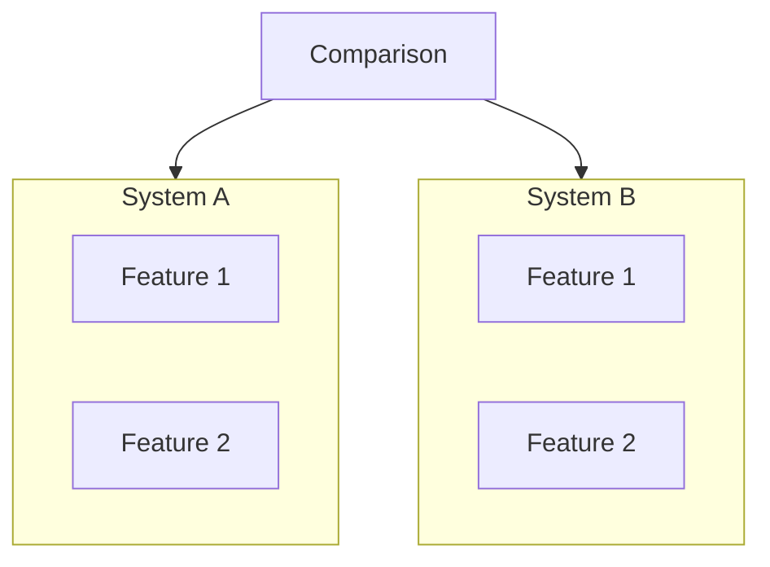
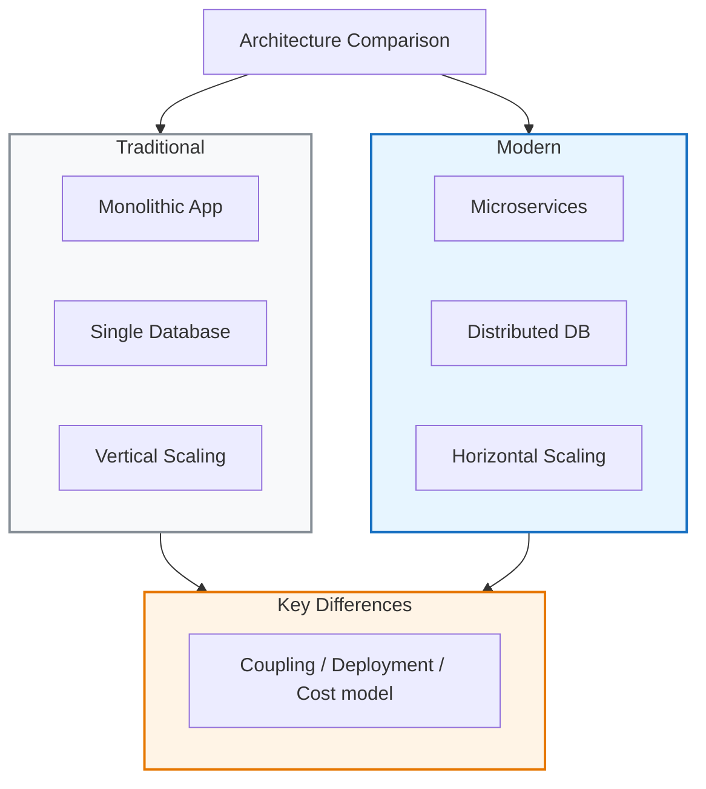
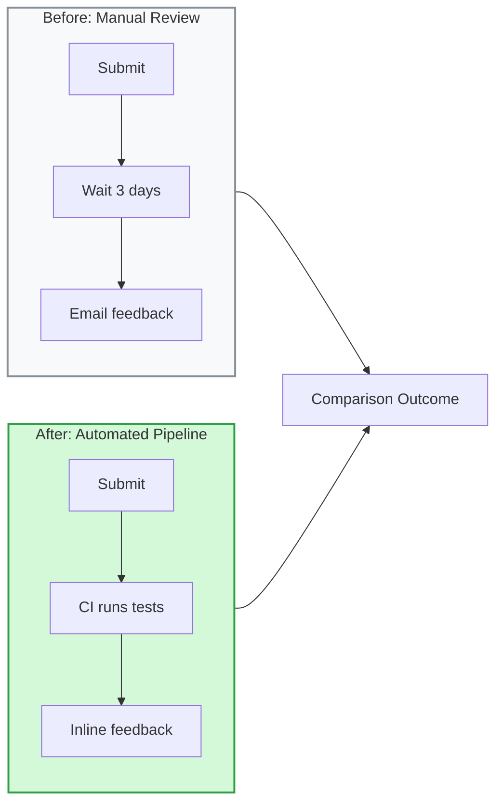
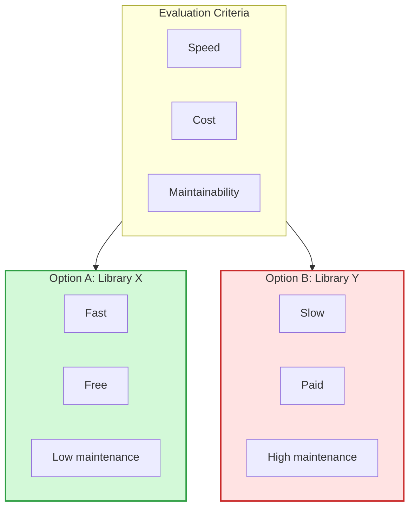

# Comparison Diagram (graph TB with parallel paths)

Side-by-side A vs B comparison, traditional vs modern analysis, option analysis.

## When to use

**Best for**:
- Before/after comparisons
- A vs B analysis (two products, two approaches)
- Traditional vs modern system comparison
- Option evaluation with shared decision criteria

**User query 關鍵字**: comparison / compare / A vs B / 比較 / 對比 / 差異 / contrast

**Not for**: 2×2 positioning (use `data-viz/quadrant.md`), hierarchical concepts (use `flow/mindmap.md`), more than 3 items (use a table or separate diagrams).

## Canonical syntax

Comparison is a **flowchart pattern** — uses `graph TB` with parallel subgraphs and a shared title or comparison node.

## Configuration options

Inherits flowchart options. Key variations for comparison:

- **Layout**: TB with parallel subgraphs (default) OR LR for wide comparisons
- **Styling contrast**: differentiate the two sides with contrasting colors (e.g., gray = traditional, blue = modern)
- **Shared criteria**: use a "Key Differences" subgraph below to show summary

## Obsidian 11.4.1 compatibility

- **Status**: ✅ Full support — uses standard flowchart syntax
- **Known quirks**: same as flowchart
- **Workaround**: none needed

## Worked examples

### Example 1: Traditional vs modern system

### Example 2: Before/after process

### Example 3: A vs B with shared criteria

## Error prevention

| ❌ Wrong | ✅ Right | Reason |
|---|---|---|
| Mixing 3+ options into one diagram | Use tables or multiple comparison diagrams | Comparison layout gets cluttered >2-3 options |
| No visual distinction between sides | Use contrasting fill colors (e.g., gray vs blue) | Reader can't parse comparison without visual cue |
| Subgraphs at different depths on each side | Keep parallel structure identical (same node count, same nesting) | Asymmetry implies the comparison isn't fair |
| Using circular feedback arrows | Comparison is static, not cyclic — use flow arrows only | Feedback arrows confuse the comparison semantic |
| Unquoted display text: `A[Feature]` | `A["Feature"]` | Unified quote rule for display strings |

See also [obsidian-common-quirks.md](../obsidian-common-quirks.md) for universal rules.
