# Flowchart (graph TB / LR)

Process flow, decision tree, workflow, system architecture, AI agent pipeline.

## When to use

**Best for**:
- Sequential workflows and decision trees
- AI agent architectures with perception → reasoning → action loops
- Multi-step processes with branches and merges
- System architectures showing data / control flow
- Any content describing steps, stages, or a sequence of actions

**User query 關鍵字**: flowchart / workflow / 流程圖 / 流程 / process / pipeline / architecture / 步驟 / decision tree

**Not for**: sequence interactions over time (use `flow/sequence.md`), state transitions (use `flow/state.md`), git branches (use `structural/gitgraph.md`), data charts (use `data-viz/xychart.md`).

## Canonical syntax

Minimal example:

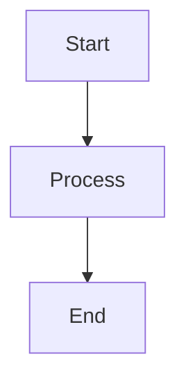

With decision + multiple paths:

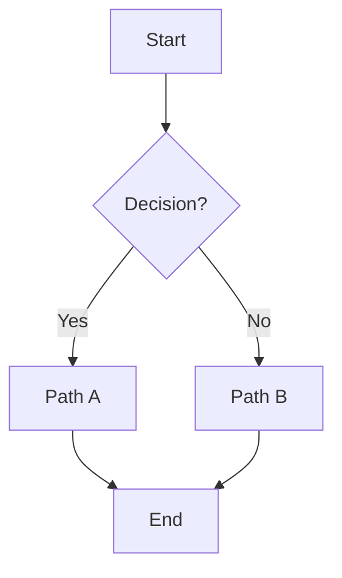

## Configuration options

### Layout direction (set at top of diagram)

| Code | Meaning |
|---|---|
| `graph TB` / `graph TD` | Top to bottom (vertical, default) |
| `graph BT` | Bottom to top |
| `graph LR` | Left to right (horizontal) |
| `graph RL` | Right to left |

**Heuristic**: TB for sequential processes and hierarchies; LR for timelines and wide displays.

### Node shapes

```mermaid
A["Rectangle Text"]             # Default rectangle
B("Rounded Text")               # Rounded rectangle
C(["Stadium Text"])             # Stadium / pill
D(("Circle<br/>Text"))          # Circle (supports <br/>)
E>"Right Arrow"]                # Asymmetric / flag
F{"Decision?"}                  # Rhombus (decision)
G{{"Hexagon"}}                  # Hexagon
H[/"Parallelogram"/]            # Parallelogram
I[("Database")]                 # Database cylinder
J[/"Trapezoid"\]                # Trapezoid
```

### Arrow types

| Syntax | Meaning |
|---|---|
| `A --> B` | Solid arrow (default flow) |
| `A -.-> B` | Dashed arrow (optional, feedback, or supporting flow) |
| `A ==> B` | Thick arrow (emphasis) |
| `A ~~~ B` | Invisible link (layout only, not rendered) |
| `A <--> B` | Bidirectional solid |
| `A <-.-> B` | Bidirectional dashed |
| `A -->|"Label"| B` | Arrow with label (always quote the label) |

### Multi-target connections

```mermaid
A --> B & C & D        # One to many
A & B & C --> D        # Many to one
A --> B --> C --> D    # Chaining
```

### Subgraphs (grouping)

```mermaid
graph TB
    subgraph group_id["Group Display Name"]
        direction TB
        A --> B
    end

    subgraph simple
        C --> D
    end

    group_id -.-> simple    # Connect at group level (creates invisible layout link)
```

#### Subgraph direction — important limitation

The `direction TB/LR/BT/RL` statement inside a subgraph **is honored only when the subgraph is self-contained OR connected at the subgraph level** (i.e. `subgraphA --> subgraphB` referencing IDs, not nodes).

**If any of a subgraph's NODES are linked to nodes outside the subgraph, the `direction` is ignored** — the subgraph inherits the parent graph's direction (per Mermaid flowchart docs).

| Connection pattern | Subgraph `direction` honored? |
|---|:---:|
| Self-contained subgraph (no external connections) | ✅ yes |
| `subgraphA --> subgraphB` (subgraph-level link) | ✅ yes — connects subgraph IDs, not nodes |
| `A2 --> B1` (node-to-node across subgraph boundary) | ❌ no — direction ignored, inherits parent |

**Tip**: to preserve per-subgraph direction in multi-stage pipelines, route connections through subgraph IDs rather than internal nodes. See § Worked example 7 below.

**Nested subgraphs** — limit to 2 levels for readability:

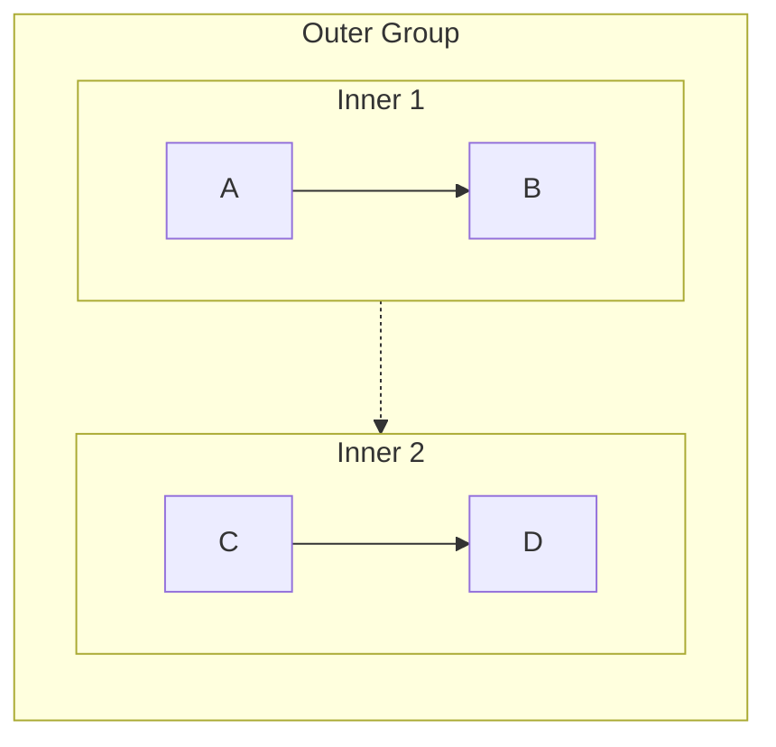

### Styling

```mermaid
style NodeID fill:#color,stroke:#color,stroke-width:2px
```

See SKILL.md §Color Scheme Defaults for the 9-color palette and when to apply each.

## Obsidian 11.4.1 compatibility

- **Status**: ✅ Full support — flowchart is the most stable Mermaid type
- **Known quirks**:
  - Undirected graph edges (`---`) may render as directed in 11.4.1 (known 11.5+ fix) — use explicit arrows
  - Large flowcharts (>50 nodes) may have layout stability issues — consider splitting into multiple diagrams
  - `<br/>` in node text works reliably only in circle nodes `(("Text<br/>Line"))`
- **Workaround**: none needed for standard use; follow [obsidian-common-quirks.md](../obsidian-common-quirks.md) universal rules

## Worked examples

### Example 1: Swimlane pattern (grouping parallel lanes)

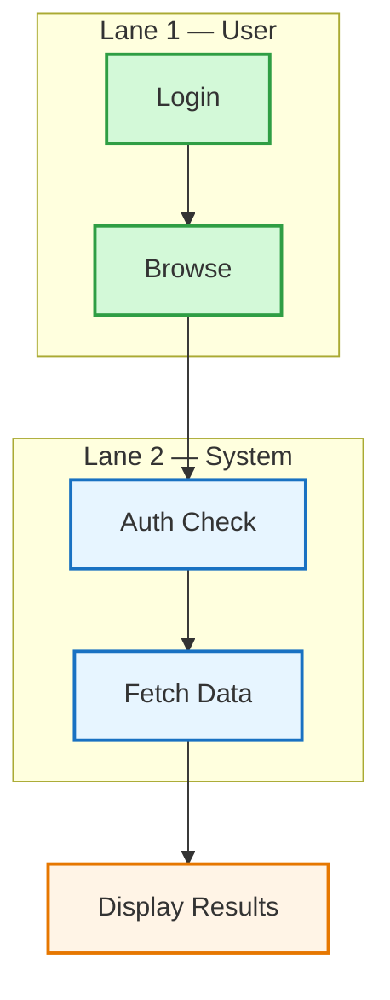

### Example 2: Feedback loop (cyclic process)

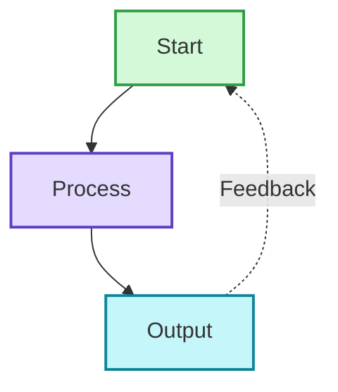

### Example 3: Hub and spoke (radial / many-to-one)

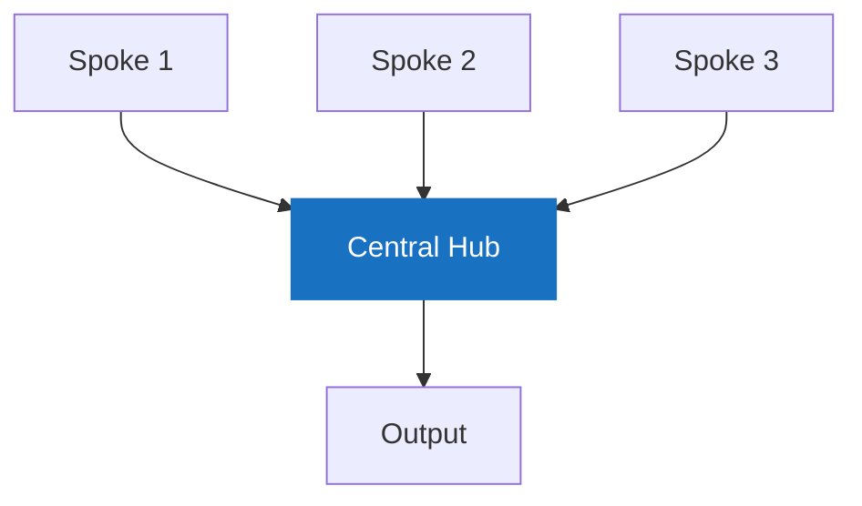

### Example 4: Decision tree

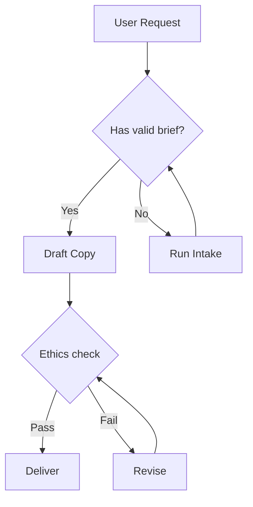

### Example 5: AI agent architecture (layered with subgraphs)

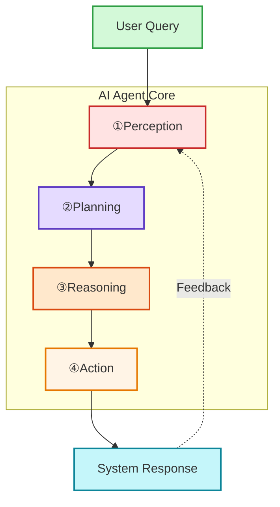

Note the use of `①②③④` instead of `1. 2. 3. 4.` to avoid the Markdown list syntax conflict (see [obsidian-common-quirks.md Quirk 1](../obsidian-common-quirks.md)).

### Example 6: CJK content (訂單處理流程)

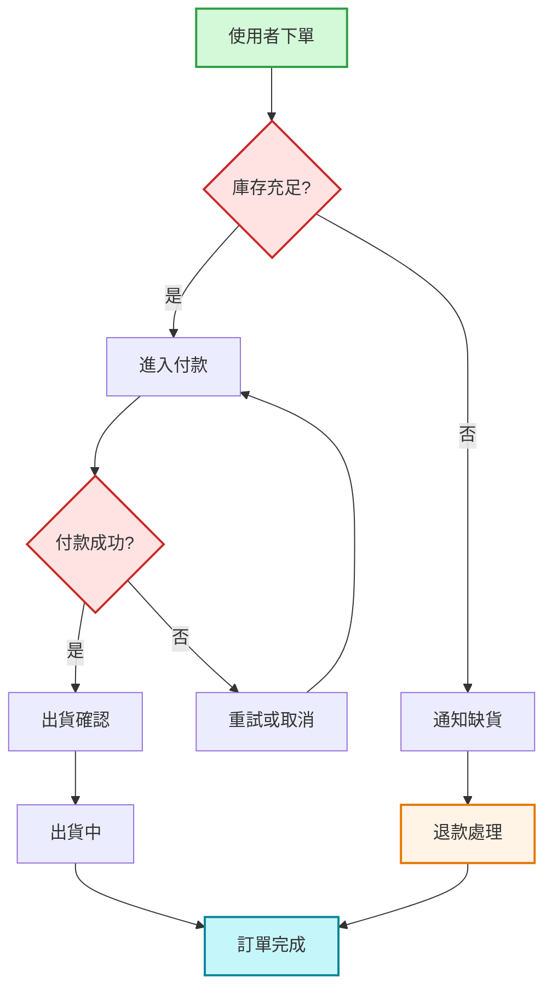

CJK labels work reliably when wrapped in `"..."` per the unified quote rule (see [obsidian-common-quirks.md § Quirk 4.5](../obsidian-common-quirks.md)). Without quotes, CJK characters in node labels may fail to render or break parsing.

### Example 7: Multi-stage pipeline (compact display for long workflows)

**When to use this pattern**:
- **Long workflows that would overflow horizontally or vertically if flat**. A 10-20 node linear flowchart becomes either very wide (`LR`) or very tall (`TB`) — both cramp into Obsidian's preview pane and strain reader focus.
- **Solution**: chunk the flow into phases (Stage A / B / C ...) with each phase as a subgraph containing its internal sub-steps. Parent graph `LR` arranges phases horizontally; each subgraph `direction TB` stacks sub-steps vertically. Same content, **~2× information density** vs flat layout, much better readability.
- **Bonus**: phase grouping also adds **semantic structure** — reader sees "user phase / staff phase / archive phase" at a glance before reading details.

The syntax trick: use **subgraph-level connections** (`stageA --> stageB`) rather than node-to-node cross-boundary links. This preserves each subgraph's internal `direction`:

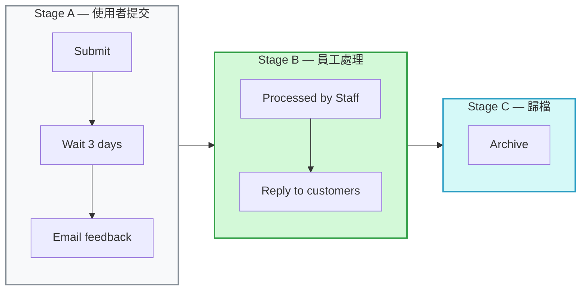

**Why this works**:
- Parent graph: `LR` → stages flow left-to-right
- Each subgraph: `direction TB` → sub-steps flow top-to-bottom WITHIN stage
- Stages connected at **subgraph ID level** (`stageA --> stageB`), NOT via internal nodes (`A3 --> B1`)
- Because no internal node links across subgraph boundaries, each `direction TB` is honored

**Anti-pattern** — if you connected via `A3 --> B1` instead of `stageA --> stageB`, Mermaid would ignore `direction TB` and render each subgraph in parent's `LR` direction, collapsing the intended column layout.

**Pattern fit checklist** — use this pattern when:
- ✅ Workflow has **≥8-10 nodes** total (flat layout would be too wide or too tall)
- ✅ Flow has **natural phase boundaries** (handoff between teams / systems / contexts)
- ✅ Each phase has **2-5 sub-steps** (if just 1 step per phase, no grouping benefit)
- ✅ Obsidian preview pane is limited width — vertical chunks fit better than long horizontal snake

**When NOT to use**:
- ❌ Workflow has ≤5 nodes total — flat flowchart is simpler
- ❌ Workflow has many cross-phase jumps — subgraph grouping fights the content
- ❌ No clear phase boundaries — grouping would be arbitrary

**Typical use cases**:
- Multi-stage approval workflows (submission / review / approval / archive)
- Customer service pipelines (intake / triage / resolution / follow-up)
- CI/CD pipelines (build / test / staging / production)
- Multi-team handoff processes (design / engineering / QA / deploy)

### Example 8: Vertical variant (TB outer + LR inner) — for narrow preview panes

Same technique as Example 7 with orientation flipped. Use this when Obsidian's preview pane is narrow (typical sidebar preview) or when the workflow reads more naturally as top-to-bottom phases:

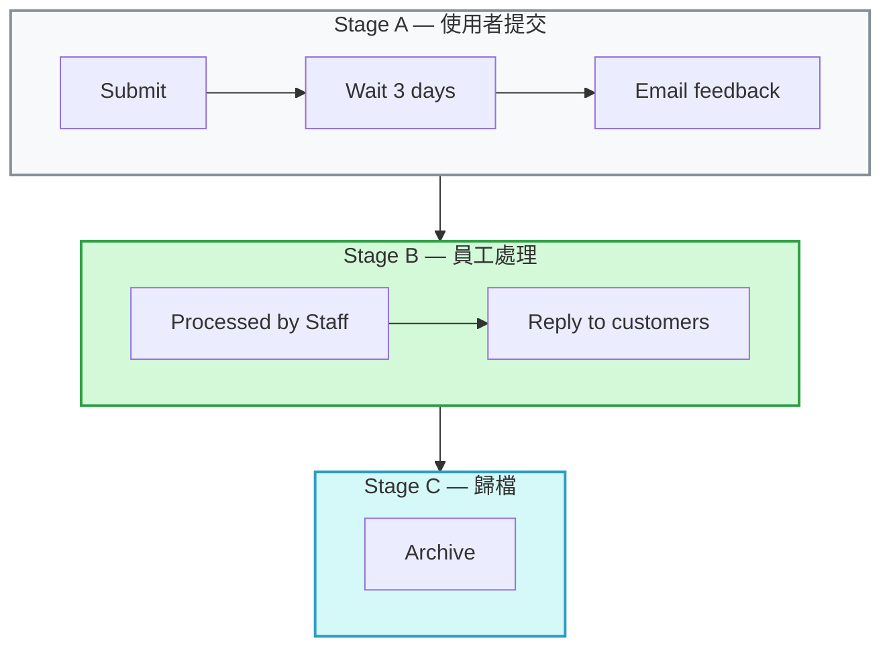

**When to prefer Example 8 (TB outer) over Example 7 (LR outer)**:

| Condition | Example 7 (LR + inner TB) | Example 8 (TB + inner LR) |
|---|:---:|:---:|
| Obsidian preview pane is narrow (sidebar mode) | 🟡 horizontal scroll | ✅ vertical scroll (natural) |
| Many stages (≥5), each 2-4 steps | 🟡 row gets long | ✅ fits vertical |
| Stages ~equal length, pipeline / timeline feel | ✅ | 🟡 |
| Export to PDF / print | 🟡 landscape needed | ✅ portrait native |
| Reader scrolls vertically (default reading) | 🟡 requires H-scroll | ✅ |
| Reader has wide screen / full-width editor | ✅ | 🟡 feels short-wide |

Both variants apply the same technique — **subgraph-level connections** (`stageA --> stageB`) — and the same `direction` preservation rule. Pick based on preview / screen / reading orientation.

## Error prevention

### Specific to flowchart

| ❌ Wrong | ✅ Right | Reason |
|---|---|---|
| `A --> ["Display Text"]` | `A --> B` then define `B["Display Text"]` elsewhere | Target must be node ID, not shape definition inline |
| `graph TB A --> B` (on one line) | Put `graph TB` on its own line, then `A --> B` on next | Direction declaration needs newline |
| `subgraph AI Agent` without ID | `subgraph agent["AI Agent"]` | Space in name requires ID+display format |
| `A --> B --> |"Label"| C` | `A --> B -->|"Label"| C` (no space before `|`) | Arrow label syntax is strict |
| Using `<br/>` in rectangles `["Line1<br/>Line2"]` | Use circle nodes `(("Line1<br/>Line2"))` OR split into annotation nodes | `<br/>` reliable only in circles |
| Unquoted display text: `A[Label]` | Quote display text: `A["Label"]` | Unified quote rule for reliability (CJK + special chars) |

### Pre-save validation

- [ ] Direction specified on first line (`graph TB` / `graph LR` etc.)
- [ ] All nodes referenced by ID, never by display text
- [ ] **All user-visible display text wrapped in `"..."`** (node labels, arrow labels, subgraph names)
- [ ] All subgraphs with spaces use `subgraph id["Display Name"]`
- [ ] Arrow syntax matches type (`-->`, `-.->`, `==>`, never mixed like `-.>`)
- [ ] Decision nodes use `{"Text?"}` rhombus shape
- [ ] `<br/>` only used in circle nodes
- [ ] Style declarations apply to node IDs not display text
- [ ] Cross-type universal checks per [obsidian-common-quirks.md](../obsidian-common-quirks.md)
