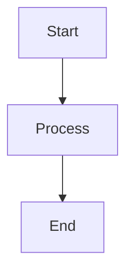
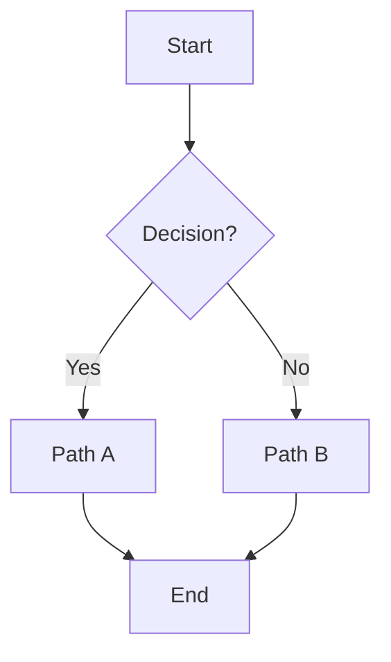
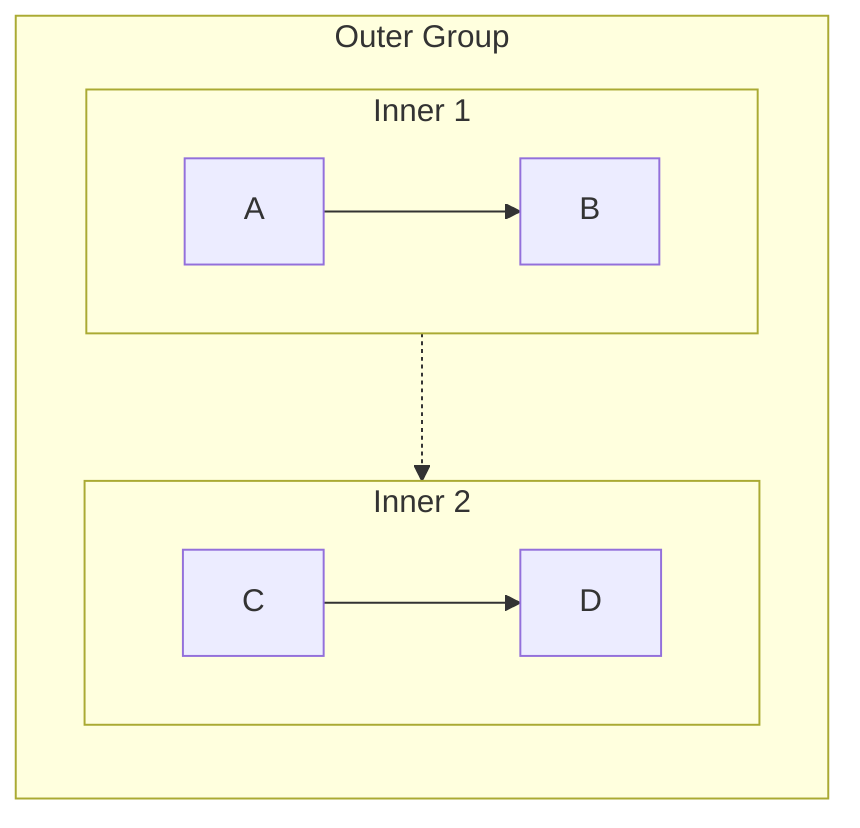
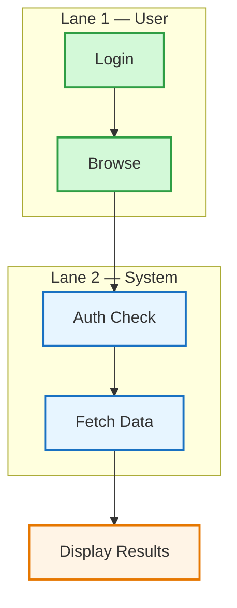
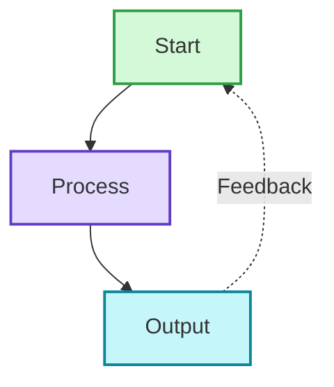
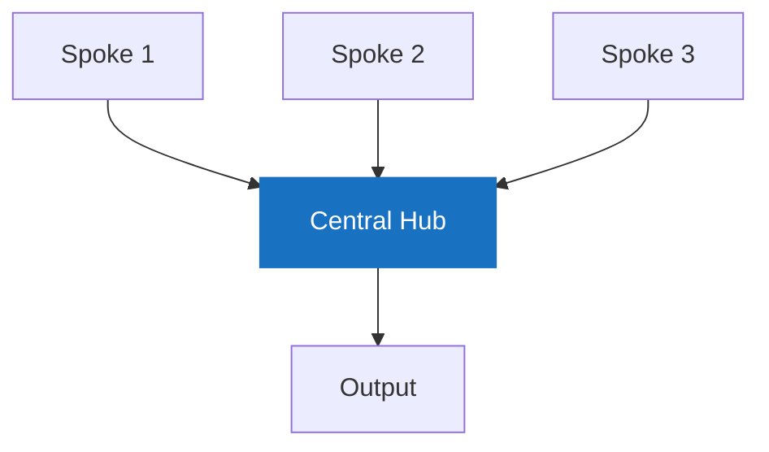
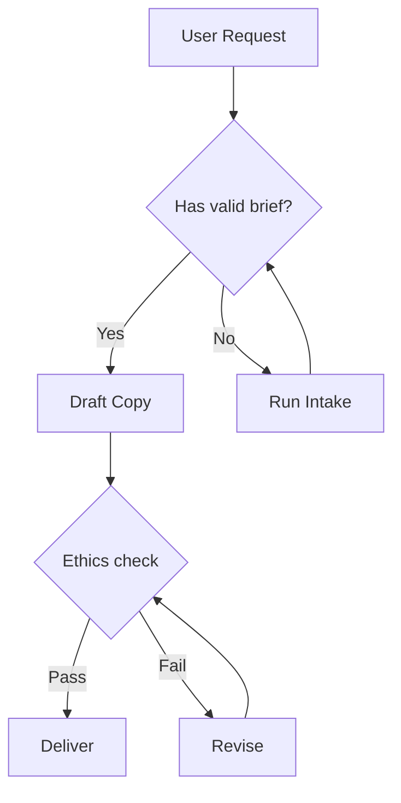
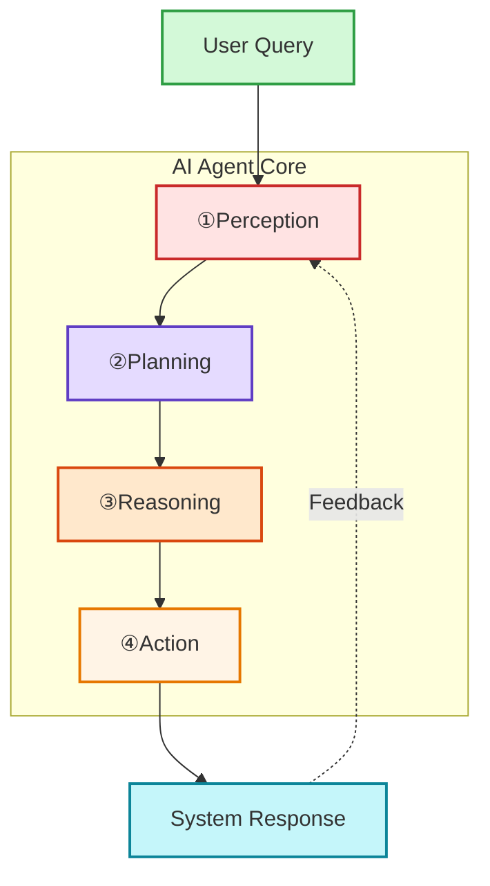

# Flowchart (graph TB / LR)

Process flow, decision tree, workflow, system architecture, AI agent pipeline.

## When to use

**Best for**:
- Sequential workflows and decision trees
- AI agent architectures with perception → reasoning → action loops
- Multi-step processes with branches and merges
- System architectures showing data / control flow
- Any content describing steps, stages, or a sequence of actions

**User query 關鍵字**: flowchart / workflow / 流程圖 / 流程 / process / pipeline / architecture / 步驟 / decision tree

**Not for**: sequence interactions over time (use `flow/sequence.md`), state transitions (use `flow/state.md`), git branches (use `structural/gitgraph.md`), data charts (use `data-viz/xychart.md`).

## Canonical syntax

Minimal example:



With decision + multiple paths:



## Configuration options

### Layout direction (set at top of diagram)

| Code | Meaning |
|---|---|
| `graph TB` / `graph TD` | Top to bottom (vertical, default) |
| `graph BT` | Bottom to top |
| `graph LR` | Left to right (horizontal) |
| `graph RL` | Right to left |

**Heuristic**: TB for sequential processes and hierarchies; LR for timelines and wide displays.

### Node shapes

```mermaid
A[Rectangle Text]             # Default rectangle
B(Rounded Text)               # Rounded rectangle
C([Stadium Text])             # Stadium / pill
D((Circle<br/>Text))          # Circle (supports <br/>)
E>Right Arrow]                # Asymmetric / flag
F{Decision?}                  # Rhombus (decision)
G{{Hexagon}}                  # Hexagon
H[/Parallelogram/]            # Parallelogram
I[(Database)]                 # Database cylinder
J[/Trapezoid\]                # Trapezoid
```

### Arrow types

| Syntax | Meaning |
|---|---|
| `A --> B` | Solid arrow (default flow) |
| `A -.-> B` | Dashed arrow (optional, feedback, or supporting flow) |
| `A ==> B` | Thick arrow (emphasis) |
| `A ~~~ B` | Invisible link (layout only, not rendered) |
| `A <--> B` | Bidirectional solid |
| `A <-.-> B` | Bidirectional dashed |
| `A -->|Label| B` | Arrow with label |

### Multi-target connections

```mermaid
A --> B & C & D        # One to many
A & B & C --> D        # Many to one
A --> B --> C --> D    # Chaining
```

### Subgraphs (grouping)

```mermaid
graph TB
    subgraph group_id["Group Display Name"]
        direction TB
        A --> B
    end

    subgraph simple
        C --> D
    end

    group_id -.-> simple    # Connect at group level (creates invisible layout link)
```

**Nested subgraphs** — limit to 2 levels for readability:



### Styling

```mermaid
style NodeID fill:#color,stroke:#color,stroke-width:2px
```

See SKILL.md §Color Scheme Defaults for the 9-color palette and when to apply each.

## Obsidian 11.4.1 compatibility

- **Status**: ✅ Full support — flowchart is the most stable Mermaid type
- **Known quirks**:
  - Undirected graph edges (`---`) may render as directed in 11.4.1 (known 11.5+ fix) — use explicit arrows
  - Large flowcharts (>50 nodes) may have layout stability issues — consider splitting into multiple diagrams
  - `<br/>` in node text works reliably only in circle nodes `((Text<br/>Line))`
- **Workaround**: none needed for standard use; follow [obsidian-common-quirks.md](../obsidian-common-quirks.md) universal rules

## Worked examples

### Example 1: Swimlane pattern (grouping parallel lanes)



### Example 2: Feedback loop (cyclic process)



### Example 3: Hub and spoke (radial / many-to-one)



### Example 4: Decision tree



### Example 5: AI agent architecture (layered with subgraphs)



Note the use of `①②③④` instead of `1. 2. 3. 4.` to avoid the Markdown list syntax conflict (see [obsidian-common-quirks.md Quirk 1](../obsidian-common-quirks.md)).

## Error prevention

### Specific to flowchart

| ❌ Wrong | ✅ Right | Reason |
|---|---|---|
| `A --> [Display Text]` | `A --> B` then define `B[Display Text]` elsewhere | Target must be node ID, not shape definition inline |
| `graph TB A --> B` (on one line) | Put `graph TB` on its own line, then `A --> B` on next | Direction declaration needs newline |
| `subgraph AI Agent` without ID | `subgraph agent["AI Agent"]` | Space in name requires ID+display format |
| `A --> B --> |Label| C` | `A --> B -->|Label| C` (no space before `|`) | Arrow label syntax is strict |
| Using `<br/>` in rectangles `[Line1<br/>Line2]` | Use circle nodes `((Line1<br/>Line2))` OR split into annotation nodes | `<br/>` reliable only in circles |

### Pre-save validation

- [ ] Direction specified on first line (`graph TB` / `graph LR` etc.)
- [ ] All nodes referenced by ID, never by display text
- [ ] All subgraphs with spaces use `subgraph id["Display Name"]`
- [ ] Arrow syntax matches type (`-->`, `-.->`, `==>`, never mixed like `-.>`)
- [ ] Decision nodes use `{Text?}` rhombus shape
- [ ] `<br/>` only used in circle nodes
- [ ] Style declarations apply to node IDs not display text
- [ ] Cross-type universal checks per [obsidian-common-quirks.md](../obsidian-common-quirks.md)
