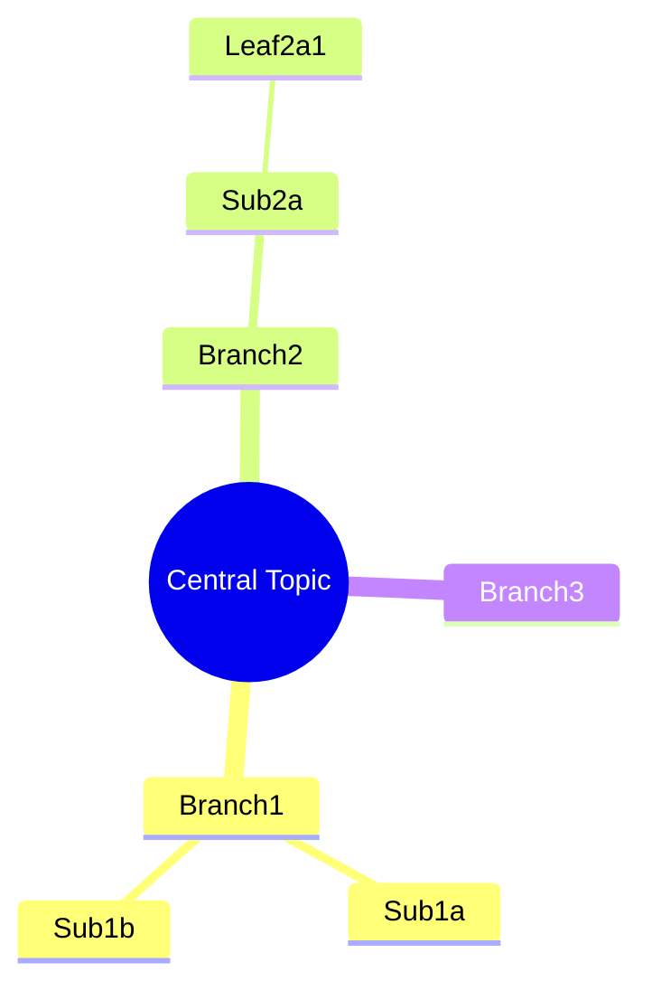
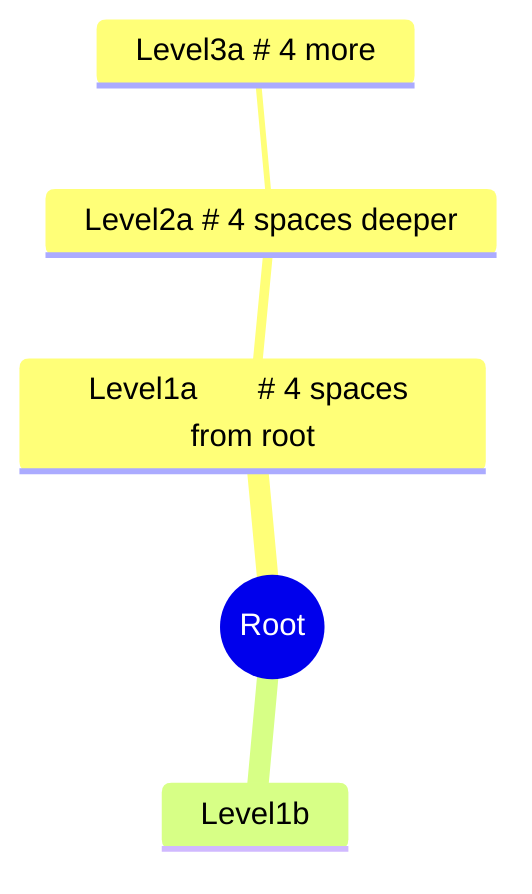
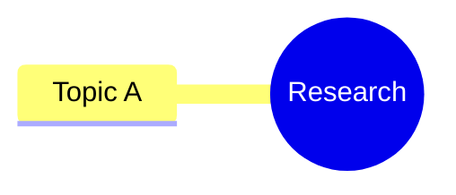
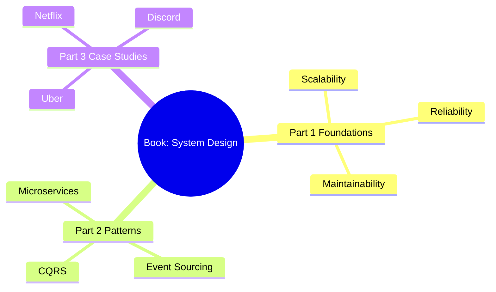
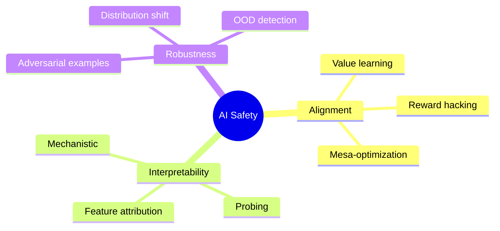
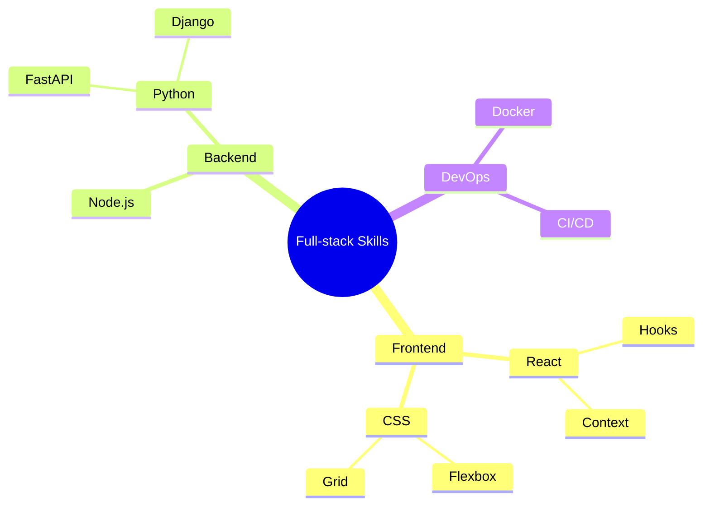

# Mindmap

Hierarchical concepts, knowledge organization, topic breakdowns, brainstorming.

## When to use

**Best for**:
- Hierarchical concepts with clear parent-child relationships
- Knowledge organization (book outlines, research topics)
- Topic / skill breakdowns
- Brainstorming branches from a central concept

**User query 關鍵字**: mindmap / mind map / 心智圖 / 腦圖 / hierarchy / outline / concept tree / breakdown

**Not for**: cyclic relationships (use `flow/circular-flow.md`), time sequences (use `time/timeline.md`), decision trees with branches-and-merges (use `flow/flowchart.md`).

## Canonical syntax

Mermaid `mindmap` uses indentation-based hierarchy (not arrows).



## Configuration options

### Node shapes

```mermaid
mindmap
  root((Circle))           # Double parens = circle
    Rectangle[Square]      # Square brackets = rectangle
    Rounded(Rounded)       # Single parens = rounded
    Bang))Bang((            # Double parens reversed = bang shape
    Cloud)Cloud(            # Single paren reversed = cloud
    Hexagon{{Hex}}         # Double braces = hexagon
    Default                # No brackets = default rounded
```

### Indentation

**Rule**: use consistent spacing (2 or 4 spaces) for each level. Mixing levels of indentation confuses the parser.



### Icons (optional, v10.3+)



Note: icon rendering depends on FontAwesome availability in Obsidian. May not render in 11.4.1 without additional setup.

## Obsidian 11.4.1 compatibility

- **Status**: ✅ Full support — mindmap is stable since Mermaid 9.3
- **Known quirks**:
  - FontAwesome icons may not render without additional CSS / plugin setup — avoid icons for portable notes
  - Deep nesting (>4 levels) may overflow Obsidian preview pane; keep to 3 levels for readability
  - `<br/>` in node text has inconsistent behavior across shapes
- **Workaround**: none needed for standard nested content

## Worked examples

### Example 1: Book outline



### Example 2: Research topic breakdown



### Example 3: Project skill tree



## Error prevention

| ❌ Wrong | ✅ Right | Reason |
|---|---|---|
| Mixed indentation (tabs + spaces) | Use only spaces, consistent width | Mermaid parser is strict about indentation levels |
| `root((Name with spaces))` with problematic chars | Escape quotes and parens in text | Same special-char rules as other types |
| >5 nesting levels | Keep to ≤3 levels; split into multiple mindmaps if needed | Preview overflow + reader cognitive load |
| Using arrows `-->` inside mindmap | Mindmap uses indentation, not arrows | Wrong diagram type — use flowchart if you need arrows |
| Forgetting `mindmap` keyword | First line must be `mindmap` | Otherwise Mermaid tries to parse as flowchart |

### Mindmap vs flowchart — when to pick which

- **Mindmap**: pure parent-child hierarchy, no cross-links between branches, no specific flow direction
- **Flowchart**: need arrows between items, cross-branch connections, labeled relationships, decision points

If you need both hierarchy AND cross-links, use flowchart with subgraphs — not mindmap.

See also [obsidian-common-quirks.md](../obsidian-common-quirks.md) for universal Obsidian Mermaid rules.
