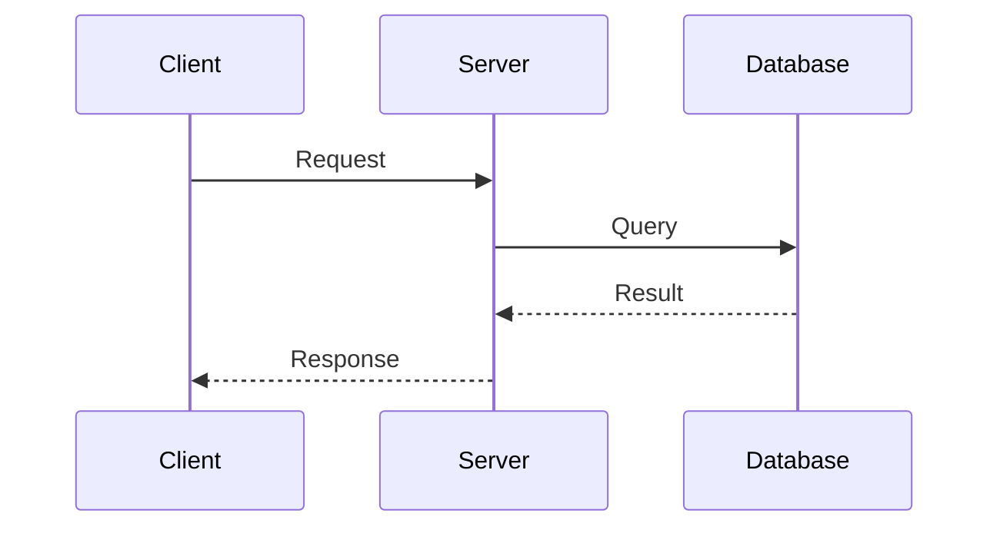
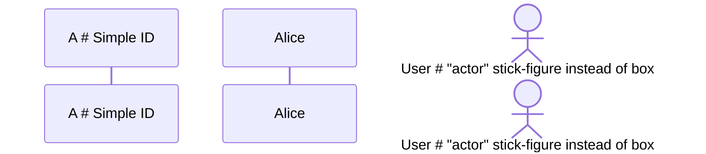
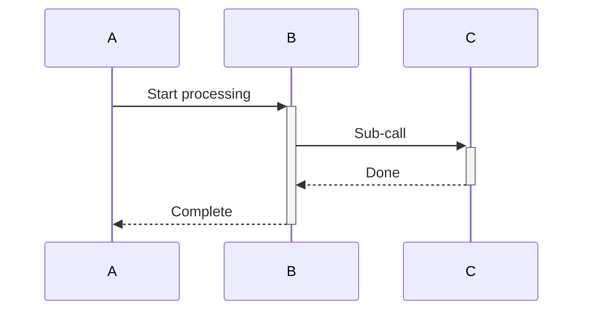
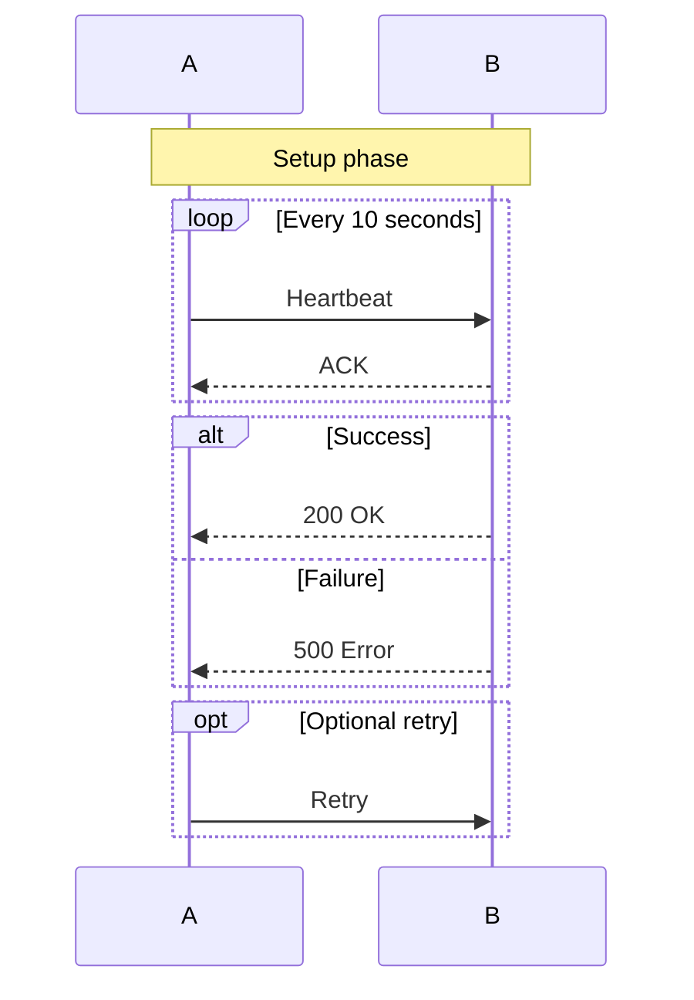
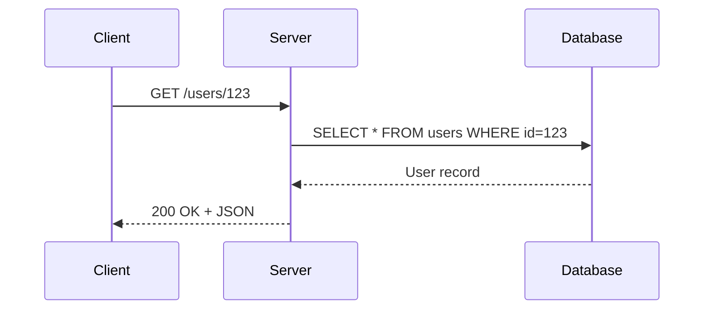
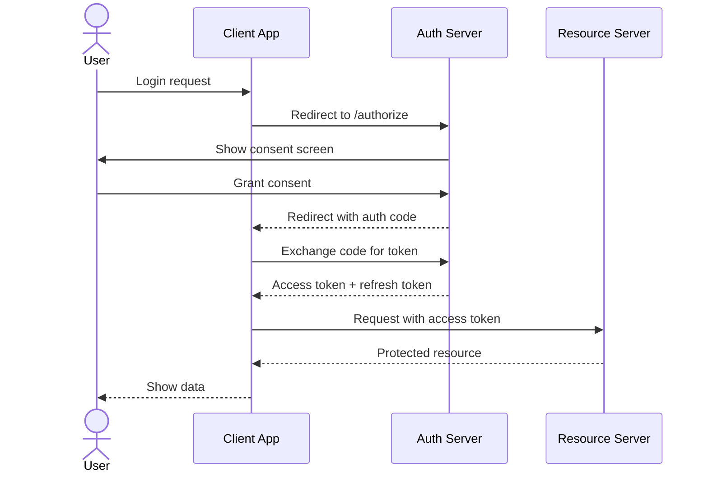
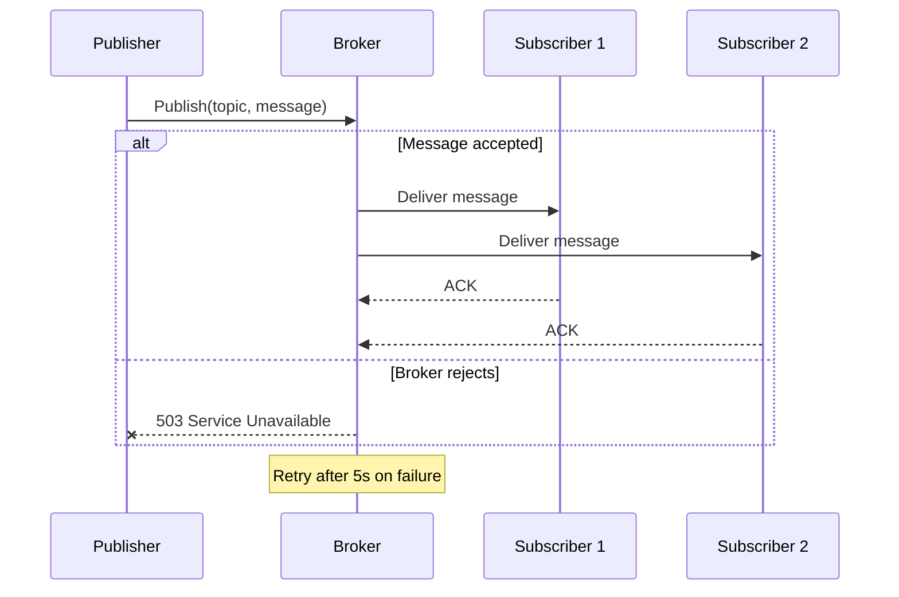
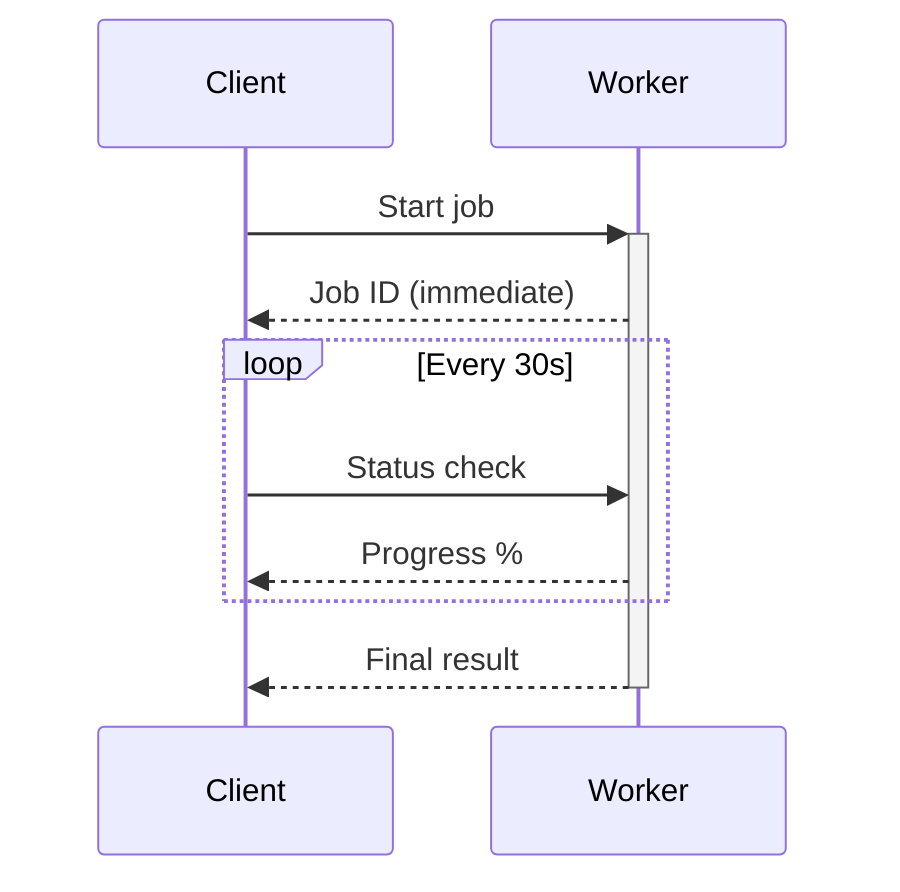
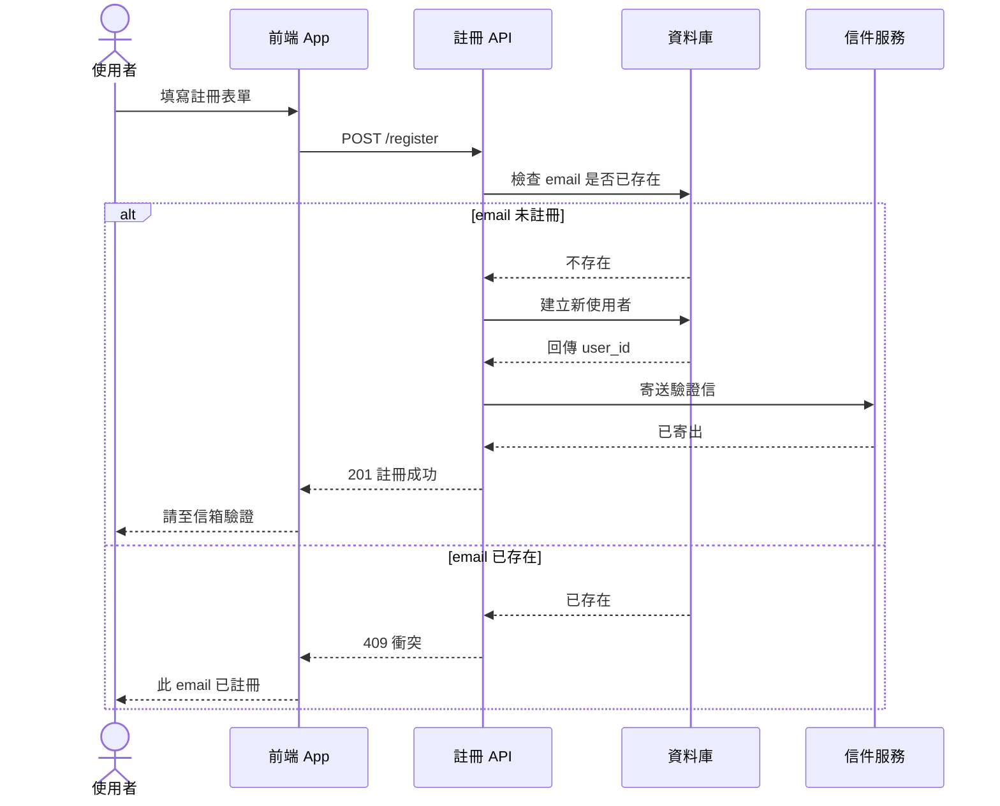

# Sequence Diagram

Interactions between components / actors over time — API calls, message flows, protocols.

## When to use

**Best for**:
- API call flows (client ↔ server ↔ database)
- Inter-service communication
- Authentication / authorization handshakes
- Message protocols (WebSocket, pub/sub)
- User interaction with system over time

**User query 關鍵字**: sequence / sequence diagram / API flow / message flow / 序列圖 / 互動 / 流程 over time / handshake / protocol

**Not for**: internal process steps (use `flow/flowchart.md`), state transitions (use `flow/state.md`), system architecture (use `structural/architecture.md`).

## Canonical syntax

**Note**: sequence diagram uses DIFFERENT arrow syntax from flowchart. See § Arrow types below.

## Configuration options

### Participant declaration

### Arrow types (sequence-specific — NOT same as flowchart)

| Syntax | Meaning |
|---|---|
| `A->>B: msg` | Solid arrow with head (async message) |
| `A-->>B: msg` | Dashed arrow with head (return / response) |
| `A->B: msg` | Solid arrow no head (rare) |
| `A-->B: msg` | Dashed arrow no head |
| `A-xB: msg` | Solid with cross (failure) |
| `A--xB: msg` | Dashed with cross (failure response) |
| `A-)B: msg` | Async message (fire and forget) |

### Activation (optional box around active participant)

`+` activates, `-` deactivates.

### Notes and loops

## Obsidian 11.4.1 compatibility

- **Status**: ✅ Full support — sequence diagram has been stable since Mermaid's earliest versions
- **Known quirks**:
  - Messages with special characters may need quoting
  - Very long sequences (>30 messages) get cramped — split into multiple diagrams
  - Activation boxes (`+`/`-`) must be paired — unmatched `+` without `-` causes render error
- **Workaround**: none needed for standard flows

## Quote rule for sequence diagrams

Sequence diagram has **limited quote support** compared to flowchart. Mermaid sequence parser treats most display text as free-form between delimiters, and adding quotes in participant aliases, message text, or notes typically makes the quote characters appear literally in the rendered output rather than being stripped.

**Safe to quote**:
- Nothing reliably — quotes appear literally in the render

**Do NOT quote** (quote characters render literally):
- `participant A as Alice` — NOT `participant A as "Alice"`
- `A->>B: Message` — NOT `A->>B: "Message"`
- `Note over A,B: Setup` — NOT `Note over A,B: "Setup"`
- `loop Every 10 seconds` — NOT `loop "Every 10 seconds"`
- `alt Success` — NOT `alt "Success"`

**For CJK / special characters in sequence**: Mermaid sequence tolerates CJK in these positions without quoting. If a specific message fails to parse, use the backtick-escape `A->>B: \`message with special chars\`` or HTML-encode problematic characters. Do not wrap the whole string in `"..."` as the quotes will render literally.

## Worked examples

### Example 1: Simple API call

### Example 2: OAuth 2.0 authorization code flow

### Example 3: Pub/sub with error handling

### Example 4: Long-running task with heartbeat

### Example 5: CJK content (使用者註冊流程 — demonstrates CJK tolerance without quoting)

**Important note**: sequence diagram does NOT support quoting — messages / participant aliases / note text / alt-else labels are all free-form after the delimiter. CJK content works directly in these positions without `"..."`. This example deliberately shows CJK in every quote-unsupported position (participant aliases, messages, alt labels, note) to demonstrate the Mermaid parser tolerates CJK there.

## Error prevention

| ❌ Wrong | ✅ Right | Reason |
|---|---|---|
| Using `A --> B` (flowchart arrow) | Use `A->>B` or `A-->>B` (sequence-specific) | Sequence has its own arrow syntax |
| Unmatched activation `+` without `-` | Every `+` must pair with `-` to deactivate | Parser error or visual glitch |
| `loop Every X` without `end` | `loop ... end` must be closed | Syntax error |
| Using participant name as ID then referencing by name | Declare `participant A as AliceName`, then use `A->>B` | Reference by participant ID, not display name |
| Nesting loop/alt too deeply (>3 levels) | Flatten or split into multiple diagrams | Visual clutter, hard to follow |

### Sequence vs flowchart — when to pick which

- **Sequence**: message flow over time between discrete actors/components — emphasis on ordering and timing
- **Flowchart**: process steps that may or may not involve multiple parties — emphasis on logical flow

If the diagram shows "first A does X, then B does Y in response" → sequence. If it's "if condition then step1 else step2" → flowchart.

See also [obsidian-common-quirks.md](../obsidian-common-quirks.md) for universal Obsidian Mermaid rules.
