# State Diagram

System states, status transitions, lifecycle stages — finite state machines.

## When to use

**Best for**:
- Finite state machines (FSM) with explicit states and transitions
- Lifecycle stages (order: created → paid → shipped → delivered)
- UI states (loading / error / success / idle)
- Protocol states (connecting / connected / disconnected / reconnecting)
- Workflow statuses (draft / review / approved / published)

**User query 關鍵字**: state diagram / FSM / state machine / lifecycle / status / 狀態圖 / 狀態機 / 狀態轉換 / transition

**Not for**: process flows without discrete states (use `flow/flowchart.md`), message timing between actors (use `flow/sequence.md`), hierarchy (use `flow/mindmap.md`).

## Canonical syntax

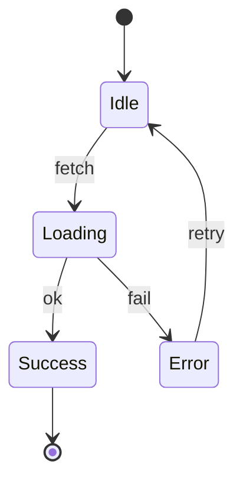

**Use `stateDiagram-v2`**, not the older `stateDiagram`. v2 has better styling and composite state support.

## Configuration options

### Basic transitions

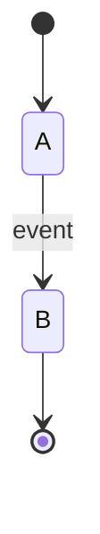

### Composite (nested) states

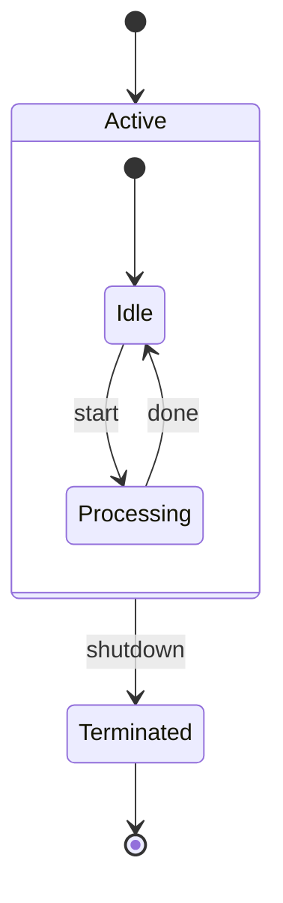

### Choice (decision) points

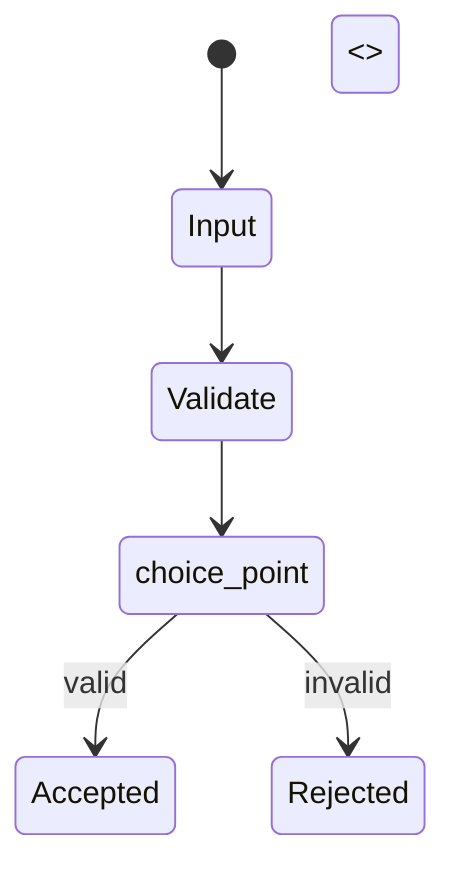

### Fork / join (parallel states)

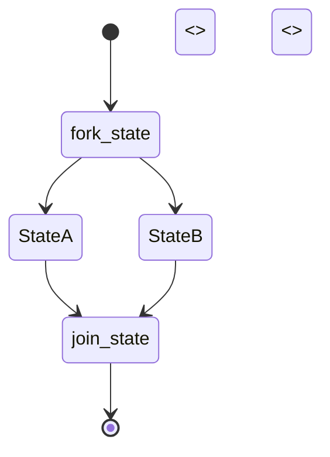

### Notes

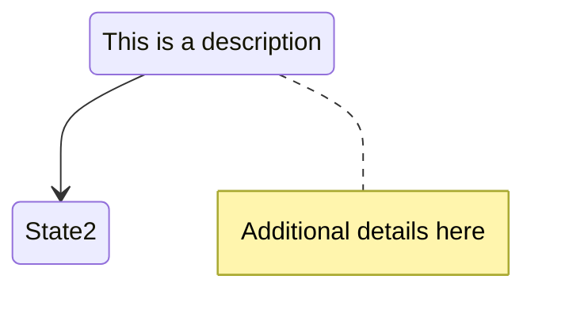

### Direction

```mermaid
stateDiagram-v2
    direction LR       # or TB, BT, RL
    [*] --> A --> B --> [*]
```

## Obsidian 11.4.1 compatibility

- **Status**: ✅ Full support — state diagrams are stable
- **Known quirks**:
  - `stateDiagram` (v1) is deprecated — always use `stateDiagram-v2`
  - Choice / fork / join syntax must be precise; typos cause render failures
  - Composite states nested >2 levels deep can overflow preview pane
- **Workaround**: none needed

## Worked examples

### Example 1: Simple UI state

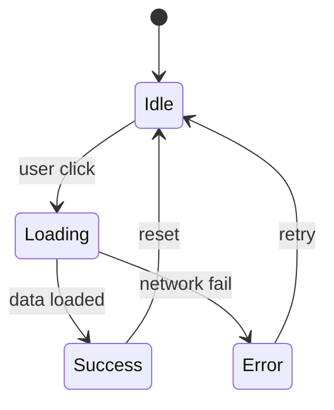

### Example 2: Order lifecycle

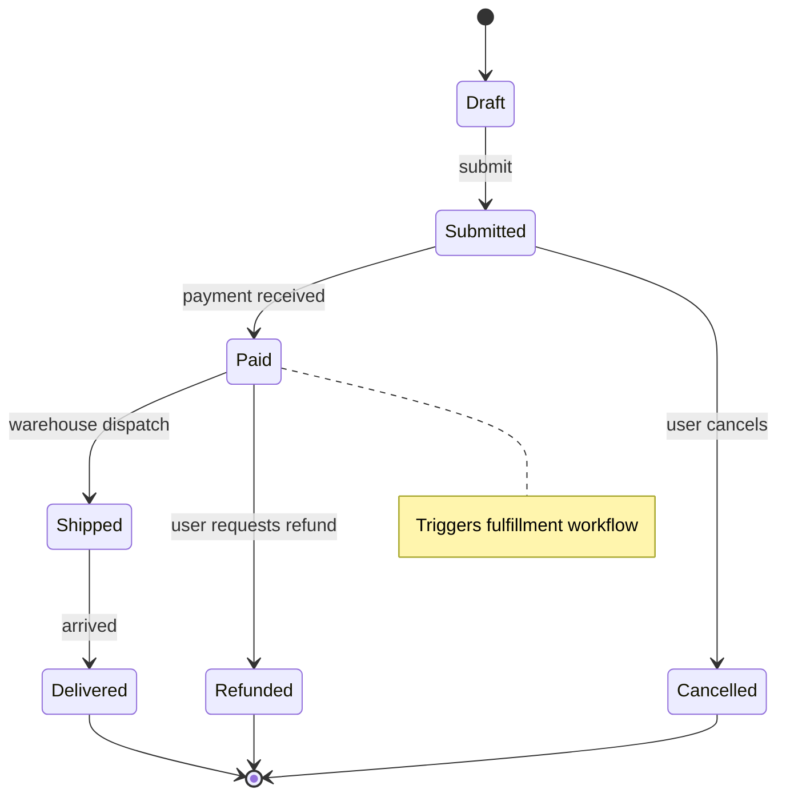

### Example 3: Composite state (nested — connection lifecycle)

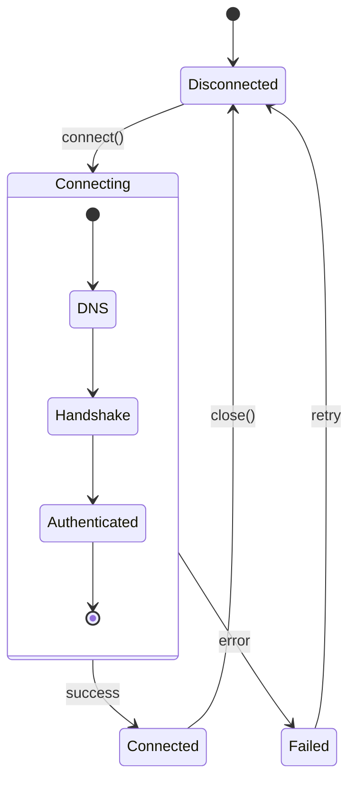

### Example 4: Parallel states (document processing pipeline)

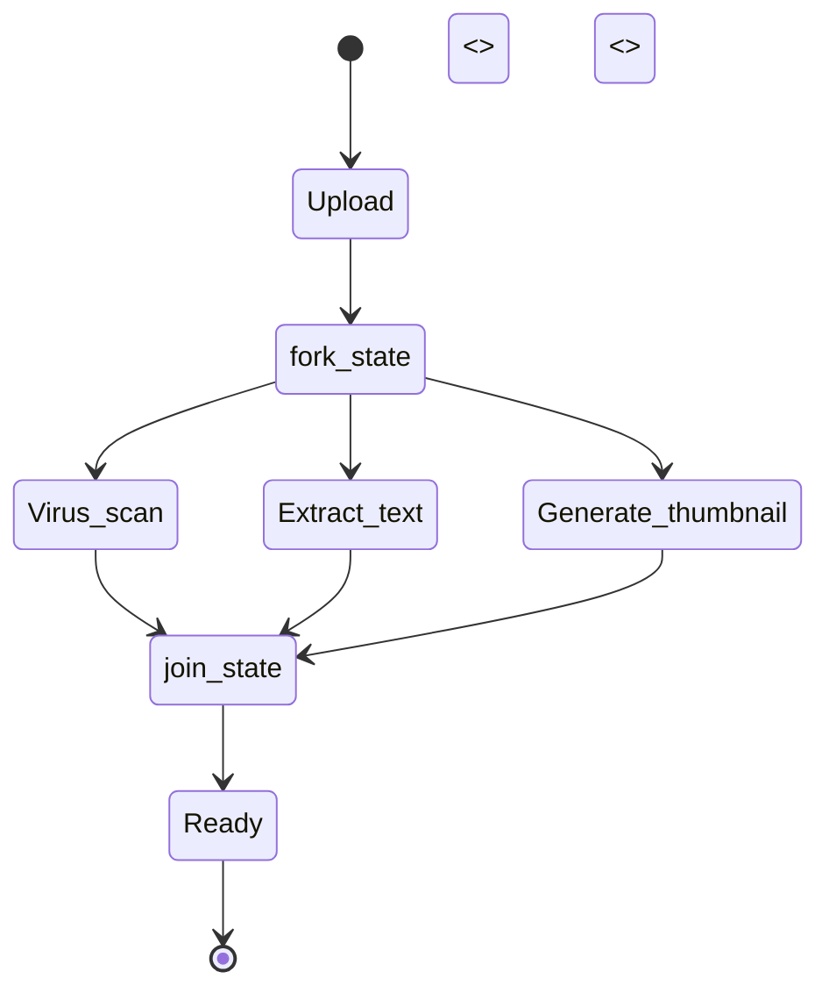

### Example 5: Choice point (validation branching)

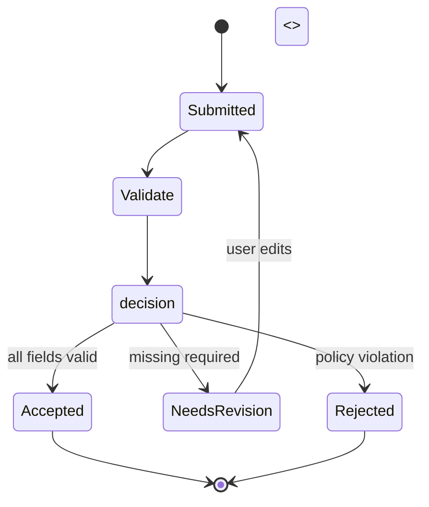

## Error prevention

| ❌ Wrong | ✅ Right | Reason |
|---|---|---|
| `stateDiagram` (v1) | `stateDiagram-v2` | v1 deprecated; v2 has better features |
| `state1 --> state2 : label` (space around colon) | `state1 --> state2: label` (space after only) | Label syntax is strict |
| `[*]` inside nested state to escape | `[*]` only refers to the **containing scope's** start/end | Nested states have their own start/end |
| Choice without `<<choice>>` marker | `decision <<choice>>` required | Otherwise treated as regular state |
| Unbalanced fork/join | Every `<<fork>>` needs a matching `<<join>>` | Syntax error or orphan branches |
| Missing direction on complex diagram | Add `direction LR` or `direction TB` at top | Default TB may not fit lifecycle widths |

### State diagram vs flowchart — when to pick which

- **State diagram**: discrete states with named transitions triggered by events
- **Flowchart**: steps in a process, often sequential, not necessarily "states"

If your question is "what does the system look like at time T?" → state diagram. If "what happens next in the process?" → flowchart.

See also [obsidian-common-quirks.md](../obsidian-common-quirks.md) for universal rules.
