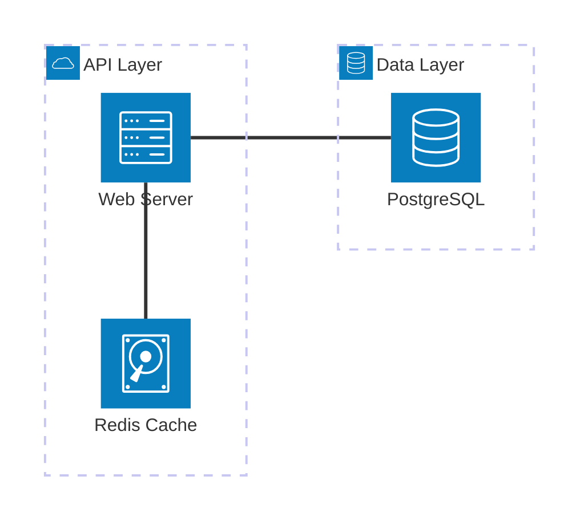
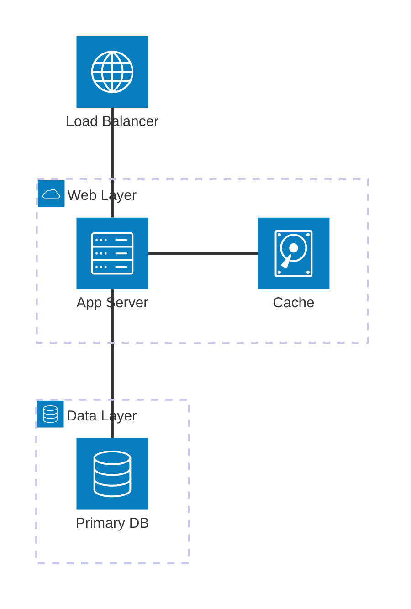
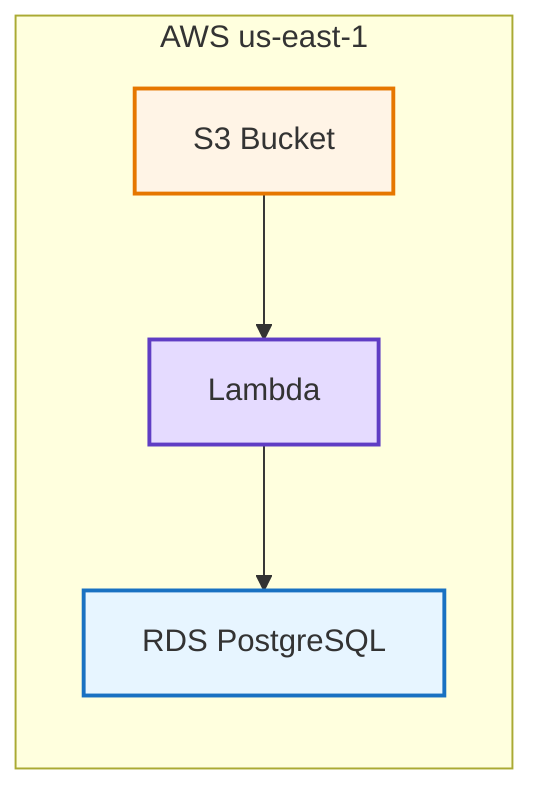

# Architecture Diagram (architecture-beta)

Cloud / infrastructure architecture with service icons — AWS / GCP / Azure / on-prem systems.

## When to use

**Best for**:
- Cloud infrastructure layouts (compute / storage / network / edge)
- Microservice architecture maps
- Deployment topology (load balancer → app servers → database)
- Multi-region or multi-cloud setups
- DevOps / infrastructure as code visualizations

**User query 關鍵字**: architecture / cloud architecture / infrastructure / 工程架構圖 / 架構圖 / cloud diagram / deployment / topology

**Not for**: software component / class structure (use `structural/c4.md`), database schema (use `structural/er.md`), process flow (use `flow/flowchart.md`), generic blocks (use `structural/block.md`).

## Canonical syntax



**Minimum required**:
- `architecture-beta` directive
- At least one `service` (groups optional)
- Connections with `:<edge>` notation

## Configuration options

### Built-in icons

Available without any setup:
- `cloud` — cloud provider / external service
- `database` — DB / storage backend
- `disk` — persistent storage / cache
- `internet` — public network / edge
- `server` — compute / application server

### Icon positioning (edge connection notation)

Each service has 4 connection edges: T (top), B (bottom), L (left), R (right).

```mermaid
serviceA:R -- L:serviceB    # A's right edge → B's left edge
serviceA:B -- T:serviceC    # A's bottom → C's top
serviceA:R -- R:serviceD    # A's right → D's right (siblings)
```

### Groups (logical containers)

```mermaid
group groupId(icon_type)[Display Name]

service svcId(icon)[Display] in groupId
```

Groups provide visual containers (like subgraph in flowchart).

### Iconify icons (v11.1+)

For icons beyond the 5 built-ins, use iconify names:

```mermaid
service aws_s3(logos:aws-s3)[S3 Bucket]
service gcp_bq(logos:google-bigquery)[BigQuery]
```

**⚠️ Obsidian 11.4.1 caveat**: iconify icons require network access to `cdn.jsdelivr.net/npm/@iconify` — icons fail to load offline or behind corporate firewalls.

### Junctions (branching points)

```mermaid
junction id_junction
service a(cloud)[Service A]
service b(cloud)[Service B]

a:R -- L:id_junction
id_junction:R -- L:b
```

Use junctions to branch one output to multiple inputs.

## Obsidian 11.4.1 compatibility

- **Status**: 🟡 Partial — syntax supported (added in v11.1), but **icon loading depends on external CDN**
- **Known quirks**:
  - Iconify icons fail to render offline — only 5 built-in icons are reliable
  - Complex layouts with groups + junctions may have positioning glitches in smaller preview panes
  - Styling options (colors, custom fonts) have limited support — stick to defaults
- **Workaround — Architecture icon fallback policy**:
  - If Obsidian is online + unblocked: iconify icons work
  - If icons don't render (offline / CDN blocked): skill falls back to `graph TB` + subgraph approximation — see [obsidian-compatibility.md § Architecture icon fallback policy](../obsidian-compatibility.md)

## Quote rule for architecture-beta

architecture-beta uses the bracket form `[Display Label]` for service / group display names. The quoting rule is **script-dependent** — verified with mermaid-cli (2026-06):

- **ASCII labels**: leave unquoted, `service svc(server)[App Server]` — this is the canonical form.
- **CJK / non-ASCII labels**: MUST be quoted **inside** the bracket, `service svc(server)["應用伺服器"]`. Unquoted CJK in a bracket throws `Syntax error in text` (applies to BOTH `service` and `group` labels). Quoted CJK renders clean (no literal quotes).

> [!warning]
> Earlier guidance here said CJK "generally works without quoting" — that is **wrong**. Unquoted CJK bracket content fails to parse. Always quote CJK (and other non-ASCII / special-char) bracket labels. If a label contains the bracket chars `[` or `]` themselves, rephrase — those can't be escaped.

If the fallback to `graph TB` is triggered, apply the standard flowchart quote rule (`A["Label"]`) to the fallback diagram.

## Worked examples

### Example 1: Simple 3-tier web app (built-in icons only, 100% reliable)



### Example 2: Multi-region failover (built-in icons)


### Example 3: With iconify (requires network — may not render offline)


### Example 4: Fallback to graph when icons unavailable

When iconify icons fail, replace with `graph TB` + subgraph:



Lose the icons but keep the architectural clarity.

## Error prevention

| ❌ Wrong | ✅ Right | Reason |
|---|---|---|
| `architecture` (no `-beta`) | `architecture-beta` | v11.4.1 uses beta suffix |
| `service a[Label]` (missing icon) | `service a(server)[Label]` | Icon type required |
| Service referenced before declaration | Declare all services first, then connections | Parser needs forward references |
| `a:R -> L:b` (single arrow) | `a:R -- L:b` (double dash) | Must use `--` between edges |
| Iconify icon name wrong format | Use `prefix:name` format (e.g., `logos:aws-s3`) | Full iconify syntax required |
| Using `architecture-beta` without testing offline | Test in target Obsidian environment (may fail CDN) | Icon loading is external dependency |

### Pre-save validation

- [ ] `architecture-beta` declared on line 1
- [ ] All services declared with `service id(icon)[label]` format
- [ ] Groups use `group id(icon)[label]` format
- [ ] Connections use `:<edge> -- <edge>:` notation
- [ ] For iconify icons: network access confirmed in target environment OR fallback prepared
- [ ] Consider graph TB fallback if offline rendering is a concern

See also [obsidian-common-quirks.md](../obsidian-common-quirks.md) and [obsidian-compatibility.md](../obsidian-compatibility.md).
