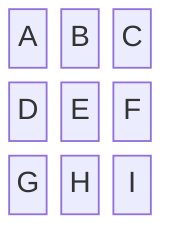
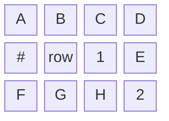
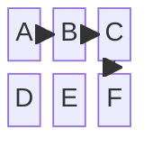
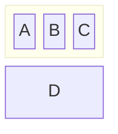
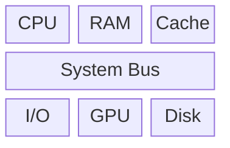
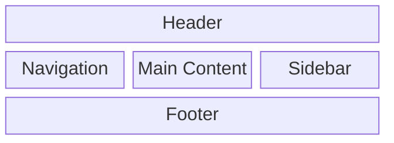
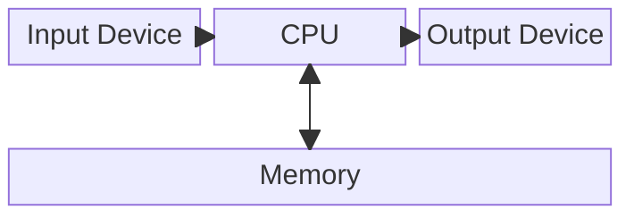
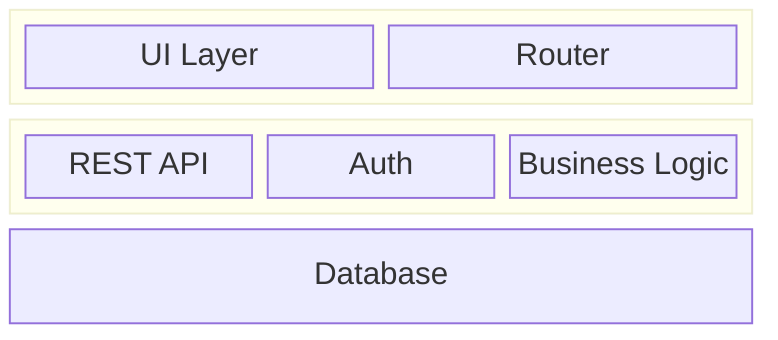
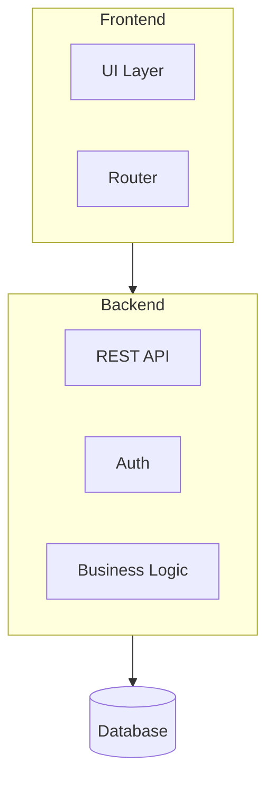

# Block Diagram (block-beta)

Generic block / grid layouts — hardware diagrams, conceptual groupings, layout mockups.

## When to use

**Best for**:
- Hardware block diagrams (CPU / memory / bus / peripherals)
- Conceptual system components in grid layout
- Rough layout mockups (pages / UI zones)
- Non-flow structural representations (no arrows between steps)

**User query 關鍵字**: block diagram / block / 方塊圖 / grid layout / hardware diagram / system block

**Not for**: flow / decision steps (use `flow/flowchart.md`), cloud architecture (use `structural/architecture.md`), class diagrams (use `structural/class.md`).

## Canonical syntax



**Minimum required**:
- `block-beta` directive
- `columns N` to set column count
- Blocks listed row by row

Block names (e.g., `A`, `B`) define block IDs. Optional labels with brackets: `A["Display Label"]`.

## Configuration options

### Column layout



### Labeled blocks

```mermaid
block-beta
    columns 3
    CPU["Central Processing Unit"]
    RAM["Memory"]
    GPU["Graphics"]
    Bus["System Bus"]:3      # :3 = span 3 columns
```

### Block spanning

```mermaid
A:2      # A spans 2 columns
B:3      # B spans 3 columns
```

### Connections between blocks



Arrows work but are less central than in flowchart.

### Grouped blocks (nested blocks)



`block:id ... end` creates a nested container.

## Obsidian 11.4.1 compatibility

- **Status**: 🟡 Needs testing — 2024 Obsidian Forum reports suggest partial / failed rendering. Syntax exists in 11.4.1 but rendering quality varies.
- **Known quirks**:
  - Early block-beta versions had layout instability
  - Complex nested blocks may render poorly
  - Connections (arrows) between blocks sometimes mis-positioned
- **Workaround**:
  - If block-beta renders poorly: fall back to `graph TB` + subgraph (loses grid semantics but preserves structure)
  - Commit 4 of this skill's development will populate actual render status in [obsidian-compatibility.md](../obsidian-compatibility.md)

## Worked examples

### Example 1: Basic CPU architecture



### Example 2: Page layout mockup



### Example 3: System with arrows



`space` reserves blank cells.

### Example 4: Nested (grouped) blocks



### Example 5: Fallback to graph TB when block-beta rendering is poor

If block-beta doesn't render well in user's Obsidian, degrade to:



Loses the grid structure but gains reliable rendering.

## Error prevention

| ❌ Wrong | ✅ Right | Reason |
|---|---|---|
| `block` (no `-beta`) | `block-beta` | v11.4.1 uses beta suffix |
| Missing `columns N` | `columns 3` (or other number) first | Layout requires column count |
| Inconsistent row lengths | Match row length to column count (use `space` for empty cells) | Auto-layout gets confused |
| Spanning span size > remaining columns | `A:3` on a 3-column row at position 1 = OK; at position 2 = error | Can't span beyond remaining columns |
| Nested `block:id ... end` without matching end | Each `block:` needs corresponding `end` | Syntax error |

### Pre-save validation

- [ ] `block-beta` declared on line 1
- [ ] `columns N` specified
- [ ] Row cells add up to column count (using `space` for blanks)
- [ ] All nested `block:` have matching `end`
- [ ] Test render in target Obsidian — have graph TB fallback ready if rendering fails

See also [obsidian-common-quirks.md](../obsidian-common-quirks.md) and [obsidian-compatibility.md](../obsidian-compatibility.md) for version considerations.
