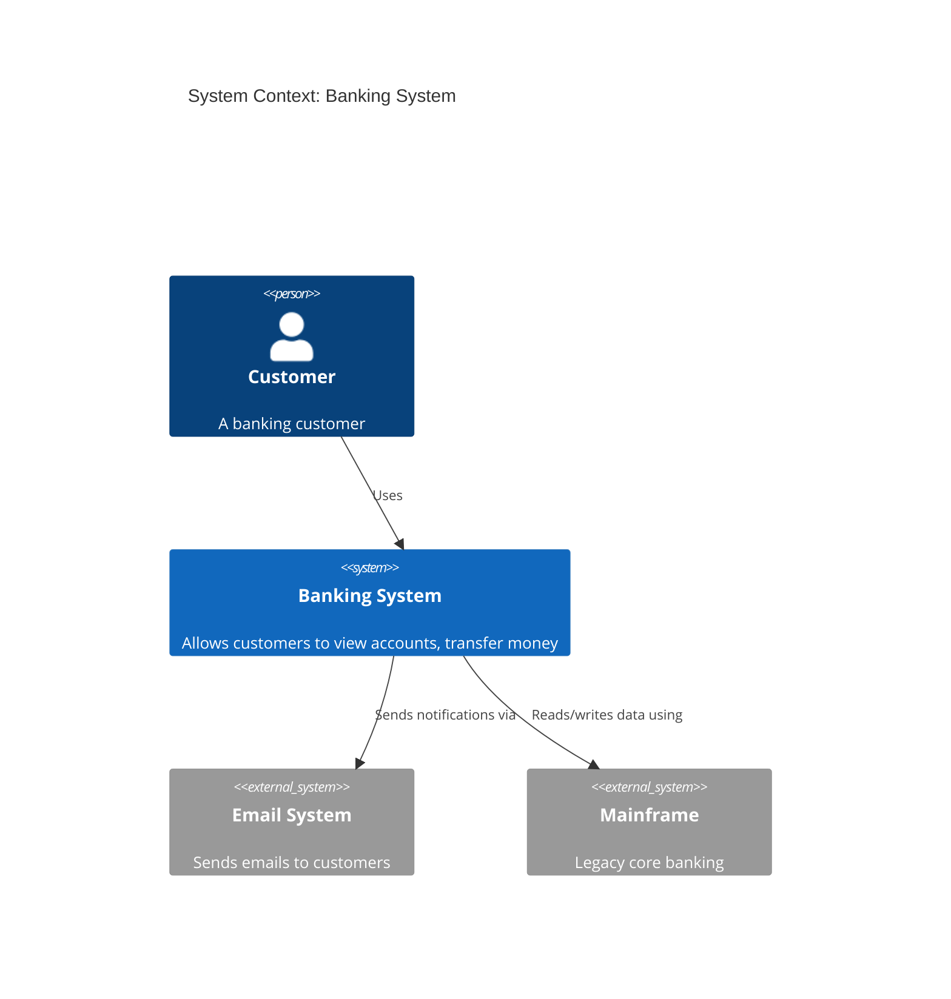
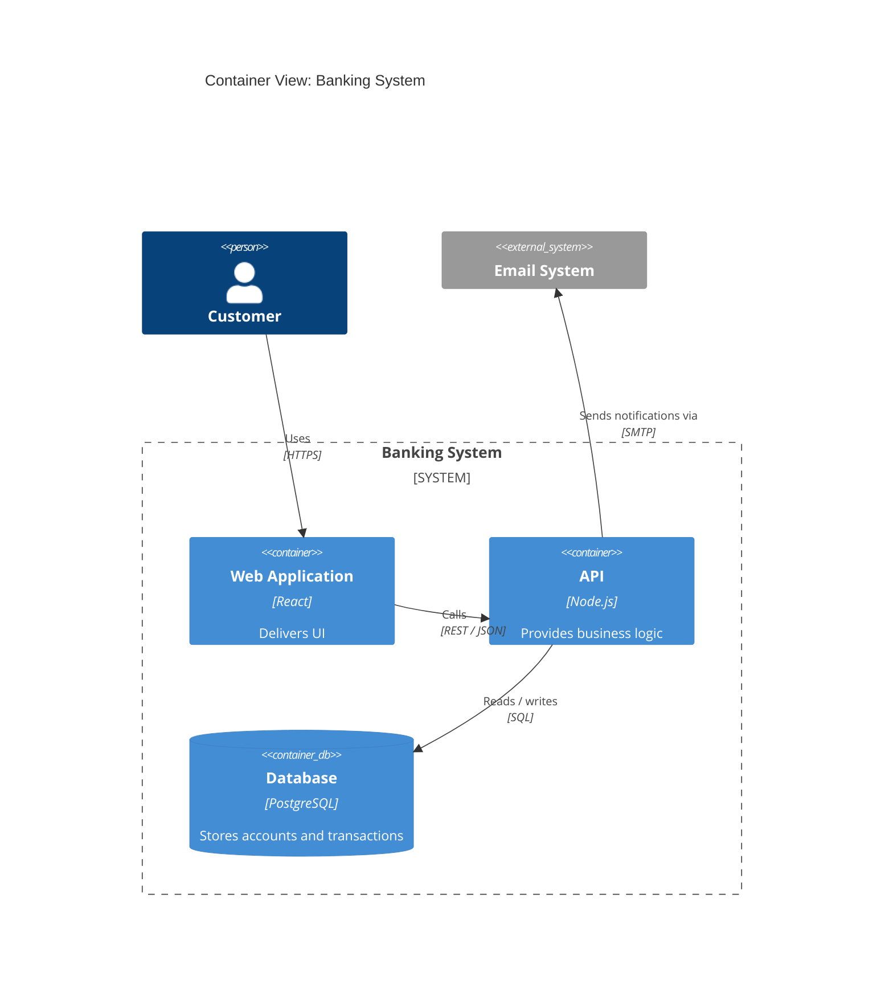
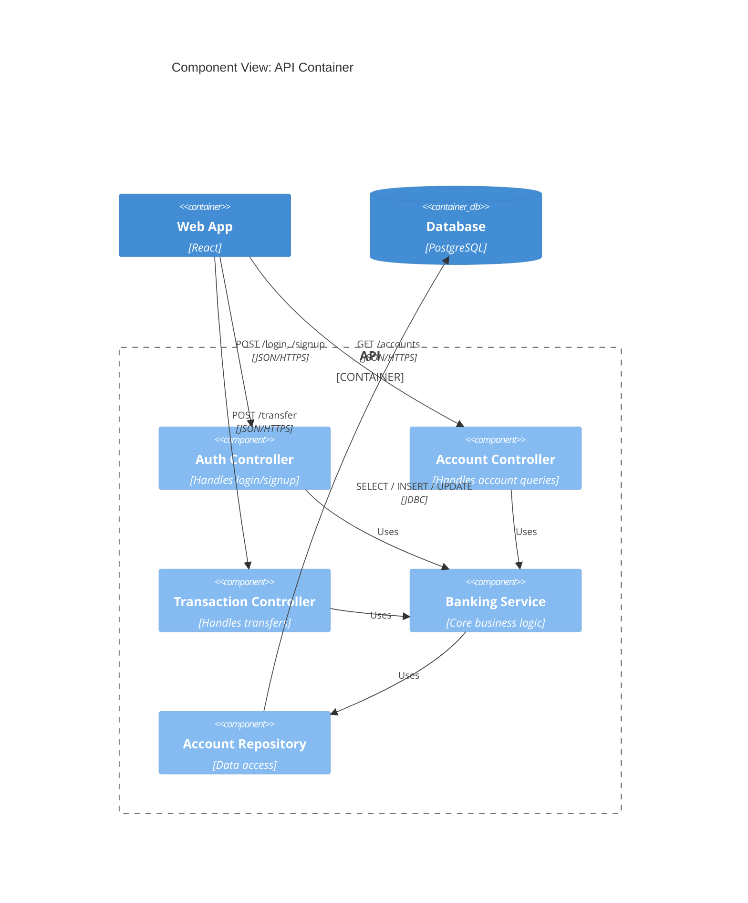
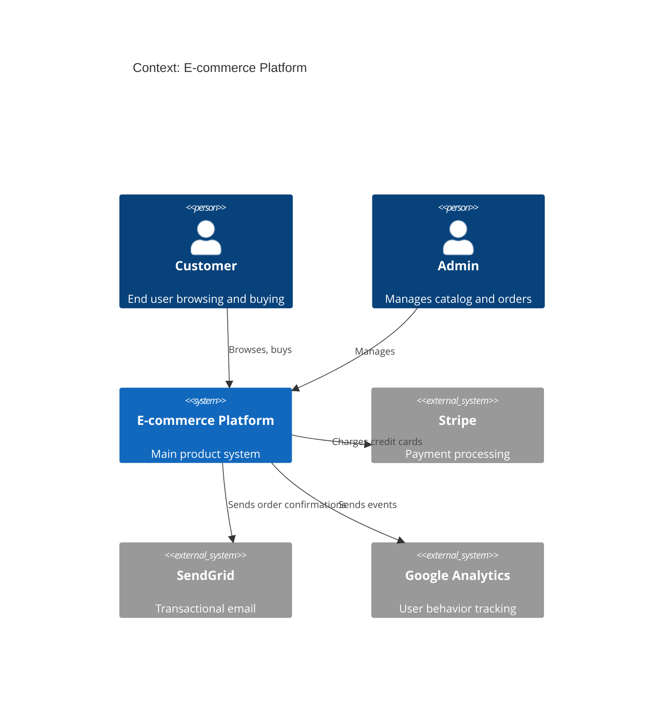
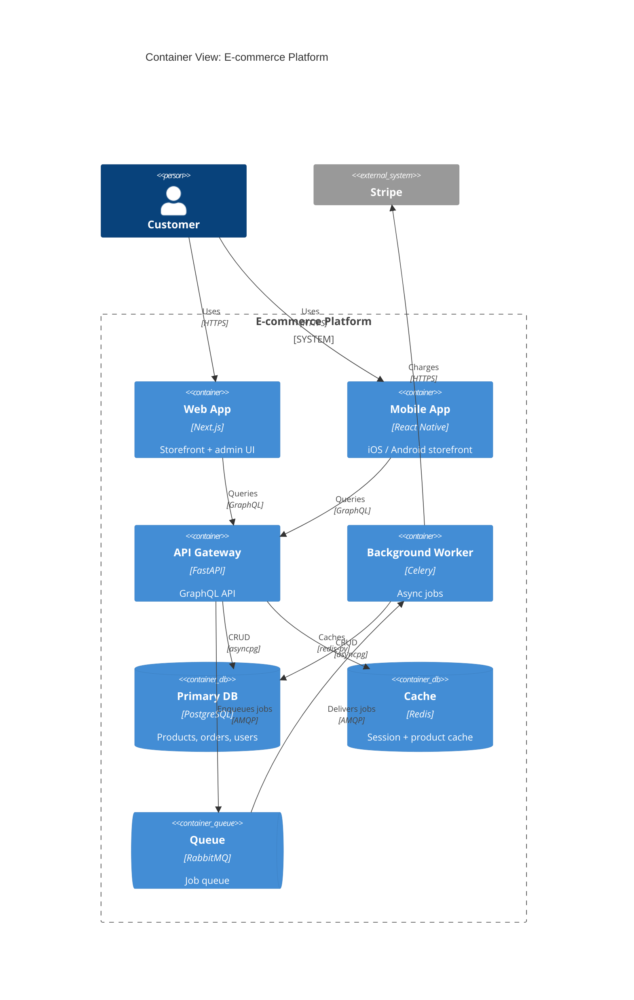
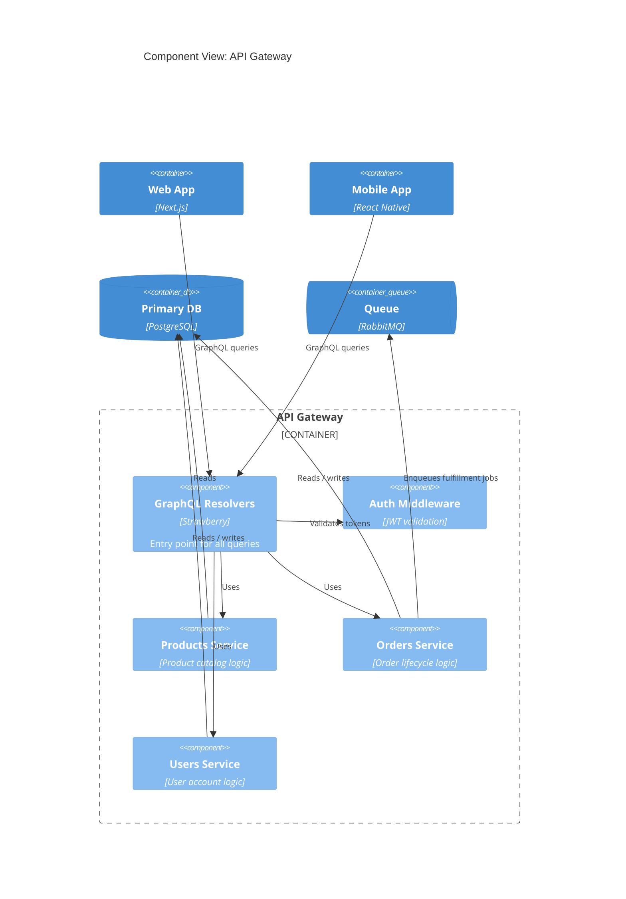
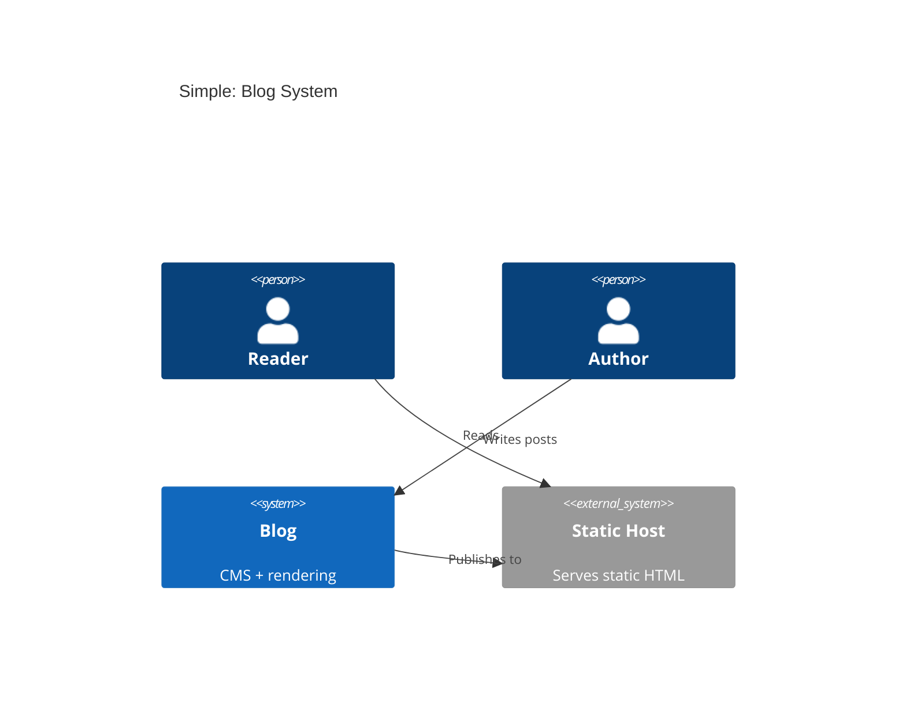

# C4 Diagram (C4Context / C4Container / C4Component)

Software architecture at 3 levels of abstraction — the C4 model by Simon Brown.

## When to use

**Best for**:
- Software architecture documentation at 3 zoom levels:
  - **C4Context**: system in relation to users and external systems
  - **C4Container**: internal apps / services / data stores inside one system
  - **C4Component**: components inside one container
- Architecture Decision Records (ADRs) with visual context
- Onboarding new engineers to system structure
- Bridging business stakeholders and technical teams (Context level)

**User query 關鍵字**: C4 diagram / C4 model / C4 context / C4 container / C4 component / software architecture / 軟體架構 / system context

**Not for**: infrastructure layout (use `structural/architecture.md`), OOP class details (use `structural/class.md`), data schema (use `structural/er.md`).

## Canonical syntax

### C4Context (Level 1: System in environment)



### C4Container (Level 2: Inside one system)



### C4Component (Level 3: Inside one container)



## Configuration options

### Element types

| Context | Container | Component |
|---|---|---|
| `Person(id, "label", "description")` | `Person` (same) | `Person` (same) |
| `Person_Ext` (external person) | `Person_Ext` | `Person_Ext` |
| `System(id, "label", "desc")` | — | — |
| `System_Ext` (external system) | `System_Ext` | `System_Ext` |
| `SystemDb` (database system) | — | — |
| — | `Container(id, "label", "tech", "desc")` | — |
| — | `ContainerDb` (database container) | — |
| — | `ContainerQueue` (queue container) | — |
| — | — | `Component(id, "label", "tech", "desc")` |
| — | — | `ComponentDb` |

### Boundaries (grouping)

- `System_Boundary(id, "label") { ... }` — in Container diagrams
- `Container_Boundary(id, "label") { ... }` — in Component diagrams
- `Enterprise_Boundary(id, "label") { ... }` — for enterprise-scope Context diagrams

### Relationships

```mermaid
Rel(from, to, "label", "technology")
Rel(from, to, "label")                    # technology optional

BiRel(from, to, "label")                  # bidirectional

Rel_Back(from, to, "label")               # arrow reversed direction
Rel_Up(from, to, "label")                 # force upward layout
Rel_Down / Rel_Left / Rel_Right           # force direction
```

### Updating layout

```mermaid
UpdateLayoutConfig($c4ShapeInRow="3", $c4BoundaryInRow="2")
```

Controls how many shapes per row.

## Obsidian 11.4.1 compatibility

- **Status**: ✅ Full support — C4 has been stable since v9
- **Known quirks**:
  - C4 layouts can get crowded; use `UpdateLayoutConfig` for dense diagrams
  - Boundaries may not visually enclose all children if layout is too tight
  - The three levels (Context / Container / Component) must be used correctly — mixing levels in one diagram is confusing
- **Workaround**: none needed; use separate diagrams for different zoom levels rather than mixing

## Quote rule for C4 diagrams

C4 requires **all string arguments quoted** per Mermaid C4 canonical syntax — all examples in this file already follow that convention:

- **Element labels / descriptions / tech**: `Person(id, "Label", "Description")` / `Container(id, "Name", "Tech", "Desc")` ✅
- **Boundary labels**: `System_Boundary(id, "Label") { ... }` ✅
- **Relationship labels / technology**: `Rel(from, to, "Label", "Technology")` ✅
- **Title**: `title Context: Banking System` — unquoted, free-form (one of the few positions in C4 that is not quoted)
- **Element IDs** (`customer`, `banking`, `web`, `api`): identifiers — unquoted

C4's all-quoted convention is consistent with the unified quote rule and needs no changes.

## Worked examples

### Example 1: Context view of a product



### Example 2: Container view — zooming into the platform



### Example 3: Component view — inside the API container



### Example 4: Simple context with minimal styling



## Error prevention

| ❌ Wrong | ✅ Right | Reason |
|---|---|---|
| Mixing Container + Component in same diagram | Use separate diagrams per level | Mixing levels violates C4 semantics |
| `C4context` (lowercase) | `C4Context` (camelCase) | Directive is case-sensitive |
| Forgetting quotes: `Person(user, User, Description)` | `Person(user, "User", "Description")` | All string arguments must be quoted |
| `System_Boundary(id, name) { content }` (no newline) | Put `{` on its own line or after newline, content on next lines | Boundary contents need newline-separated declarations |
| Relationships referencing undefined IDs | Declare all elements first, then `Rel(...)` | Parser needs forward declarations |
| Using `-->` arrow syntax | Use `Rel(from, to, "label", "tech")` function syntax | C4 has its own relationship syntax |

### Pre-save validation

- [ ] Directive correct for level: `C4Context` / `C4Container` / `C4Component`
- [ ] All string arguments quoted
- [ ] Elements declared before relationships
- [ ] Relationships use `Rel(from, to, ...)` function syntax
- [ ] Boundaries match level: `System_Boundary` in Container, `Container_Boundary` in Component
- [ ] Single abstraction level per diagram (don't mix Container + Component)
- [ ] Consider `UpdateLayoutConfig` for dense diagrams

See also [obsidian-common-quirks.md](../obsidian-common-quirks.md) for universal rules.
