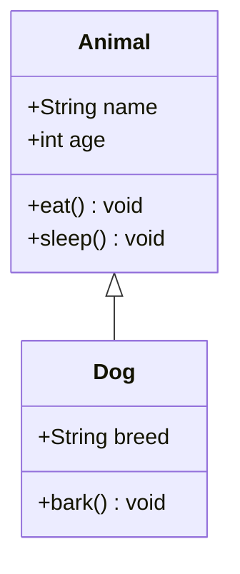
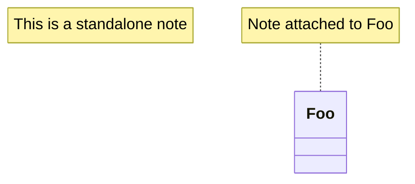
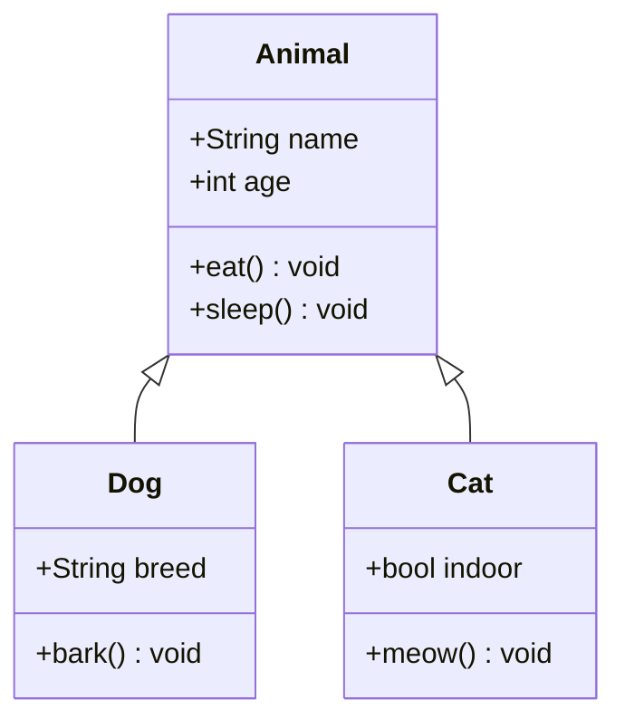
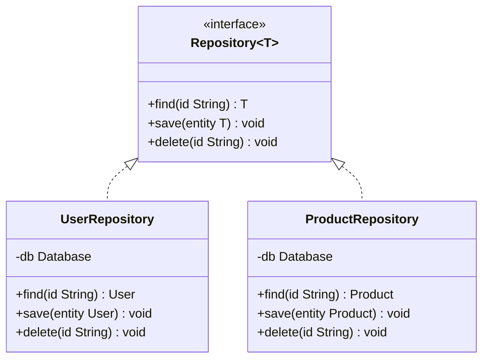
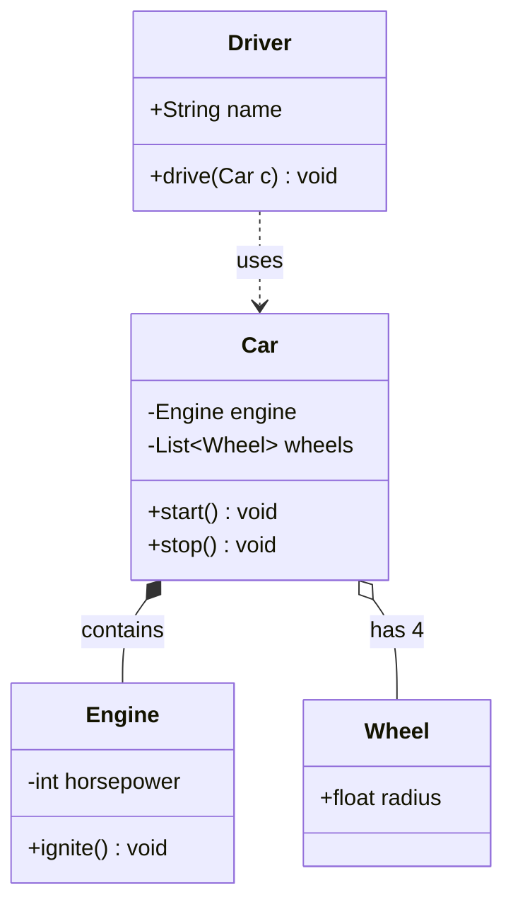
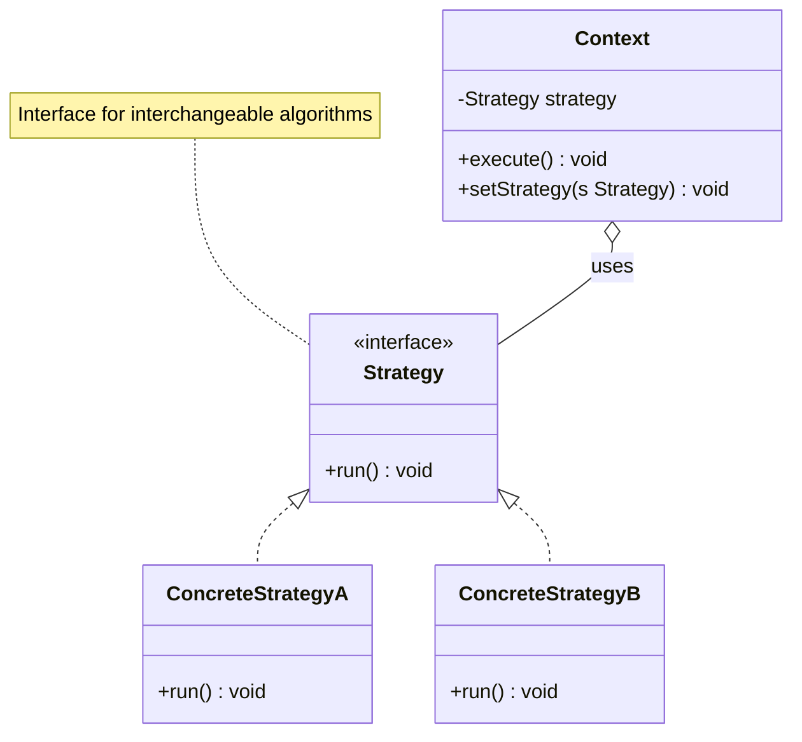
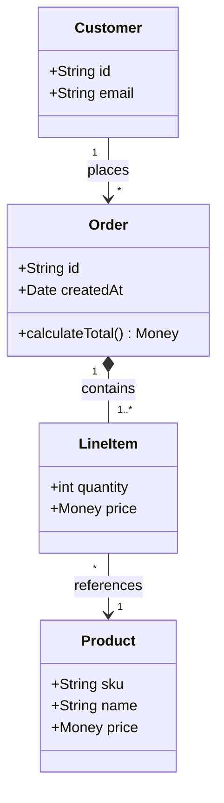

# Class Diagram

Object-oriented class structure — attributes, methods, inheritance, associations.

## When to use

**Best for**:
- OOP class structures (Python / Java / TypeScript / C++ / C#)
- Domain model representation
- Inheritance hierarchies
- Design pattern documentation (Strategy / Observer / Decorator etc.)
- API / library public interface diagrams

**User query 關鍵字**: class diagram / OOP / inheritance / 類別圖 / 類圖 / UML / domain model / class hierarchy

**Not for**: database schema (use `structural/er.md`), system architecture (use `structural/c4.md`), stateless functions (use `flow/flowchart.md`).

## Canonical syntax



**Minimum required**:
- `classDiagram` directive
- At least one `class ClassName { ... }` block
- Optional: relationships between classes

## Configuration options

### Visibility markers (members)

| Prefix | Meaning |
|---|---|
| `+` | public |
| `-` | private |
| `#` | protected |
| `~` | package / internal |

### Field / method notation

```mermaid
class ClassName {
    +public_field Type
    -private_field Type
    +method(param Type) ReturnType
    -private_method() void
    #protected_method() Type
}
```

Type goes AFTER the name; multiple params separated by comma.

### Relationship arrows

| Syntax | Meaning | Visual |
|---|---|---|
| `A <\|-- B` | B inherits from A | Triangle at A |
| `A *-- B` | A has composition of B (B can't exist without A) | Filled diamond at A |
| `A o-- B` | A has aggregation of B (B can exist independently) | Empty diamond at A |
| `A --> B` | A directly associates with B | Arrow at B |
| `A --* B` | Same as `A *-- B` but reversed reading | — |
| `A ..> B` | A depends on B (dashed) | Dashed arrow |
| `A ..\|> B` | A realizes (implements) interface B | Dashed triangle |
| `A <--> B` | Bidirectional association | Both ends arrow |

### Cardinality labels

```mermaid
ClassA "1" --> "*" ClassB : has
```

Shows "one ClassA has many ClassB, with label 'has'". Cardinalities: `0..1`, `1`, `*`, `0..*`, `1..*`, or specific like `"3..5"`.

### Class annotations

```mermaid
class Repository {
    <<interface>>
    +find(id) Entity
    +save(entity) void
}

class AbstractFactory {
    <<abstract>>
    +create() Product
}
```

Use `<<interface>>`, `<<abstract>>`, `<<enum>>`, `<<service>>` annotations.

### Notes



## Obsidian 11.4.1 compatibility

- **Status**: ✅ Full support — class diagram has been stable for many versions
- **Known quirks**:
  - Relationship arrow direction can be confusing — `A <|-- B` means B inherits from A (arrow points to parent)
  - Long method signatures may get cut off — keep concise
  - Unicode in class names sometimes causes issues — prefer ASCII
- **Workaround**: none needed

## Quote rule for class diagrams

Class diagrams use **structured identifiers**, not free-form display strings. There is no user-visible display text to quote:

- **Class names** (`Animal`, `Dog`, `Repository`): identifiers — unquoted
- **Field / method signatures** (`+String name`, `+bark() void`): typed-structured — unquoted
- **Annotations** (`<<interface>>`, `<<abstract>>`): keyword-structured — unquoted
- **Relationship labels** (`Car *-- Engine : contains`): free-form text after `:` — NOT quotable (quotes render literally)
- **Cardinality labels** (`"1" --> "*"`): ALREADY quoted per Mermaid docs — keep quoted

**Notes** attached via `note for Foo "..."` or `note "..."` — these ARE quoted per Mermaid canonical syntax; examples in this file already use the quoted form.

## Worked examples

### Example 1: Simple inheritance



### Example 2: Interface + implementation



`Repository~T~` notation indicates generic type parameter.

### Example 3: Composition + aggregation



Engine is composed (can't exist without Car); Wheels are aggregated (can be swapped); Driver depends on Car (weaker coupling).

### Example 4: Design pattern — Strategy



### Example 5: Domain model with cardinality



## Error prevention

| ❌ Wrong | ✅ Right | Reason |
|---|---|---|
| `class Foo : int bar` (outside block) | Put fields inside `class Foo { +int bar }` | Fields must be inside class block |
| `Animal <|--- Dog` (3 dashes) | `Animal <|-- Dog` (2 dashes) | Inheritance uses 2 dashes |
| `A -> B` | `A --> B` | Must use double dash |
| `+method Int` (space instead of paren) | `+method() Int` | Methods need parens, even empty |
| Relationship direction confusion: `Dog <|-- Animal` when you mean Dog extends Animal | `Animal <|-- Dog` (parent on left) | Arrowhead points TO parent |
| Using `{` on same line as class name without space | `class Foo {` (space before `{`) | Parser expects space |

### Pre-save validation

- [ ] `classDiagram` declared on line 1
- [ ] Each class uses `class Name { ... }` block
- [ ] Fields / methods use proper visibility markers (`+`, `-`, `#`, `~`)
- [ ] Methods include parens `method()` even if no params
- [ ] Inheritance arrow direction correct: `Parent <|-- Child`
- [ ] Type parameters use `~T~` syntax for generics
- [ ] Annotations use `<<annotation>>` inside class block
- [ ] Relationship arrows match intent: `*--` composition / `o--` aggregation / `..>` dependency / `<|--` inheritance / `<|..` realization

See also [obsidian-common-quirks.md](../obsidian-common-quirks.md) for universal rules.
