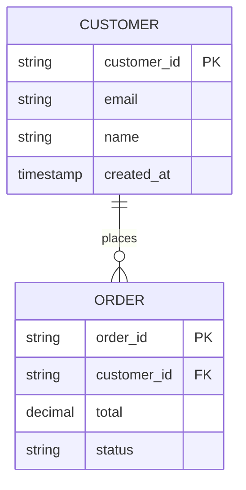
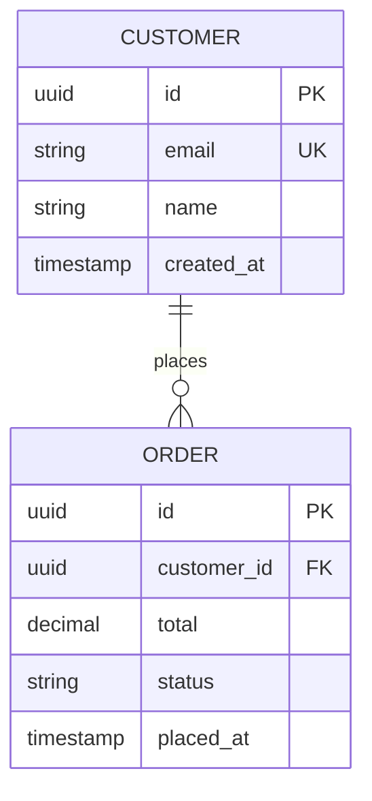
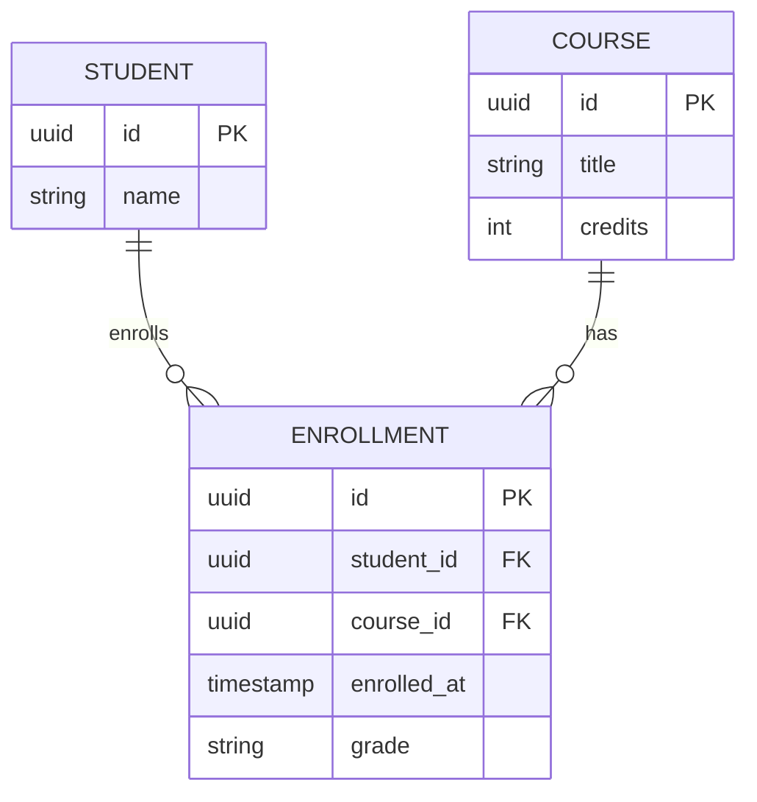
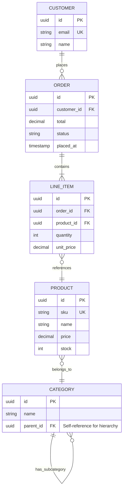
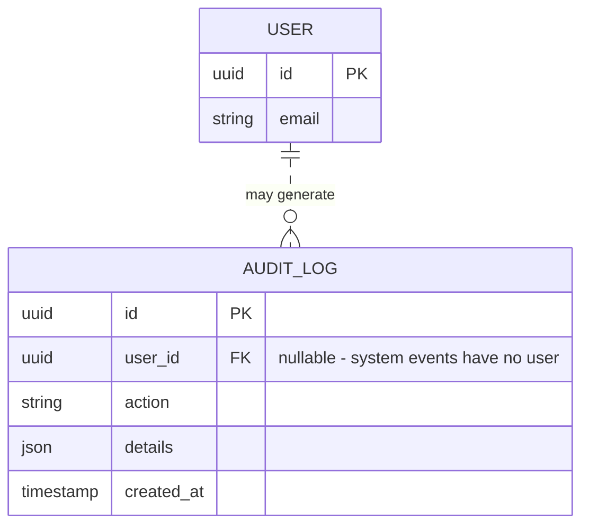
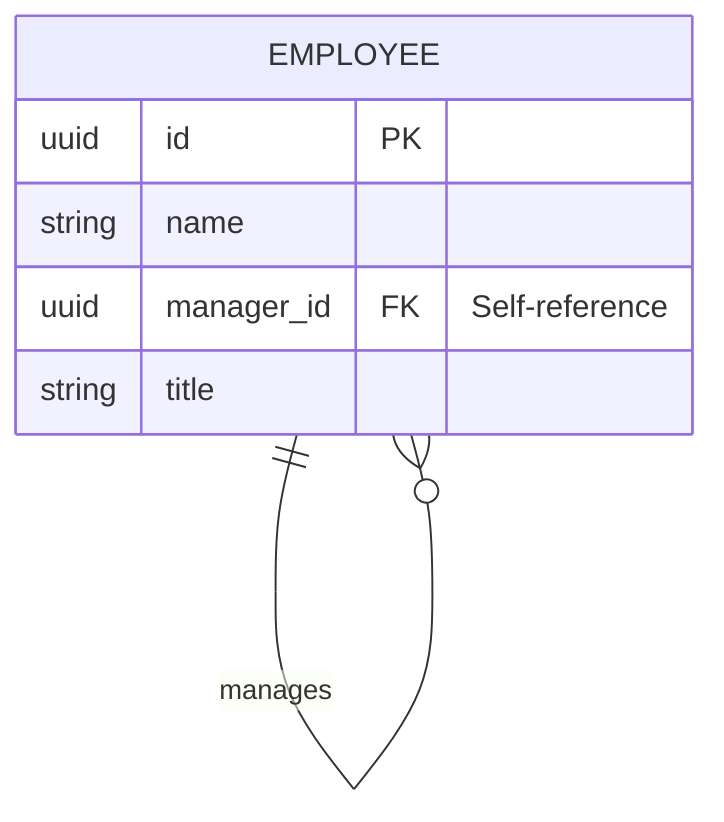

# ER Diagram (erDiagram)

Database schema — entities, attributes, relationships, cardinality.

## When to use

**Best for**:
- Database schema documentation (PostgreSQL / MySQL / MongoDB)
- Entity-relationship modeling
- Data model design for new features
- API response / table structure visualization

**User query 關鍵字**: ER diagram / ERD / entity relationship / database schema / 資料庫架構 / 資料表關係 / schema diagram

**Not for**: OOP class structure (use `structural/class.md`), system architecture (use `structural/c4.md`), workflow (use `flow/flowchart.md`).

## Canonical syntax



**Minimum required**:
- `erDiagram` directive
- At least one entity block
- Optional: relationships between entities

## Configuration options

### Entity syntax

```mermaid
ENTITY_NAME {
    type field_name [key_indicator] "optional comment"
}
```

Key indicators:
- `PK` — primary key
- `FK` — foreign key
- `UK` — unique key

Types are free-form strings (`string`, `int`, `decimal`, `timestamp`, `boolean`, etc.). Mermaid doesn't validate them.

### Relationship syntax

```mermaid
ENTITY_A RELATIONSHIP ENTITY_B : label
```

Where `RELATIONSHIP` specifies cardinality at each end:

| Left end | Right end | Meaning |
|---|---|---|
| `\|\|` | `\|\|` | Exactly one (one-to-one) |
| `\|\|` | `o{` | One to zero-or-many |
| `\|\|` | `\|{` | One to one-or-many |
| `o\|` | `o\|` | Zero-or-one to zero-or-one |
| `}o` | `o{` | Many-to-many |

The `|` means "exactly one (mandatory)", `o` means "zero or one (optional)", `{` / `}` means "many".

### Identifying vs non-identifying

- `||--||` (solid) — identifying relationship (child cannot exist without parent)
- `||..||` (dashed) — non-identifying relationship (child can exist independently)

### Comments on fields

```mermaid
ENTITY {
    string id PK "Primary key"
    string email "User's email, unique"
}
```

## Obsidian 11.4.1 compatibility

- **Status**: ✅ Full support — ER diagram has been stable
- **Known quirks**:
  - Entity names conventionally ALL_CAPS (but not enforced)
  - Very long field comments get truncated in compact preview panes
  - Relationships with both ends `}{` (many-many) can render awkwardly — consider decomposing to a junction entity
- **Workaround**: none needed

## Quote rule for ER diagrams

ER diagrams use **structured identifiers** for entities and fields; only field comments and relationship labels are user-visible display text:

- **Entity names** (`CUSTOMER`, `ORDER`): identifiers — unquoted (or quoted as `"Customer Order"` only if spaces required)
- **Field names / types / keys** (`string customer_id PK`): identifier-structured — unquoted
- **Field comments** (`string id PK "Primary key"`): ALREADY quoted per Mermaid canonical syntax — keep quoted. This is the one position where ER requires quoting
- **Relationship labels** (`CUSTOMER ||--o{ ORDER : places`): free-form text after `:` — quotable. Unlike class-diagram labels, the ER parser **strips** the quotes (they do NOT render literally — verified with mermaid-cli, 2026-06: `USER ||..o{ AUDIT_LOG : "可能產生"` renders clean `可能產生`). Single-word labels can stay unquoted; quote them when multi-word, punctuated, or CJK

**Recommendation**: keep relationship labels unquoted when they are single-word (`places`, `has`, `manages`); quote them only when they contain spaces or punctuation (`"may generate"`, `"belongs to"`). Mermaid ER parser tolerates both forms.

## Worked examples

### Example 1: Simple one-to-many (Customer → Orders)



### Example 2: Many-to-many with junction entity



Junction entity `ENROLLMENT` resolves the STUDENT-COURSE many-to-many into two one-to-many relationships.

### Example 3: E-commerce domain model



Note the self-referencing relationship on `CATEGORY` for nested hierarchies.

### Example 4: Non-identifying relationship (dashed)



Dashed `||..o{` indicates AUDIT_LOG can exist without a specific USER (for system-generated events).

### Example 5: Self-referencing relationship (employee hierarchy)



## Error prevention

| ❌ Wrong | ✅ Right | Reason |
|---|---|---|
| `CUSTOMER { id PK string }` (type last) | `CUSTOMER { string id PK }` (type first) | Type must come before field name |
| `CUSTOMER ||-o{ ORDER` (only 1 dash) | `CUSTOMER ||--o{ ORDER` (2 dashes) | Relationship must use `--` |
| Using `<` `>` in cardinality | Use `|` `o` `{` `}` per Mermaid conventions | Not SQL notation |
| Entity names with spaces | `CUSTOMER_ORDER` (underscore) or `"Customer Order"` (quoted) | Spaces require quoting or underscores |
| Relationship without label | `CUSTOMER ||--o{ ORDER : places` | Label clarifies the semantic |
| Forgetting to mark FK on child fields | Add `FK` to foreign keys: `uuid customer_id FK` | Diagram becomes ambiguous without key indicators |

### Pre-save validation

- [ ] `erDiagram` declared on line 1
- [ ] Each entity uses `ENTITY_NAME { type field [key] "comment" }` format
- [ ] Types come before field names (not SQL-style)
- [ ] PK / FK / UK indicators on appropriate fields
- [ ] Relationships use `||--o{` / `||--|{` / `||--||` / `}o--o{` syntax with `--` (solid) or `..` (dashed)
- [ ] Relationship labels included (`: verb_phrase`)
- [ ] Many-to-many decomposed to junction entity
- [ ] Entity names use ALL_CAPS or quoted if multi-word

See also [obsidian-common-quirks.md](../obsidian-common-quirks.md) for universal rules.
