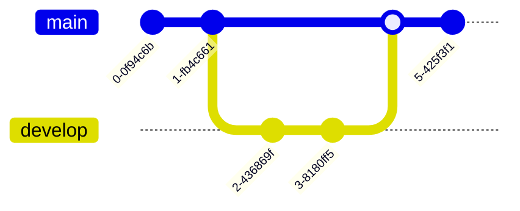
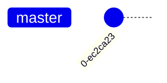
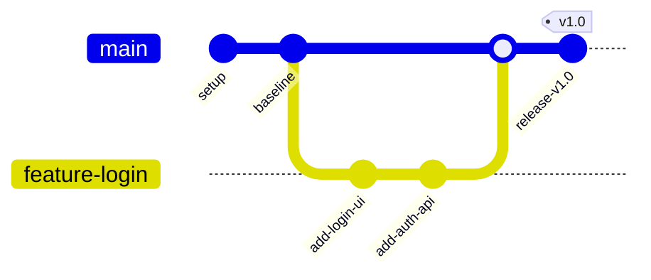
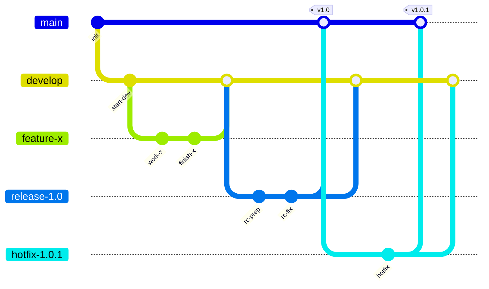
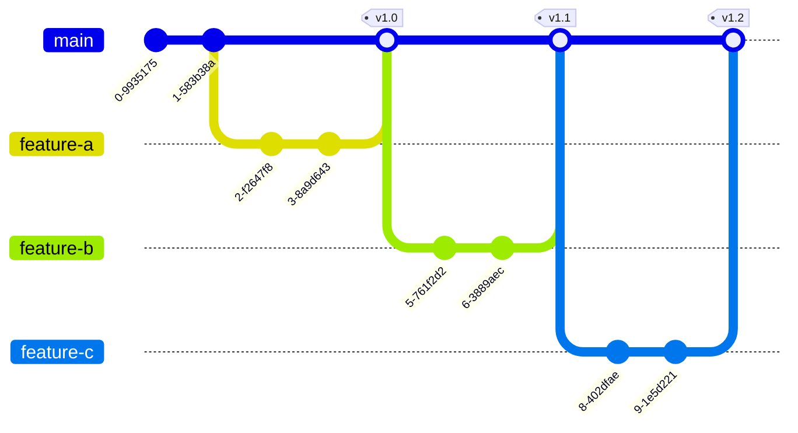
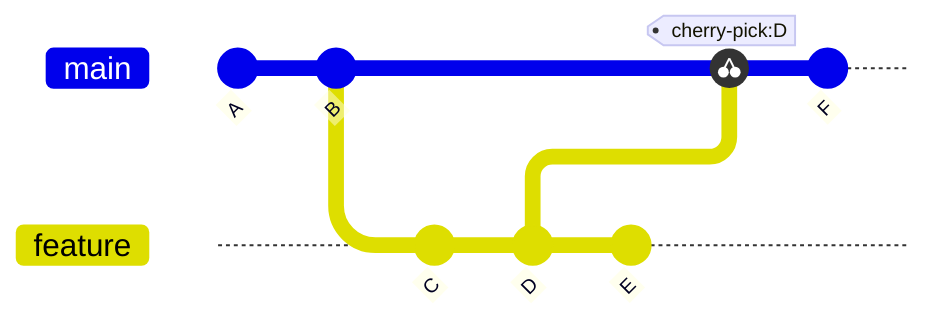
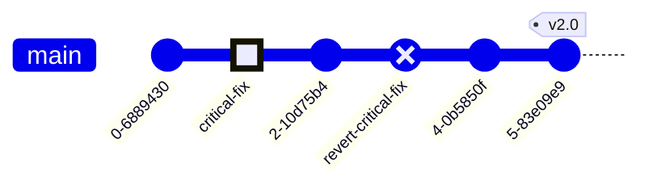

# Git Graph (gitGraph)

Git branch / commit / merge visualization — for explaining branching strategies and release flows.

## When to use

**Best for**:
- Documenting branching strategies (GitFlow / GitHub Flow / trunk-based development)
- Explaining specific release flows (hotfix / feature branch / release branch)
- Teaching git workflows
- Post-mortem analysis of a specific branch history
- Visualizing rebase / merge / cherry-pick workflows

**User query 關鍵字**: git graph / branching / git branches / GitFlow / 分支圖 / 版本分支 / branch strategy / release flow

**Not for**: actual code dependencies (use `structural/class.md`), deployment pipelines (use `flow/flowchart.md`), commit history beyond ~20 commits (use real git log viewer).

## Canonical syntax



**Minimum required**:
- `gitGraph` directive
- At least one `commit` statement

Commits happen on the currently-checked-out branch. Default branch is `main`.

## Configuration options

### Branch operations


### Commit options

```mermaid
commit                           # Basic commit
commit id: "abc123"              # Custom ID
commit tag: "v1.2.0"             # Tagged commit
commit type: REVERSE             # Revert (x circle)
commit type: HIGHLIGHT           # Highlighted (larger circle)
```

### Cherry-pick

```mermaid
cherry-pick id: "abc123"         # Cherry-pick a commit by ID
```

### Init configuration



### Orientation


Use `gitGraph TB` for top-to-bottom (but renders as LR in some versions).

## Obsidian 11.4.1 compatibility

- **Status**: ✅ Full support — gitGraph is stable across Mermaid versions
- **Known quirks**:
  - Complex diagrams with >5 branches get visually crowded — keep simple
  - Very long commit IDs / tags may overflow — keep concise
  - `gitGraph TB` may still render LR (orientation setting unreliable)
  - Parallel merges from multiple branches can look tangled — render each separately if needed
- **Workaround**: for complex branching, consider splitting into multiple smaller gitGraph diagrams showing different aspects

## Quote rule for gitGraph

Mermaid gitGraph requires quoting on **commit IDs** and **tags** — this is the canonical form and all examples in this file already follow that convention:

- **Commit IDs**: `commit id: "initial"` ✅ (always quoted per Mermaid docs)
- **Tags**: `commit tag: "v1.0"` ✅ (always quoted)
- **Cherry-pick IDs**: `cherry-pick id: "abc123"` ✅ (always quoted)
- **Branch names** (`branch develop`, `checkout develop`): identifiers — unquoted. Branch names are references, not display strings
- **Commit type keywords** (`type: REVERSE`, `type: HIGHLIGHT`): enum values — unquoted

## Worked examples

### Example 1: Simple feature branch workflow



### Example 2: GitFlow (feature + release + hotfix)



### Example 3: GitHub Flow (trunk-based, short-lived branches)



### Example 4: Cherry-pick example



### Example 5: Highlight + revert patterns



## Error prevention

| ❌ Wrong | ✅ Right | Reason |
|---|---|---|
| `gitgraph` (lowercase) | `gitGraph` (camelCase) | Directive is case-sensitive |
| `branch featureX && checkout featureX` (shell style) | `branch featureX` then `checkout featureX` on separate lines | Each command on its own line |
| `commit tag v1.0` (no quotes on tag) | `commit tag: "v1.0"` | Tag value needs quotes, with colon |
| `merge featureX id: "foo"` (mixing options) | `merge featureX tag: "v1.0"` or similar | Only certain options valid on merge |
| Implicit branch (no `branch X` declaration) | Declare branch before checkout: `branch featureX` then `checkout featureX` | Can't checkout non-existent branch |
| >5 parallel branches | Simplify or split into multiple diagrams | Visual clutter |
| Long commit IDs | Keep IDs short (<15 chars) | Long IDs overflow the commit dot |

### Pre-save validation

- [ ] `gitGraph` (correct casing) on line 1
- [ ] All branches declared with `branch name` before `checkout`
- [ ] Commit options use `id: "..."` and `tag: "..."` with quotes
- [ ] `merge` statements use branch names that exist
- [ ] Commit count ≤ 20 for readability
- [ ] Parallel branch count ≤ 5
- [ ] Use `type: HIGHLIGHT` and `type: REVERSE` sparingly for emphasis

See also [obsidian-common-quirks.md](../obsidian-common-quirks.md) for universal rules.
