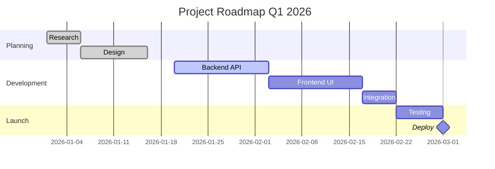
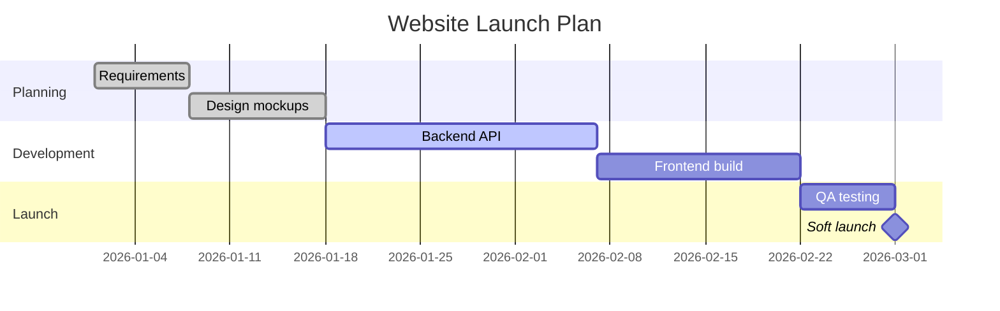
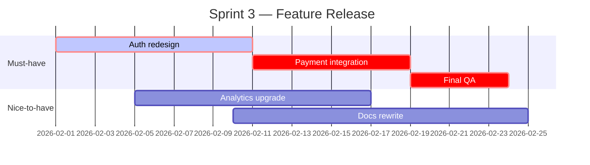
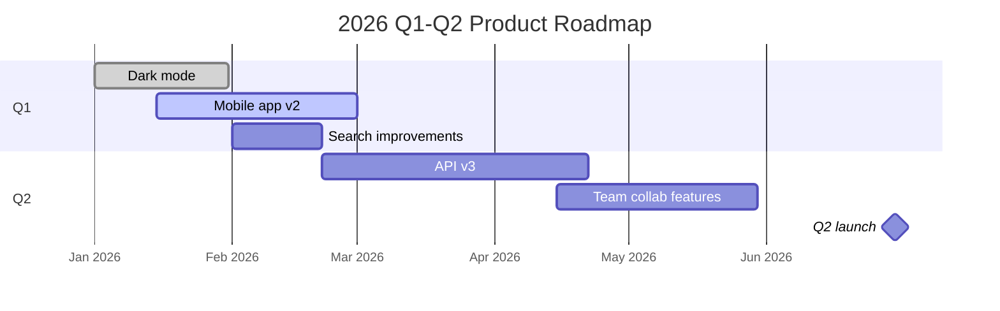
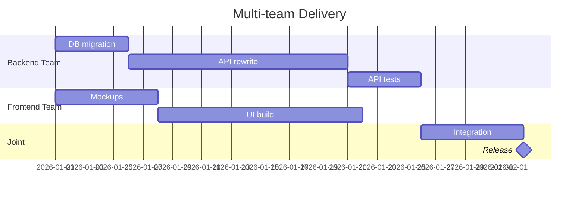
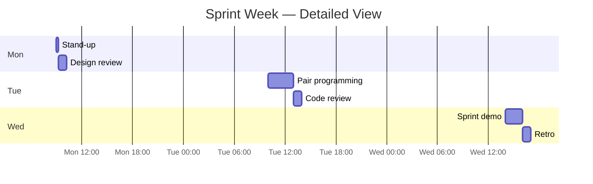

# Gantt Chart

Project schedule — tasks, durations, dependencies, milestones, critical path.

## When to use

**Best for**:
- Project timelines with tasks and dependencies
- Sprint / release planning
- Multi-phase roadmaps with dates
- Team workload allocation over time
- Critical path analysis

**User query 關鍵字**: gantt / gantt chart / 甘特圖 / project schedule / timeline / project plan / roadmap / 專案時程 / 排程

**Not for**: chronology without dependencies (use `time/timeline.md`), sequential process steps (use `flow/flowchart.md`), simple task lists (use Markdown).

## Canonical syntax



**Minimum required**:
- `gantt` directive
- `dateFormat` for parsing dates
- At least one task with start + duration

## Configuration options

### Date format

```mermaid
dateFormat YYYY-MM-DD                # Default ISO
dateFormat DD-MM-YYYY                # European
dateFormat HH:mm                     # Hour-based (short projects)
```

### Axis format (display format)

```mermaid
axisFormat %Y-%m-%d                  # ISO date
axisFormat %m/%d                     # Short
axisFormat %d %b                     # Day + month name (e.g., "15 Jan")
```

### Task declaration

```mermaid
TaskName :status, task_id, start_spec, duration_or_end
```

**Status options** (in order of declaration):
- `done` — completed
- `active` — in progress (highlighted)
- `crit` — critical path (red)
- `milestone` — point-in-time, duration 0

Multiple statuses: `:done, crit` (completed but was critical).

**Start spec**:
- Explicit date: `2026-01-15`
- After another task: `after task_id`
- After multiple: `after task_a task_b` (takes latest end)

**Duration**:
- Days: `7d`
- Weeks: `2w`
- Hours: `4h` (for hourly projects)
- Explicit end date: `until 2026-02-15`

### Sections (grouping)

```mermaid
section Group Name
    TaskA :task_a, 2026-01-01, 5d
    TaskB :task_b, after task_a, 3d

section Another Group
    TaskC :task_c, 2026-01-10, 7d
```

### Milestones (point events)

```mermaid
TaskName :milestone, id, date_or_after, 0d
```

Duration must be `0d` for milestones to render as diamond markers.

### Task dependencies via `after`

```mermaid
TaskA :a, 2026-01-01, 5d
TaskB :b, after a, 3d                # B starts when A ends
TaskC :c, after a b, 4d              # C starts when BOTH A and B end
```

### Today marker

```mermaid
gantt
    title Schedule
    dateFormat YYYY-MM-DD
    todayMarker on          # or "off" to hide
```

## Obsidian 11.4.1 compatibility

- **Status**: ✅ Full support — Gantt is one of Mermaid's oldest diagrams
- **Known quirks**:
  - Very long task names may truncate — keep to 20-30 chars
  - Too many tasks (>30) make the chart cramped — split by section or timeframe
  - Today marker position depends on user's system date when viewing
  - Sections with no tasks may render as empty rows
- **Workaround**: none needed

## Worked examples

### Example 1: Simple 2-month project



### Example 2: With critical path



### Example 3: Quarterly roadmap



### Example 4: Dependencies and parallel tracks



Note: `after apitest ui` — integration waits for BOTH.

### Example 5: Weekly sprint (hour granularity)



## Error prevention

| ❌ Wrong | ✅ Right | Reason |
|---|---|---|
| Missing `dateFormat` | `dateFormat YYYY-MM-DD` on line 2 | Without it, dates can't be parsed |
| Task ID with spaces | Use underscore or camelCase: `backend_api` / `backendApi` | IDs must be single tokens |
| Duration `7 days` (with word) | `7d` (letter code) | Use d/w/h/m suffix |
| `after task1, task2` (with comma) | `after task1 task2` (space-separated) | Multi-dependency uses space |
| Milestone with duration >0 | `:milestone, id, date, 0d` | Milestones must be 0 duration |
| Conflicting statuses | Status order matters: `done, crit` is valid; `crit, done` may parse differently | Put completion status first |

### Pre-save validation

- [ ] `gantt` declared on line 1
- [ ] `dateFormat` specified on line 2 (or near top)
- [ ] All tasks have format `Name :status, id, start, duration`
- [ ] Task IDs are single-token (no spaces)
- [ ] Durations use letter codes: `d`, `w`, `h`, `m`
- [ ] Milestones have `0d` duration
- [ ] `after taskA taskB` for multi-dependency (spaces, no commas)
- [ ] Task count ≤ 30 for readability

See also [obsidian-common-quirks.md](../obsidian-common-quirks.md) for universal rules.
