# Timeline Diagram

Chronology — historical events, version history, project milestones, personal journey.

## When to use

**Best for**:
- Historical timelines (company history, technology evolution)
- Version release history
- Personal / career timelines
- Event sequencing where dependencies don't matter (unlike Gantt)
- Narrative progression with periods and events

**User query 關鍵字**: timeline / chronology / history / 時間軸 / 歷史 / 年表 / version history / career timeline / evolution

**Not for**: project schedules with dependencies (use `time/gantt.md`), process flows (use `flow/flowchart.md`), single-point events (use text).

## Canonical syntax

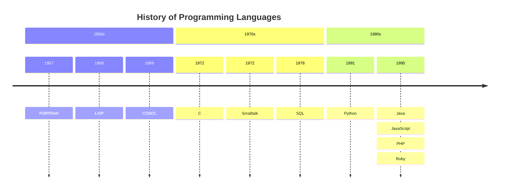

**Minimum required**:
- `timeline` directive
- At least one period or event line

**Syntax**: `period : event1 : event2 : event3` — events separated by colons on same period.

## Configuration options

### Sections

Group periods under thematic headers:

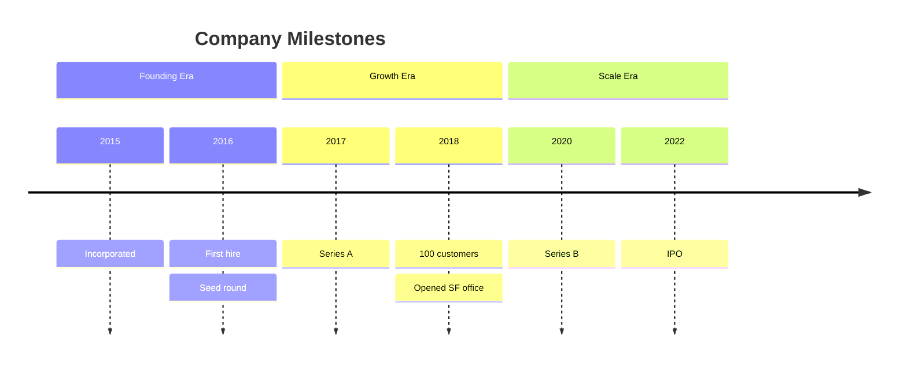

### Single event per period

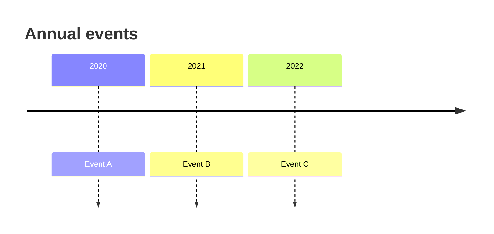

### Multiple events per period (colon-separated)

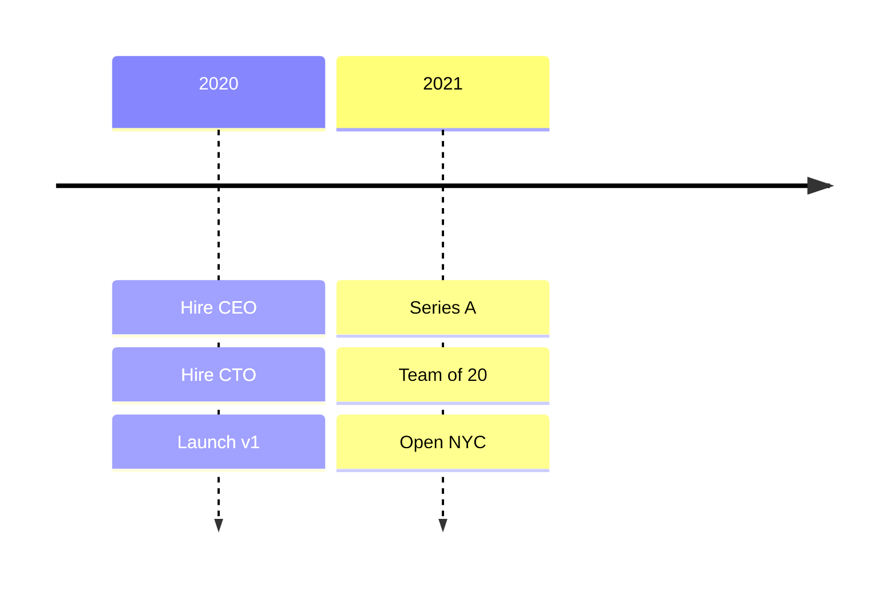

Each colon adds another event to the same period.

### Title

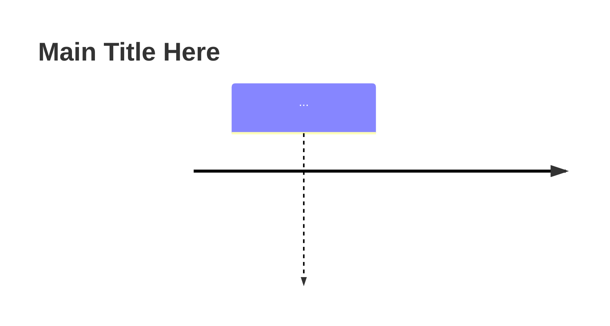

## Obsidian 11.4.1 compatibility

- **Status**: ✅ Full support — timeline added in v10.9, stable
- **Known quirks**:
  - Very long event text wraps awkwardly — keep events ≤ 40 chars each
  - Too many events per period (>5) gets cramped vertically
  - Sections with many periods create horizontal scrolling in narrow preview panes
  - Non-ASCII characters render fine but may affect alignment
- **Workaround**: none needed for standard use

## Quote rule for Timeline

Mermaid timeline treats title / section / period / event text as free-form tokens delimited by newlines or `:`. Wrapping them in `"..."` causes quote characters to render literally in the output.

**Do NOT quote**:
- Title: `title History of Programming Languages` ✅ (NOT `title "..."`)
- Section: `section 1950s` ✅ (NOT `section "1950s"`)
- Period / events: `1957 : FORTRAN` ✅ (NOT `1957 : "FORTRAN"`)
- Multi-event line: `1995 : Java : JavaScript : PHP : Ruby` ✅ — each event is colon-delimited free-form, unquoted

**For CJK content in Timeline**: CJK usually parses throughout, but this is **not guaranteed** in Obsidian's bundled lexer (mermaid-cli is more lenient than Obsidian — a cli pass does not prove an Obsidian pass). No quoting escape exists (quotes render literally); if a label fails in Obsidian, rephrase / romanize it.

**Colon caveat (scoped)**: only a **space-padded ` : `** starts a new event — that is the separator. A bare colon inside event text is safe and does NOT split: `2023 : 開會 9:00 開始` renders as one event, and `2023 : 發布 http://x` keeps the `://` (verified mermaid-cli 2026-06). So only avoid the literal ` : ` (space-colon-space) sequence inside an event; there is no quoting/escape mechanism, so rephrase if you need that exact sequence.

## Worked examples

### Example 1: Technology era timeline

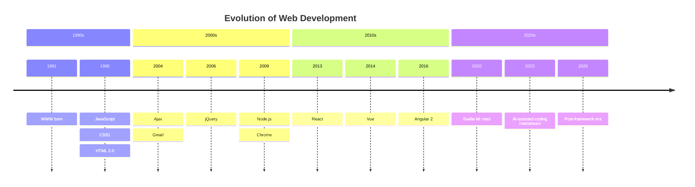

### Example 2: Personal career timeline

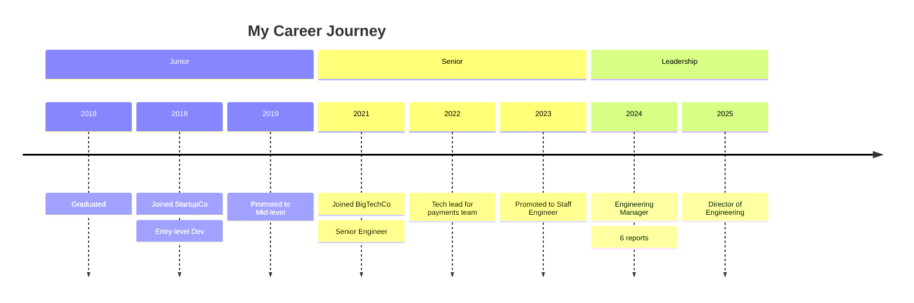

### Example 3: Product release history

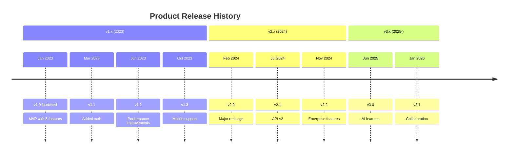

### Example 4: Historical events (world history)

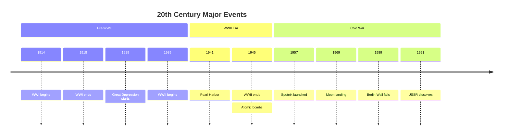

### Example 5: Without sections (simple linear)

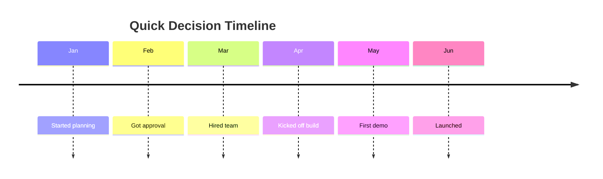

Sections are optional — simple linear timelines work without them.

### Example 6: CJK content (台灣網路業發展簡史 — demonstrates CJK tolerance without quoting)

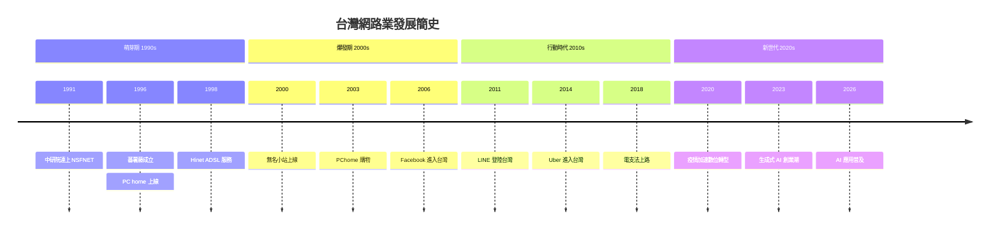

**Important note**: Timeline does NOT support quoting — title, section names, periods, and event text are all free-form tokens delimited by newlines or `:`. CJK works directly without `"..."`. Wrapping CJK in quotes like `section "萌芽期"` would make the quote characters render literally. Avoid colons `:` inside CJK event text since colons are the event separator (use dashes or rephrase if needed).

## Error prevention

| ❌ Wrong | ✅ Right | Reason |
|---|---|---|
| Using `:` without period label: `: event` | `2023 : event` (always have period label first) | Every event line needs a period marker |
| Events with colons in text: `2023 : http://url` | Escape or rephrase to avoid nested colons | Colons are event separators |
| Too many events per period (>5) | Split into multiple periods or use section | Visual clutter |
| Commas instead of colons: `2023 , eventA , eventB` | `2023 : eventA : eventB` | Separator is `:`, not `,` |
| Section header with no events | Add at least one period under each section | Empty sections confuse layout |

### Pre-save validation

- [ ] `timeline` declared on line 1
- [ ] Title optional but recommended
- [ ] Each event line format: `period : event1 : event2 : ...`
- [ ] Events separated by ` : ` (with spaces for readability)
- [ ] ≤ 5 events per period for readability
- [ ] Sections used to group if >8 periods
- [ ] Period labels consistent format (all years OR all months OR all quarters)

See also [obsidian-common-quirks.md](../obsidian-common-quirks.md) for universal rules.
