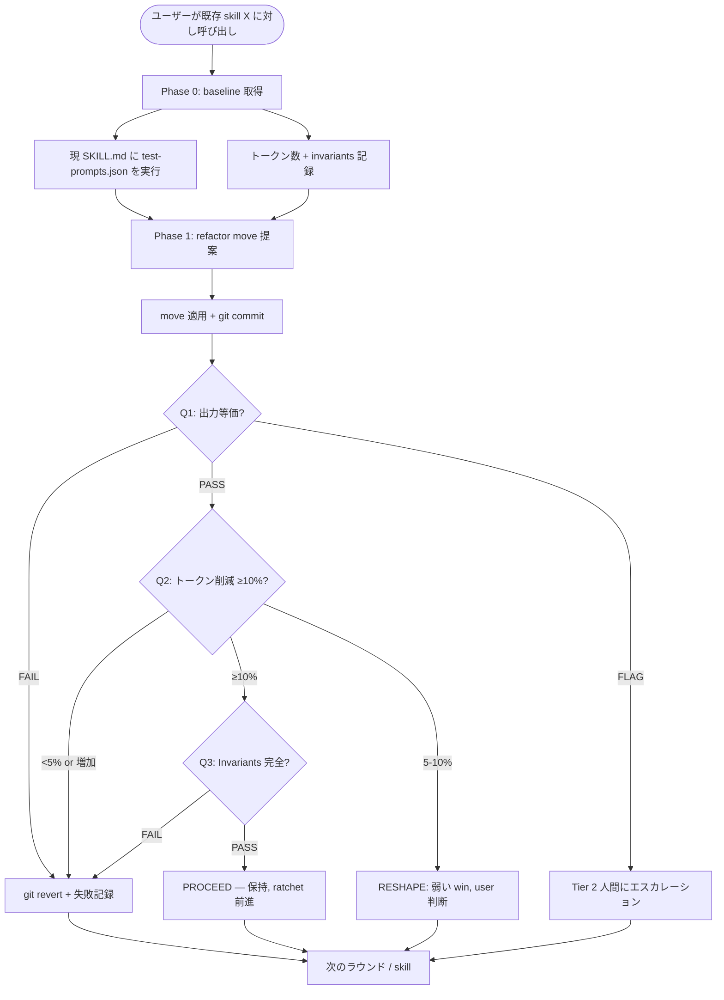

# Skill Refactor

[English](README.md) | **日本語** | [繁體中文](README.zh-TW.md)

> 既存 skill のトークン / 構造リファクタ — 出力動作を保持し、
> multi-judge ensemble + 構造化比較で等価性を証明、退化したら
> git revert で巻き戻し。

ユーザーが明示的に呼び出す **gate skill**：既存 skill の
`SKILL.md` がトークン / cruft を蓄積していて、**skill の動作を
変えずに**短縮 / 整理したいときに呼び出す。出力等価性を hard
precondition として強制し、トークン削減編集は等価検証を通って
からでないと commit されない。

この README は GitHub で読む人間向け。Claude が実際にロードする
operational ファイルは [`SKILL.md`](SKILL.md)。

---

## なぜこの skill が存在するのか？

**繰り返される失敗モード**：skill はトークンを蓄積する。SKILL.md
は編集を重ねるたびに大きくなる。多くの編集は additive — コーナー
ケースを補う、例を加える。結果として：必要以上のトークンを読み込
む skill になり、出力動作は以前と同じ（あるいは悪化 — 長い
prompt はかえって focus を薄める）。

明示的な gate がなければ、編集はデフォルトで *additive* になる。
この skill は additive default を捕まえる規律を、**特にトークン /
構造作業に絞って**凝縮し、動作変更を scope から除外する。

規律は 3 つのチェック：

1. **出力等価性** — 3-judge ensemble + 構造化比較で証明、編集者の
   主張ではない
2. **トークン削減 ≥10%** — 化粧的な微調整は ratchet クレジット
   を得ない
3. **Invariants の保持** — name / dependencies / contract / ファ
   イル構造が不変

3 つのうちどれかが失敗 → `git revert`。**ratchet は前にしか進ま
ない**。

---

## どう動くのか？

### Operational flow の概観



### 3 つのチェック

| チェック | メカニズム | 失敗 → |
|---|---|---|
| **Q1 等価性** | Layer 1 構造（決定論的）+ Layer 2 LLM-judge ensemble（3 コール、フレーム異なり）| REJECT または FLAG (Tier 2) |
| **Q2 トークン削減** | `wc -w` 前後；≥10% しきい値 | REJECT（5-10% は RESHAPE）|
| **Q3 Invariants** | name / dependencies / contract / 構造が不変 | REJECT |

### Verdict 語彙

dev-workflow の他の critique skill と並行：

| Verdict | 条件 | アクション |
|---|---|---|
| **PROCEED** | 3 つ全部厳密に pass | Ratchet 前進、commit 保持 |
| **RESHAPE** | Q2 弱い（5-10%）が Q1+Q3 通過 | user に提示、保持 / 続行を判断 |
| **REJECT** | Q1/Q2/Q3 のいずれか失敗 | `git revert`、results.tsv に記録、次へ |
| (Tier 2) | Q1 ensemble が分裂、明確な fail なし | 人間 review にエスカレーション |

### Multi-judge ensemble（核となる innovation）

LLM-as-judge には既知の失敗モード（verbosity bias、position bias、
self-preference、微妙な変化への鈍感さ）がある。単一 judge による
等価性判定は信頼性に欠ける。この skill は 3 つの judge を異なる
prompt フレーミングで spawn する：

| Judge | Frame | 何を捕まえるか |
|---|---|---|
| 1 | 「user にとって同じ価値か」（utility）| 構造保持 |
| 2 | 「同じ情報集合か」（content）| 暗黙の内容欠落 |
| 3 | 「同じエッジケース処理か」（boundary）| 失われた fallback / warning |

加えて：**specific-behavior-diff override**。単一 judge が
*具体的な*動作変更を引用すると、2/3 多数決を上書きする。これが
「リファクタを装った feature work」を捕まえる仕組み。

完全な protocol：[`references/multi-judge-ensemble.md`](references/multi-judge-ensemble.md)。

---

## いつ使うべきか？

### 以下の場合に呼び出す…

- 既存 skill の SKILL.md が長すぎ / 重複 / cruft があり、整理し
  たい
- 以下のような言葉を打った：
  - 「shorten this skill」
  - 「reduce token count」
  - 「縮減 SKILL.md」
  - 「整理 skill 結構」
  - 「動作を変えずに refactor」
  - 「リファクタ skill / トークン削減」
- リファクタ対象 skill が `test-prompts.json` を持つ（または
  作成可能で）≥3 つの代表的 prompt を含む
- 出力動作を**明示的に**保持したい

### 以下の場合は呼び出**さない**…

- **skill 出力が悪い / 間違っている** → `skill-dev-toolkit:skill-tuning`
  を使う — 品質改善は人間 A/B 必要、等価保持
  リファクタではない
- **phase 追加 / agent 変更 / workflow 再構築** →
  `skill-dev-toolkit:skill-creator-advance` — 構造的書き直しは feature hat
- **新規 skill 作成** → `skill-dev-toolkit:skill-creator-advance`
- **1 行の cosmetic 編集** — 直接編集で十分、gate コストが編集
  コストを超える
- **skill が `test-prompts.json` を持たず user が書きたがらない** —
  等価チェックが走れない、prompt を用意するか
  `skill-creator-advance` で test infra 含めて再設計
- **skill 出力が創造的 / 非決定論的**（文体、散文、デザイン感）—
  等価チェック不信頼、`skill-tuning` を使う

---

## 出力はどんな形？

### Worked Example — skill-creator-advance のトークン膨張

**Input**：ユーザー「skill-creator-advance が 5627 語、soft cap
を大幅超過。リファクタして」。

**Phase 0（baseline）**：
- `test-prompts.json` を取得（3 prompt：作成 / 改善 / description
  optimization）
- 現 skill に対して baseline 実行 → outputs を `<workspace>/baseline/`
  に保存
- トークン数：5627 語
- Invariant snapshot：`name` / 依存 / 構造を記録

**Phase 1, Round 1**：
- Move：Description Optimization セクション（~700 語）を
  `references/description-optimization.md` に抽出
- Git commit
- Q1 ensemble：3/3 say 出力等価（description-opt の使用ケースは
  reference が on-demand で読まれるので動作する）
- Q2：5627 → 4927 = 12.4% 削減 ✓
- Q3：name 不変、依存不変、構造に reference ファイル 1 つ追加
  （許容）✓
- **Verdict: PROCEED**

**Phase 1, Round 2**：
- Move：phase-2 セクション間の散文重複を dedupe
- ...（類似）
- **Verdict: PROCEED**

3 ラウンド後：5627 → 4927 → 4400 → 4100。skill が soft cap 以下
に。出力動作不変。各ラウンド独立に検証済み。

### Worked Example — REJECT すべき refactor

**Input**：ユーザー「この書き換えを試したい — もっと明確だ」。

- Q1 結果：2/3 judges say 出力等価；1 が反対 — 「candidate の
  出力は baseline がやっていた file-permission チェックを skip
  している」
- Q2 結果：5% 削減
- Q3 結果：きれい

反対 judge の理由は**具体的な動作変更**を引用している。2/3 が
等価と投票しても specific-behavior-diff override が起動する。

**Verdict: FLAG → user が反対意見を review**

User が確認 — はい、その「明確な」書き換えは file-permission
チェックを Claude に促していた一節を落とした。リファクタを装った
微妙な動作変更。

→ **このラウンドは REJECT、commit しない**。これが multi-judge
ensemble が存在する理由。

---

## 他の skill との関係は？

この skill は **既存 skill 1 つを動作保持で扱う**。引き渡しは：

- **a proposal-triage gate** — 複数の refactor 提案を
  triage して優先順位付け
- **a complexity / deletion-first gate** — 問いが「そもそも
  refactor すべきか」のとき（smallest-end-state を考えてから
  refactor 呼び出し）
- **`skill-dev-toolkit:skill-creator-advance`** — 変更が構造的
  （phase 追加 / agent 変更 / 再設計）
- **`skill-dev-toolkit:skill-tuning`** — 問いが
  「出力は等価か」から「どちらの出力が良いか」に変わったとき
- **`skill-dev-toolkit:skill-judge`** — オプショナル advisory；
  refactor 前 / 後にスコアを取り、等価チェックが通り続けても
  スコアが落ちれば微妙な taste drift の信号

---

## dev-workflow の中での位置

dev-workflow skill ファミリーは現在こう：

```
proposal-critique  → complexity-critique → skill-creator-advance
（list/plan triage）  （単一変更 gate）        （作成 + 再設計）

skill-judge          skill-refactor       skill-tuning
（advisory スコア）   （Phase A: トークン /  （Phase B: 出力 A/B、
                        構造, 動作保持）       人間 judge）
                                              [PR-3 で追加予定]
```

`skill-refactor`（Phase A）と `skill-tuning`（Phase B）の分割
は、Fowler の Two Hats を skill に適用したもの：refactor は動作
保持、tuning は動作変更。**意図的に分離**することで、LLM-as-judge
が確実に扱えない rubric-mixing を避ける。

---

## Origin / lineage

この skill は **独自設計**、port や fork ではない。

「自律ループ + git ratchet」のコンセプトは
[`alchaincyf/darwin-skill`](https://github.com/alchaincyf/darwin-skill)
（MIT）が広めたもので、これ自体は Andrej Karpathy の
[`autoresearch`](https://github.com/karpathy/autoresearch) に着想
を得ている。

**なぜ独自で派生でないのか**：`darwin-skill` は構造リファクタと
出力品質評価を単一の 8 次元 rubric で混ぜている。この skill
（skill-refactor）は意図的に Phase A（構造 + 動作保持）のみを
扱い、Phase B（出力品質 A/B）は別 skill `skill-tuning`。この
分割は単一 rubric が抱える LLM-as-judge / Goodhart drift 問題
を回避する。

その他の差異：3-judge ensemble + varied framing（vs 単 judge）、
specific-behavior-diff override（vs 多数決）、3 つの具体的問い
（vs 8 次元加重スコア）、Tier 1/2/3 cascade（vs バイナリ
keep/revert）。

完全な design-influence 詳細は [`NOTICE`](NOTICE) を参照。

---

## 既知の限界

| 限界 | 意味 | 緩和 |
|---|---|---|
| **test-prompts.json が必要** | ≥3 文書化 test prompt なしでは gate が走らない | skill が self-abort、user に作成を依頼（または skill-creator-advance で test infra 含め再設計）|
| **LLM-judge は無謬ではない** | 3-judge ensemble でも微妙な動作変更を見逃す可能性 | Specific-behavior-diff override + Tier 2 人間エスカレーション +（オプショナル）golden anchor 錨定 |
| **Token-only metric は粗い** | 30 行の型システムトリックは 100 行のストレートな散文より密度が高いことも | 10% 削減しきい値で tiny-win refactor 防止；実質的 refactor は可視 |
| **創造的 skill では「出力保持」が定義困難** | 文体 / 散文 skill には客観的な「等価」がない | 自動 abort、`skill-tuning` を推奨 |
| **ラウンド間の累積 drift** | 連続 3 回 moderate-confidence PROCEED が微細な drift を複合 | 連続 3 ラウンド moderate 後、累積 diff を人間 review にフラグ |
| **未検証で出荷** | この skill は ≥2 実 skill での dry-run validation 前に出荷 | アーキテクチャ doc §6 の validation gate が OUTSTANDING；PR-2 は PR description にこの caveat 記載 |

---

## License

MIT — [`LICENSE`](LICENSE) と [`NOTICE`](NOTICE)（design-influence
acknowledgments）参照。Repository root：[`../../../../LICENSE`](../../../../LICENSE)。

## Files

```
skill-refactor/
├── README.md           ← English README
├── README.ja.md        ← 本ファイル（日本語）
├── README.zh-TW.md     ← 繁體中文 README
├── SKILL.md            ← operational ファイル（Claude 向け）
├── LICENSE             ← MIT, 独自設計
├── NOTICE              ← darwin-skill との設計差異、inspiration
├── references/
│   ├── equivalence-check-protocol.md   ← Q1 Layer 1+2 詳細
│   ├── multi-judge-ensemble.md         ← 3-judge spawn protocol
│   ├── refactor-moves-catalog.md       ← Fowler-inspired moves
│   ├── golden-anchor-protocol.md       ← 共有 convention（skill-tuning にも）
│   ├── test-prompts-schema.md          ← 共有 convention
│   └── constitution-schema.md          ← 共有 convention
└── scripts/
    ├── equivalence_check.py            ← Layer 1 構造比較
    ├── multi_judge.py                  ← Ensemble 集約 + consensus
    └── golden_compare.py               ← Tier 2 anchor 比較
```

## Bottom Line

出力保持、トークン削減、Invariants 完全。さもなくば revert。

Ratchet は前にしか進まない。
