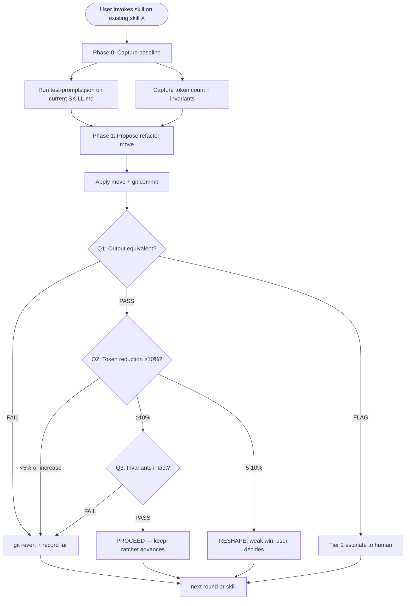

# Skill Refactor

**English** | [日本語](README.ja.md) | [繁體中文](README.zh-TW.md)

> Token / structure refactor for an existing skill — output
> behavior preserved, equivalence proven by multi-judge ensemble +
> structured comparison, ratcheted via git revert on regression.

A user-invoked **gate skill**: when an existing skill's `SKILL.md`
has accumulated tokens / cruft and you want to shrink it without
changing what the skill does, you invoke this skill. It enforces
output equivalence as a hard precondition before any token-saving
edit is committed.

This README is for humans reading the skill on GitHub. The
operational file Claude actually loads is [`SKILL.md`](SKILL.md).

---

## Why does this skill exist?

**The recurring failure mode**: skills accumulate tokens. SKILL.md
files grow over rounds of edits. Most edits are additive — fixing a
corner case here, adding an example there. The result: skills that
take more tokens to load than they need to, with output behavior
that's the same as before (or worse — longer prompts can degrade
focus).

Without an explicit gate, every edit defaults to *additive*. This
skill captures the discipline that catches the additive default
specifically for token / structure work, while ruling out behavior
change as out-of-scope.

The discipline is three checks:

1. **Output equivalence** — proven by 3-judge ensemble + structured
   comparison, not asserted by the editor
2. **Token reduction ≥10%** — cosmetic micro-edits don't earn
   ratchet credit
3. **Invariants preserved** — name / dependencies / contract / file
   structure unchanged

If any of three fails, `git revert`. The **ratchet only turns
forward**.

---

## How does it work?

### Operational flow at a glance



### The three checks

| Check | Mechanism | Failure → |
|---|---|---|
| **Q1 Equivalence** | Layer 1 structural (deterministic) + Layer 2 LLM-judge ensemble (3 calls, varied framing) | REJECT or FLAG (Tier 2) |
| **Q2 Token reduction** | `wc -w` before vs after; ≥10% threshold | REJECT (or RESHAPE if 5-10%) |
| **Q3 Invariants** | Name / dependencies / contract / structure unchanged | REJECT |

### The verdict vocabulary

Parallel to dev-workflow's critique skills:

| Verdict | When | Action |
|---|---|---|
| **PROCEED** | All 3 checks strict pass | Ratchet advances; commit kept |
| **RESHAPE** | Weak Q2 (5-10% reduction) but Q1+Q3 pass | Show user; decide keep or further-refactor |
| **REJECT** | Any of Q1/Q2/Q3 fails | `git revert`; record in results.tsv; move on |
| (Tier 2) | Q1 ensemble disagrees but no clear fail | Escalate to human review |

### Multi-judge ensemble (the load-bearing innovation)

LLM-as-judge has known failure modes (verbosity bias, position bias,
self-preference, insensitivity to subtle change). Single-judge
verdicts on equivalence are unreliable. This skill runs 3 judges
with varied prompt framing:

| Judge | Frame | What it catches |
|---|---|---|
| 1 | "Same value to user" (utility) | Structural preservation |
| 2 | "Same information set" (content) | Silent content drops |
| 3 | "Same edge-case handling" (boundary) | Lost fallbacks / warnings |

Plus: **specific-behavior-diff override**. A single judge citing a
*concrete* behavior change outranks 2/3 numeric majority. This is
what catches refactors that smuggle feature work.

Full protocol: [`references/multi-judge-ensemble.md`](references/multi-judge-ensemble.md).

---

## When should you use it?

### Invoke when…

- An existing skill's SKILL.md is too long / repetitive / cruft-y
  and you want to trim
- You typed something like:
  - "shorten this skill"
  - "reduce token count"
  - "縮減 SKILL.md"
  - "整理 skill 結構"
  - "refactor without changing behavior"
  - "リファクタ skill / トークン削減"
- The skill you want to refactor has (or can have) a
  `test-prompts.json` with ≥3 representative prompts
- You explicitly want output behavior preserved

### Don't invoke when…

- **Skill output is bad / wrong** — use
  `skill-dev-toolkit:skill-tuning` — taste
  improvement requires human-judged A/B, not equivalence-preserving
  refactor
- **You want to add a phase / change agent / restructure
  workflow** — use `skill-dev-toolkit:skill-creator-advance` — structural
  rewrite is feature-hat work
- **Creating a new skill** — use `skill-dev-toolkit:skill-creator-advance`
- **Single-line cosmetic edits** — just edit directly; the gate cost
  exceeds the change cost
- **Skill has no `test-prompts.json` and user won't write one** —
  the equivalence check can't run; either provide test prompts or
  use `skill-creator-advance` to redesign with proper test infra
- **Skill output is creative / non-deterministic** (writing style,
  prose, design feel) — equivalence check unreliable; use
  `skill-tuning`

---

## What does the output look like?

### Worked Example — token bloat in skill-creator-advance

**Input**: User says "skill-creator-advance is at 5627 words, way
over the soft cap. Refactor it."

**Phase 0 (baseline)**:
- Capture `test-prompts.json` (3 prompts: creation / improvement /
  description optimization)
- Run baseline against current skill → outputs in `<workspace>/baseline/`
- Token count: 5627 words
- Invariant snapshot: `name` / dependencies / structure recorded

**Phase 1, Round 1**:
- Move: extract Description Optimization section (~700 words) to
  `references/description-optimization.md`
- Git commit
- Q1 ensemble: 3/3 say outputs equivalent (description-opt use case
  still works because reference loads on demand)
- Q2: 5627 → 4927 = 12.4% reduction ✓
- Q3: name unchanged, dependencies unchanged, structure adds one
  reference file (allowed) ✓
- **Verdict: PROCEED**

**Phase 1, Round 2**:
- Move: dedupe prose between two phase-2 sections
- ... (similar)
- **Verdict: PROCEED**

After 3 rounds: 5627 → 4927 → 4400 → 4100. Skill back under soft
cap. Output behavior unchanged. Each round individually verified.

### Worked Example — refactor that should be REJECT

**Input**: User says "let me try this rewording — it's clearer".

- Q1 result: 2/3 judges say outputs equivalent; 1 dissents — "the
  candidate's output skips the file-permission check that the
  baseline performed"
- Q2 result: 5% reduction
- Q3 result: clean

The dissenting judge's reason cites a **specific behavior change**.
This triggers the specific-behavior-diff override even though 2/3
voted equivalent.

**Verdict: FLAG → user reviews dissent**

User examines and confirms — yes, the "clearer" rewording dropped a
phrase that nudged Claude to perform the file-permission check.
Subtle behavior change masked as refactor.

→ **REJECT this round; do not commit.** This is what the
multi-judge ensemble exists to catch.

---

## How does it relate to other skills?

This skill operates on **a single existing skill, with output
preserved**. Hand off when:

- **a proposal-triage gate** — when faced with multiple
  refactor proposals, triage which to do first
- **a complexity / deletion-first gate** — when the question is
  "should we even refactor this skill at all" (smallest-end-state
  thinking before invoking refactor)
- **`skill-dev-toolkit:skill-creator-advance`** — when the change is
  structural (add phase, change agents, redesign workflow)
- **`skill-dev-toolkit:skill-tuning`** — when the
  question turns from "are outputs equivalent" to "which output is
  better"
- **`skill-dev-toolkit:skill-judge`** — optional advisory check before /
  after refactor; if score drops while equivalence keeps passing,
  signal of subtle taste-drift the equivalence check missed

---

## Where in skill-dev-toolkit does this fit?

The skill-authoring lifecycle (all in `skill-dev-toolkit`):

- `skill-creator-advance` — creation + redesign
- `skill-judge` — advisory design score
- `skill-refactor` — Phase A: token / structure refactor, output preserved
- `skill-tuning` — Phase B: output A/B, human judge, preference log
- `dogfood-skill-testing` — blind behavioral test

The general critique gates (`proposal-critique` / `complexity-critique`)
stay in `dev-workflow`.

The split between `skill-refactor` (Phase A) and `skill-tuning`
(Phase B) reflects Fowler's Two Hats applied to skills: refactor
preserves behavior, tuning changes it. They are deliberately
separate skills to prevent rubric-mixing that LLM-as-judge cannot
reliably handle.

---

## Origin / lineage

This skill is **original design**, not a port or fork.

The "autonomous loop with git ratchet" concept was popularized by
[`alchaincyf/darwin-skill`](https://github.com/alchaincyf/darwin-skill)
(MIT), which was itself inspired by Andrej Karpathy's
[`autoresearch`](https://github.com/karpathy/autoresearch).

**Why this is original, not derivative**: `darwin-skill` mixes
structural refactoring with output quality evaluation in a single
8-dim rubric. This skill (skill-refactor) deliberately handles only
Phase A (structure with output preservation); Phase B (output
quality A/B) is the separate `skill-tuning` skill. The split avoids
the LLM-as-judge / Goodhart drift that monolithic taste-rubrics
produce.

Other distinctions: 3-judge ensemble + varied framing (vs single
judge), specific-behavior-diff override (vs majority rules), three
concrete questions (vs 8-dim weighted score), Tier 1/2/3 cascade
(vs binary keep/revert).

Full design-influence detail in [`NOTICE`](NOTICE).

---

## Known limitations

| Limitation | What it means | Mitigation |
|---|---|---|
| **Requires test-prompts.json** | Skills without ≥3 documented test prompts can't run the gate. | Skill self-aborts and asks user to write prompts (or use skill-creator-advance to redesign with test infra). |
| **LLM-judge is not infallible** | Even 3-judge ensemble can miss subtle behavior changes. | Specific-behavior-diff override + Tier 2 human escalation + (optional) golden anchor anchoring. |
| **Token-only metric is coarse** | A 30-line type-system trick may be denser than 100 lines of straightforward prose. | The 10% reduction threshold prevents tiny-win refactors; substantial refactors are visible. |
| **Output preservation is ill-defined for creative skills** | Skills producing prose / writing style have no objective "equivalent". | Self-aborts and recommends `skill-tuning` for those skills. |
| **Cumulative drift across rounds** | 3 consecutive moderate-confidence PROCEEDs can compound subtle drift. | Auto-flag for human review of cumulative diff after 3 such rounds. |
| **Validation not yet performed** | This skill ships before dry-run validation against ≥2 real skills. | Validation gate per architecture doc §6 is OUTSTANDING; PR-2 ships with this caveat noted in PR description. |

---

## License

MIT — see [`LICENSE`](LICENSE) and [`NOTICE`](NOTICE) for design-
influence acknowledgments. Repository root: [`../../../LICENSE`](../../../LICENSE).

## Files

```
skill-refactor/
├── README.md           ← this file (English)
├── README.ja.md        ← 日本語 README
├── README.zh-TW.md     ← 繁體中文 README
├── SKILL.md            ← operational file (for Claude)
├── LICENSE             ← MIT, original design
├── NOTICE              ← design distinctions vs darwin-skill, inspirations
├── references/
│   ├── equivalence-check-protocol.md   ← Q1 Layer 1+2 details
│   ├── multi-judge-ensemble.md         ← 3-judge spawn protocol
│   ├── refactor-moves-catalog.md       ← Fowler-inspired moves
│   ├── golden-anchor-protocol.md       ← shared convention (also in skill-tuning)
│   ├── test-prompts-schema.md          ← shared convention
│   └── constitution-schema.md          ← shared convention
└── scripts/
    ├── equivalence_check.py            ← Layer 1 structural comparison
    ├── multi_judge.py                  ← Ensemble aggregation + consensus
    └── golden_compare.py               ← Tier 2 anchor comparison
```

## Bottom Line

Output preserved. Tokens shrunk. Invariants intact. Or revert.

The ratchet only turns forward.
