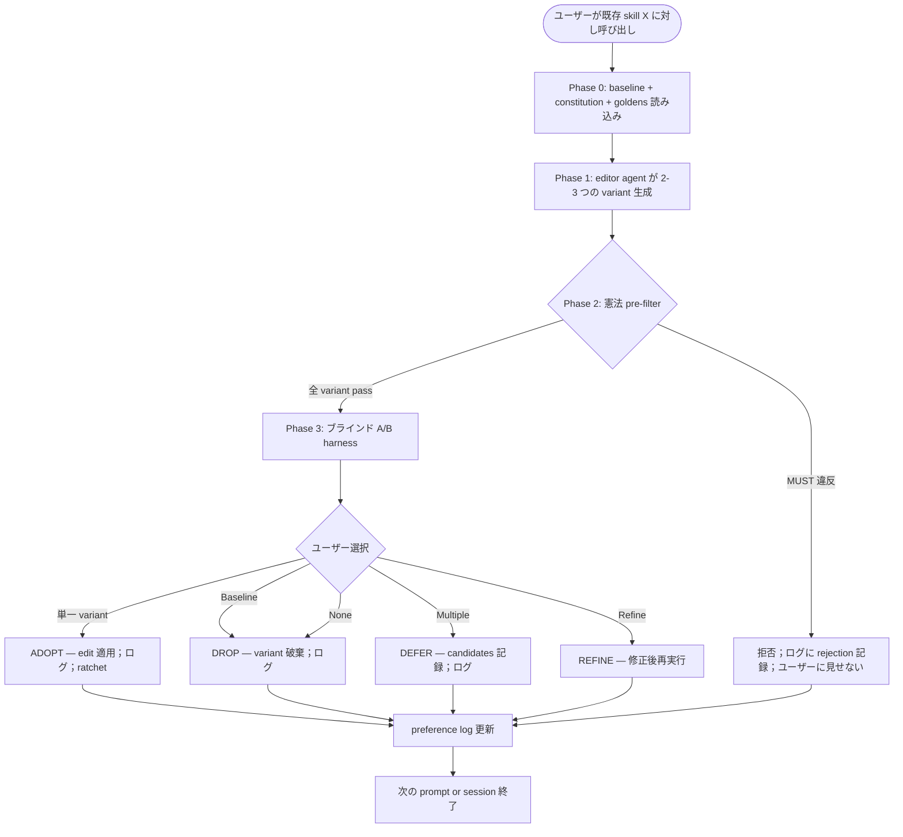

# Skill Tuning

[English](README.md) | **日本語** | [繁體中文](README.zh-TW.md)

> 既存 skill の出力品質 A/B — 異なる出力傾向の variant を生成、
> ブラインドで実行、ユーザーの好みを捕捉。Constitution が床、
> taste が天井、preference log は RLHF-lite データセットとして
> 蓄積。

ユーザーが明示的に呼び出す **gate skill**：既存 skill の出力が
ピンとこない — トーンが違う、平坦、スタイルがズレている — variant
を試して実際に良い版を選びたいときに呼び出す。ブラインド比較 +
イテレーションごとの人間判断 + 永続的な選好記録を強制する。

この README は GitHub で読む人間向け。Claude が実際にロードする
operational ファイルは [`SKILL.md`](SKILL.md)。

---

## なぜこの skill が存在するのか？

**繰り返される失敗モード**：skill 出力には *taste-sensitive な
次元*（スタイル、声、トーン、リズム、説得力）があり、LLM-as-judge
が信頼性を持って評価できない。「機能する」skill でも平坦・
トーンが違う・ユーザーが望むものでない出力を産むことがある。
そういう skill を改善するには、ルール追従ではなく**人間の選好
シグナル**が必要。

この skill は [`skill-refactor`](../skill-refactor/) の refactor
hat に対する **feature hat** 対偶：refactor は動作を保持する
（LLM-as-judge で等価性を検証 — LLM が得意なバイナリチェック）、
tuning は意図的に動作を変えて良い出力を探す（人間判断を使う —
taste はまさに LLM-as-judge が失敗する領域）。

この分割は基礎的。

---

## どう動くのか？

### Operational flow の概観



### 4 つの phase

| Phase | メカニズム | 出力 |
|---|---|---|
| **0 Baseline** | test-prompts.json + constitution.md +（オプション）goldens 読み込み；baseline 実行 | Baseline 出力 + invariants 記録 |
| **1 Variant 生成** | feature-hat prompt で editor subagent を spawn；ラウンドごとに 2-3 variant | 候補 SKILL.md edit + named dimension |
| **2 憲法 pre-filter** | 各 variant を代表的 prompt で MUST / MUST NOT に対してテスト | 通過 / 失敗（理由付き）|
| **3 ブラインド A/B harness** | ランダム label 割り当て；side-by-side 表示；ユーザーが single / multiple / none / refine 選択 | ユーザー選択 + 復号 identity |

### Verdict 語彙

dev-workflow の critique skill と並行：

| Verdict | 条件 | アクション |
|---|---|---|
| **ADOPT** | ユーザーが non-baseline variant を好む | edit 適用；ratchet；preference ログ |
| **DROP** | ユーザーが baseline を好む or 全 variant 悪い | variant 破棄；baseline 保持；ログ |
| **DEFER** | 複数 variant が好まれる（単一勝者なし）| candidates 記録；即時変更なし |
| **REFINE** | ユーザーが異なる入力 / variant 必要 | 再実行；まだ判断せず |
| **ESCALATE** | Multi-evaluator 不一致 >30% | ブロック；human-to-human で解決 |

**Auto-revert なし**。skill-refactor（LLM equivalence チェックが
auto-revert を駆動）と異なり、skill-tuning は人間 ADOPT が
ない限り何も ship しない。人間選択の不在 = 変更なし。

### 憲法判定（床）

Skill の `constitution.md` は MUST / MUST NOT 条項を列挙。MUST に
違反する variant は **ユーザーが見る前にフィルタ** される — Phase
3 A/B には到達しない。これは preference log を保護する：各エントリ
が純粋な taste シグナルを表し、契約違反シグナルではないことを保証。

完全なメカニズムは
[`references/constitutional-judging.md`](references/constitutional-judging.md)。

### Preference log → self-trained judge（H4）

各選択は完全な context（label 割り当て、却下 variant、憲法拒否
記録、決定時間、ユーザーノート）と共にログされる。時間とともに
preference-pair データセットに蓄積。

単一 skill で ≥1000 ADOPT エントリに達すると、データセットは
**domain-specific preference model** の訓練入力になる — どんな
汎用 LLM judge よりもユーザー taste に近い self-trained judge。

パイプラインは **v1.7.0 では scaffolded だが未稼働**。完全計画は
[`references/self-trained-judge-pipeline.md`](references/self-trained-judge-pipeline.md)。

---

## いつ使うべきか？

### 以下の場合に呼び出す…

- Skill 出力がピンとこない — トーン違い、平坦、汎用すぎ
- 別 phrasing / 構造 / 声を試したい
- 出力がラウンドごとに**異なってよい**ことを明示的に受容
  （これが目的）
- 以下のような言葉を打った：
  - 「improve skill output」
  - 「A/B test variants」
  - 「改善 skill 輸出」
  - 「風格優化」
  - 「出力品質を改善」
  - 「this output isn't quite right — let me try alternatives」
- 対象 skill が `test-prompts.json` を持つ（または作成可能で）
  +（強く推奨）`constitution.md`

### 以下の場合は呼び出**さない**…

- **出力動作を保持したい** → [`skill-refactor`](../skill-refactor/)
  （Phase A：トークン / 構造 refactor + 等価性）を使う
- **構造的再設計**（phase 追加 / agent 変更）→
  `skill-creator-advance` を使う
- **新規 skill 作成** → `skill-creator-advance` を使う
- **出力が決定論的 / 機械的**（ファイル変換、JSON spec、固定
  フォーマット report）→ 出力はバイナリ正誤；taste 次元なし；
  tuning は overkill
- **シングルイテレーションの vibes-check** → 一回限りの「これで
  合ってる？」のために preference log を蓄積しない；直接編集
- **constitution も test prompts もない skill** → gate が安全に
  動かない；先に基盤作業を推奨

---

## 出力はどんな形？

### Worked Example — status-report skill のトーン改善

**Input**：ユーザー「status-report skill が乾いた、形式的な散文を
出す。情報密度を保ちながら、もっと温かく直接的な出力が欲しい」。

**Phase 0**：test prompt（週次 update / blocker post / shipping
announcement の 3 つ）読み込み；constitution 読み込み（MUST「3 つ
の事実：shipped / in flight / blocked を含む」；MUST NOT「メトリク
ス捏造禁止」）；baseline 実行。

**Phase 1**：3 つの variant 生成 —
- A：同じ内容、会話的トーン（短縮形、短文）
- B：箇条書き先行、散文減
- C：人間ストーリーで導入、その後事実

**Phase 2**：憲法チェック — 3 つすべて pass（3 事実カバレッジ、
捏造なし）。

**Phase 3**：ランダム label でブラインド A/B。ユーザーが「A か C、
どちらも合う；B はスカスカ」と選択。

**Verdict**：DEFER（複数選択）— A と C を candidates として記録。
Round 2 で A/C スタイル variant 生成；ユーザーが A を選択。Round
3 で確認；ADOPT。

3 ラウンド後：skill が温かくも密度のある status report を出力；
preference log に 9 エントリ；この context での「温かさ」の意味の
永続的記録。

### Worked Example — 憲法に拒否された variant

ユーザーが inventory-snapshot skill の variant を希望。生成された
variant C は「我々は約 200 個の widget といくつかの sprocket を
持っています...」と言う。

Phase 2 が捕捉：MUST「全数量は入力からの正確な整数でなければ
ならない」に違反。Variant C はユーザーが見る前にフィルタされる。

ユーザーに通知：「variant C は生成されたが、数量を概算
（『約 200』『いくつかの』）したため、skill の正確性要件に違反する
ため拒否された。」

A と B が A/B に進む。ユーザーが A を選択。

**これが憲法を床とすること**：ユーザーが*好んだかもしれない*
variant（より温かい散文）が、譲歩できない正確性契約を破るため
フィルタされる。

---

## 他の skill との関係は？

- **`skill-dev-toolkit:skill-refactor`** — 姉妹 Phase A skill；動作
  保持、LLM-judge 等価；tuning は動作変更、人間 judge。組み合わ
  せ可能：先に refactor でトークンを縮め、次に taste で品質最適化。
- **`skill-dev-toolkit:skill-creator-advance`** — tuning が同じ形状
  内で好まれる出力の variant がないことを示すとき、再設計に hand off。
- **`skill-dev-toolkit:skill-judge`** — variants への advisory チェック
  （advisory のみ；taste は理解しない）。
- **a voice-anchor curation discipline** — コピーライティングの
  対応概念；この skill はその curation 規律を借りる。
- **a proposal-triage gate** — 複数 tuning 提案を
  triage するとき。

---

## skill-dev-toolkit の中での位置

skill オーサリングのライフサイクル（すべて `skill-dev-toolkit`）：

- `skill-creator-advance` — 作成 + 再設計
- `skill-judge` — advisory 設計スコア
- `skill-refactor` — Phase A: トークン / 構造のリファクタ、動作保持
- `skill-tuning` — Phase B: 出力 A/B、人間 judge、preference log
- `dogfood-skill-testing` — ブラインド挙動テスト

汎用 critique gate（`proposal-critique` / `complexity-critique`）は
`dev-workflow` に残ります。

`skill-refactor`（Phase A）と `skill-tuning`（Phase B）の分割は
基礎的 — Fowler の Two Hats を skill に適用：refactor は動作保持、
tuning は動作変更。これらを 1 つの skill に混ぜる（`darwin-skill`
が 8 次元 rubric でやるように）と、LLM-as-judge が taste-sensitive
次元で信頼性を失う。分けることで各ツールが正しい評価レジームを
使える。

---

## Origin / lineage

**独自設計**、port や fork ではない。

この skill を informed した自律ループ概念は：
- Andrej Karpathy の [`autoresearch`](https://github.com/karpathy/autoresearch) — 原型
- alchaincyf の [`darwin-skill`](https://github.com/alchaincyf/darwin-skill) — Claude Agent Skills への最初の応用

この skill の設計は独立。注目すべき差異（完全リストは [`NOTICE`](NOTICE)）：

1. **Phase B 隔離** — taste-sensitive A/B のみ扱う
2. **Human-in-loop 不可スキップ** 各イテレーション
3. **憲法 pre-filter** が床
4. **ランダム label のブラインド A/B** position-bias 緩和
5. **4 オプション捕捉**（single / multiple / none / refine）
6. **Preference log を RLHF-lite データセットとして** 訓練 judge 用
7. **Self-trained judge scaffold**（H4 軌跡）
8. **Auto-revert なし** — taste は信頼できる auto-revoke 不可

---

## 既知の限界

| 限界 | 意味 | 緩和 |
|---|---|---|
| **イテレーションごとに人間時間が必要** | 各ラウンドに人間選択；バックグラウンド実行不可 | session ごとに 3-5 round 上限；休憩推奨；高価値 skill のみ |
| **Self-trained judge 未稼働** | パイプライン scaffolded だが ≥1000 エントリで活性 | LLM-judge advisory を pre-filter として継続；ログ蓄積後に再訪 |
| **憲法チェックはバイナリ** | あいまいな MUST 条項は主観判断を強いる | あいまい MUST をテスト可能ルールに書き直すよう推奨（anti-pattern 文書化）|
| **User taste は時間とともにドリフト** | 何年も前の好みは valid でないかも | Time-decay weighting（計画中）；per-skill スコープが cross-context drift を制限 |
| **シングル evaluator 実行** | 1 人の taste は team の taste でないかも | Multi-evaluator extension 対応；実務では稀だが利用可能 |
| **Variant 生成は editor agent 品質に依存** | 悪い variant → A/B ラウンド浪費 | より強い dimension 指示で再生成；variant 空間を広げる |

---

## License

MIT — [`LICENSE`](LICENSE) と [`NOTICE`](NOTICE)（design-influence
acknowledgments）参照。Repository root：[`../../../LICENSE`](../../../LICENSE)。

## Files

```
skill-tuning/
├── README.md           ← English README
├── README.ja.md        ← 本ファイル（日本語）
├── README.zh-TW.md     ← 繁體中文 README
├── SKILL.md            ← operational ファイル（Claude 向け）
├── LICENSE             ← MIT, 独自設計
├── NOTICE              ← darwin-skill との設計差異、inspirations
├── references/
│   ├── ab-harness-protocol.md         ← Phase 3 ブラインド A/B メカニクス
│   ├── constitutional-judging.md      ← Phase 2 pre-filter メカニクス
│   ├── preference-log-schema.md       ← JSONL フォーマット + 保持
│   ├── self-trained-judge-pipeline.md ← H4 horizon scaffold
│   ├── golden-anchor-protocol.md      ← 共有 convention（functional copy）
│   ├── test-prompts-schema.md         ← 共有 convention（functional copy）
│   └── constitution-schema.md         ← 共有 convention（functional copy）
└── scripts/
    ├── ab_harness.py        ← Phase 3 ブラインド A/B オーケストレーション
    ├── preference_log.py    ← JSONL append/query/aggregate
    └── judge_train_stub.py  ← H4 stub（≥1000 エントリ前 fail fast）
```

## Bottom Line

```
Constitution は床、taste は天井。
ユーザーが選んだ variant は ship；選ばなかった variant もシグナル
としてログ。
ここでの ratchet は preference log — 蓄積するのみ。
```
