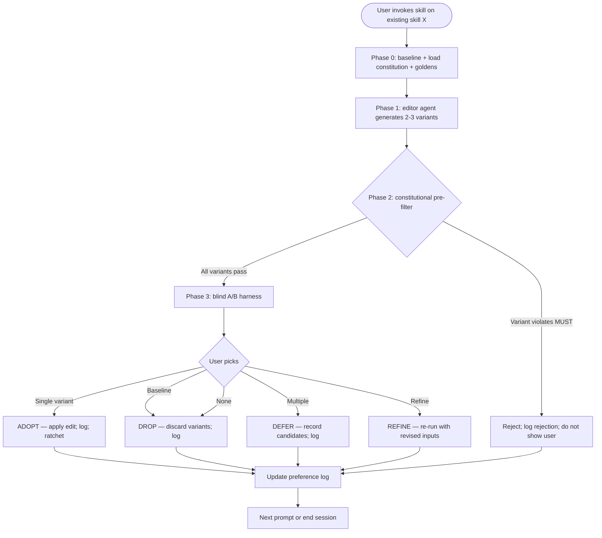

# Skill Tuning

**English** | [日本語](README.ja.md) | [繁體中文](README.zh-TW.md)

> Output quality A/B for an existing skill — generate variants
> with different output traits, run them blind, capture the user's
> preference. Constitution is the floor; taste is the ceiling.
> Preference log accumulates as RLHF-lite dataset.

A user-invoked **gate skill**: when an existing skill's output
feels off — wrong tone, flat prose, off-style — and you want to
explore variants and pick the one that's actually better, you
invoke this skill. It enforces blind comparison + per-iteration
human judgment + durable preference logging.

This README is for humans reading the skill on GitHub. The
operational file Claude actually loads is [`SKILL.md`](SKILL.md).

---

## Why does this skill exist?

**The recurring failure mode**: skill outputs have *taste-sensitive
dimensions* (style, voice, tone, rhythm, persuasive force) that
LLM-as-judge cannot reliably evaluate. A skill that "works" can
still produce outputs that are flat, off-tone, or just not what
the user wanted. Improving such skills requires **human preference
signal**, not more rule-following.

This skill is the **feature hat** counterpart to
[`skill-refactor`](../skill-refactor/)'s refactor hat: where
refactor preserves behavior (and uses LLM-as-judge to verify
equivalence — a binary check LLMs handle well), tuning
deliberately changes behavior to find better outputs (and uses
human judgment because taste is exactly where LLM-as-judge fails).

The split is foundational.

---

## How does it work?

### Operational flow at a glance



### The 4 phases

| Phase | Mechanism | Output |
|---|---|---|
| **0 Baseline** | Load test-prompts.json + constitution.md + (optional) goldens; run baseline | Baseline outputs + invariants captured |
| **1 Variant generation** | Spawn editor subagent with feature-hat prompt; generate 2-3 variants per round | Candidate SKILL.md edits with named dimensions |
| **2 Constitutional pre-filter** | For each variant, test against MUST / MUST NOT clauses on representative prompts | Variants that pass / variants that fail (and why) |
| **3 Blind A/B harness** | Random label assign; show side-by-side; user picks single / multiple / none / refine | User pick + decoded identity |

### Verdict vocabulary

Parallel to dev-workflow's critique skills:

| Verdict | When | Action |
|---|---|---|
| **ADOPT** | User prefers a non-baseline variant | Apply edit; ratchet; log preference |
| **DROP** | User prefers baseline OR all variants worse | Discard variants; preserve baseline; log |
| **DEFER** | Multiple variants preferred (no single winner) | Record candidates; no immediate change |
| **REFINE** | User needs different test inputs / variants | Re-run; no decision yet |
| **ESCALATE** | Multi-evaluator disagreement >30% | Block; resolve human-to-human |

**No auto-revert.** Unlike skill-refactor (where LLM equivalence
check drives auto-revert), skill-tuning requires a human ADOPT
to ship anything. Absence of human pick = no change.

### Constitutional judging (the floor)

A skill's `constitution.md` lists MUST / MUST NOT clauses.
Variants violating MUSTs are **filtered before the human sees
them** — they never reach Phase 3 A/B. This protects the
preference log: every entry represents a pure taste signal, not
a contract-violation signal.

See [`references/constitutional-judging.md`](references/constitutional-judging.md)
for the full mechanic.

### Preference log → self-trained judge (H4)

Every pick is logged with full context (label assignment,
rejected variants, constitutional rejection record, decision
time, user notes). Over time, the log accumulates into a
preference-pair dataset.

At ≥1000 ADOPT entries for a single skill, the dataset becomes
training input for a **domain-specific preference model** — a
self-trained judge that approximates the user's taste better
than any general LLM judge can.

The pipeline is **scaffolded but not active in v1.7.0**. See
[`references/self-trained-judge-pipeline.md`](references/self-trained-judge-pipeline.md)
for the full plan.

---

## When should you use it?

### Invoke when…

- Skill output feels off — wrong tone, flat, generic
- You want to try alternative phrasings / structures / voices
- You explicitly accept that **outputs may differ** between rounds
  (this is the point)
- You typed something like:
  - "improve skill output"
  - "A/B test variants"
  - "改善 skill 輸出"
  - "風格優化"
  - "出力品質を改善"
  - "this output isn't quite right — let me try alternatives"
- The target skill has (or can have) `test-prompts.json` + (highly
  recommended) `constitution.md`

### Don't invoke when…

- **Want to preserve output behavior** — use [`skill-refactor`](../skill-refactor/)
  (Phase A: token / structure refactor with equivalence)
- **Want structural redesign** (add phase, change agents) — use
  `skill-creator-advance`
- **Creating a new skill** — use `skill-creator-advance`
- **Output is deterministic / mechanical** (file transforms, JSON
  spec, fixed-format report) — output is binary correct/incorrect;
  no taste dimension to A/B
- **Single-iteration vibes-check** — don't accumulate preference
  log for one-off "does this look right?"; just edit
- **Skill has neither constitution nor test prompts** — gate cannot
  run safely; recommend foundation work first

---

## What does the output look like?

### Worked example — improving a status-report skill's tone

**Input**: User says "the status-report skill produces dry, formal
prose. I want warmer, more direct outputs without losing
information density."

**Phase 0**: load test prompts (3 prompts: weekly update / blocker
post / shipping announcement); load constitution (MUSTs include
"include 3 facts: shipped / in flight / blocked"; MUST NOT
"fabricate metrics"); run baseline.

**Phase 1**: generate 3 variants —
- A: same content, conversational tone (contractions, shorter sentences)
- B: bulleted-up list-first, less prose
- C: lead with human story, then facts

**Phase 2**: constitutional check — all 3 pass (3-fact coverage,
no fabrication).

**Phase 3**: blind A/B in random label order. User picks "A or C,
both feel right; B is too sparse".

**Verdict**: DEFER (multi-pick) — record A and C as candidates.
Round 2 generates A/C-style variants; user picks A. Round 3
confirms; ADOPT.

After 3 rounds: skill outputs warm-but-dense status reports;
preference log has 9 entries; durable record of what "warm" means
in this context.

### Worked example — variant rejected by constitution

User wants variants for an inventory-snapshot skill. Variant C
generated says "we have approximately 200 widgets and a few dozen
sprockets..."

Phase 2 catches: violates MUST "All quantities MUST be exact
integers from input". Variant C is filtered before user sees.

User informed: "Variant C generated but rejected because it
approximates quantities ('approximately 200', 'a few dozen'),
violating the skill's exactness requirement."

A and B proceed to A/B. User picks A.

**This is the constitution-as-floor**: a variant the user *might
have preferred* (warmer prose) is filtered because it breaks a
non-negotiable accuracy contract.

---

## How does it relate to other skills?

- **`skill-dev-toolkit:skill-refactor`** — sibling Phase A skill;
  preserves behavior, LLM-judge equivalence; tuning changes
  behavior, human judges. They compose: refactor first to shrink
  tokens, then taste to optimize quality.
- **`skill-dev-toolkit:skill-creator-advance`** — when tuning reveals
  no variant in the same shape produces preferred output, hand off
  to redesign.
- **`skill-dev-toolkit:skill-judge`** — optional advisory check on
  variants; advisory only (does not understand taste).
- **a voice-anchor curation discipline** — analogous concept at
  the copywriting level; this skill borrows curation discipline.
- **a proposal-triage gate** — when faced with multiple
  tuning proposals, triage which to do first.

---

## Where in skill-dev-toolkit does this fit?

The skill-authoring lifecycle (all in `skill-dev-toolkit`):

- `skill-creator-advance` — creation + redesign
- `skill-judge` — advisory design score
- `skill-refactor` — Phase A: token / structure refactor, output preserved
- `skill-tuning` — Phase B: output A/B, human judge, preference log
- `dogfood-skill-testing` — blind behavioral test

The general critique gates (`proposal-critique` / `complexity-critique`)
stay in `dev-workflow`.

The split between `skill-refactor` (Phase A) and `skill-tuning`
(Phase B) is foundational — it reflects Fowler's Two Hats applied
to skills: refactor preserves behavior, tuning changes it.
Mixing them in one skill (as `darwin-skill` does with its 8-dim
rubric) makes LLM-as-judge unreliable on taste-sensitive
dimensions. Splitting them lets each tool use the right
evaluation regime.

---

## Origin / lineage

**Original design**, not a port or fork.

The autonomous-loop concept that informed this skill traces:
- Andrej Karpathy's [`autoresearch`](https://github.com/karpathy/autoresearch) — original pattern
- alchaincyf's [`darwin-skill`](https://github.com/alchaincyf/darwin-skill) — first application to Claude Agent Skills

This skill's design is independent. Notable distinctions
(see [`NOTICE`](NOTICE) for full list):

1. **Phase B isolation** — only handles taste-sensitive A/B
2. **Human-in-loop non-skippable** every iteration
3. **Constitutional pre-filter** as floor
4. **Blind A/B with random labels** for position-bias mitigation
5. **4-option capture** (single / multiple / none / refine)
6. **Preference log as RLHF-lite dataset** for trained-judge future
7. **Self-trained judge scaffold** (H4 trajectory)
8. **No auto-revert** — taste cannot be reliably auto-revoked

---

## Known limitations

| Limitation | What it means | Mitigation |
|---|---|---|
| **Requires human time per iteration** | Each round needs human pick; not background-runnable | Cap at 3-5 rounds per session; encourage breaks; high-value skills only |
| **Self-trained judge not yet active** | Pipeline scaffolded but needs ≥1000 entries to activate | Continue using LLM-judge advisory as pre-filter; revisit when log accumulates |
| **Constitutional check is binary** | Ambiguous MUST clauses force subjective judgment | Recommend rewriting vague MUSTs as testable rules (anti-pattern documented) |
| **User taste drifts over time** | Preferences from years ago may not be valid | Time-decay weighting (planned); per-skill scope limits cross-context drift |
| **Single-evaluator runs** | One person's taste isn't always the team's | Multi-evaluator extension supported; rare in practice but available |
| **Variant generation depends on editor agent quality** | Bad variants → wasted A/B rounds | Re-generate with stronger dimension instruction; widen variant space |

---

## License

MIT — see [`LICENSE`](LICENSE) and [`NOTICE`](NOTICE) for design-
influence acknowledgments. Repository root: [`../../../../LICENSE`](../../../../LICENSE).

## Files

```
skill-tuning/
├── README.md           ← English (this file)
├── README.ja.md        ← 日本語
├── README.zh-TW.md     ← 繁體中文
├── SKILL.md            ← operational file (for Claude)
├── LICENSE             ← MIT, original design
├── NOTICE              ← design distinctions vs darwin-skill, inspirations
├── references/
│   ├── ab-harness-protocol.md         ← Phase 3 blind A/B mechanics
│   ├── constitutional-judging.md      ← Phase 2 pre-filter mechanic
│   ├── preference-log-schema.md       ← JSONL format + retention
│   ├── self-trained-judge-pipeline.md ← H4 horizon scaffold
│   ├── golden-anchor-protocol.md      ← shared convention (functional copy)
│   ├── test-prompts-schema.md         ← shared convention (functional copy)
│   └── constitution-schema.md         ← shared convention (functional copy)
└── scripts/
    ├── ab_harness.py        ← Phase 3 blind A/B orchestration
    ├── preference_log.py    ← JSONL append/query/aggregate
    └── judge_train_stub.py  ← H4 stub (fails fast until ≥1000 entries)
```

## Bottom Line

```
Constitution is the floor. Taste is the ceiling.
Variants the user picks ship; variants they don't log the signal anyway.
The ratchet here is the preference log — it only grows.
```
