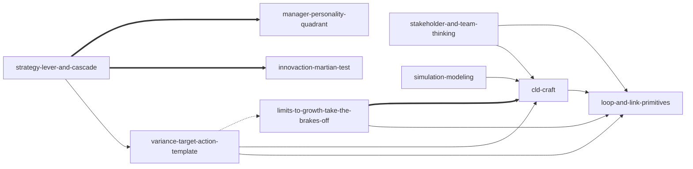

# Systems Thinking Toolkit — Skill Index

Nine v0.1.0 skills derived from Dennis Sherwood's *Seeing the Forest for
the Trees* (2002) via Profile-B merge of the original 14-skill Stage-3
distill. Five compose-with pairs collapsed into single skills; four
standalone (sk05/sk06 contrast at cognitive-frame level; sk13/sk14
V1-weak retained per user override).

## Skills (grouped by topic)

### Foundational
- [`loop-and-link-primitives`](./skills/loop-and-link-primitives/SKILL.md) — R/B classification + S/O link signing (sk01+sk02 merge)

### CLD craft
- [`cld-craft`](./skills/cld-craft/SKILL.md) — 12 hygiene rules + fuzzy variable elevation (sk03+sk04 merge)

### Loop dynamics & intervention
- [`limits-to-growth-take-the-brakes-off`](./skills/limits-to-growth-take-the-brakes-off/SKILL.md) — R braked by B archetype; constraint-relief (sk05)
- [`variance-target-action-template`](./skills/variance-target-action-template/SKILL.md) — generic B-loop control + do-nothing-under-oscillation (sk06)

### Strategy
- [`strategy-lever-and-cascade`](./skills/strategy-lever-and-cascade/SKILL.md) — lever-vs-outcome reframe + 3-timescale cascade + 3×N scenario planning (sk07+sk08 merge)

### Stakeholder & team
- [`stakeholder-and-team-thinking`](./skills/stakeholder-and-team-thinking/SKILL.md) — multi-perspective CLD overlay + mental-model harmony (sk09+sk10 merge)

### Quantification
- [`simulation-modeling`](./skills/simulation-modeling/SKILL.md) — stock-flow translation + models-for-learning-not-answers (sk11+sk12 merge)

### Auxiliary (V1-weak per Stage 1.5; retained per user override)
- [`innovaction-martian-test`](./skills/innovaction-martian-test/SKILL.md) — Martian-test feature perturbation (sk13)
- [`manager-personality-quadrant`](./skills/manager-personality-quadrant/SKILL.md) — Gods/Gamblers/Grinders/Guides 2×2 (sk14)

### Entry / router
- [`using-systems-thinking-toolkit`](./skills/using-systems-thinking-toolkit/SKILL.md) — intent-table routing for users who don't know which method to pick

## Reference graph (re-derived from 14-node original)

- `-->` depends-on (A presupposes B)
- `-.->` contrasts-with (A and B are alternative options; choice depends on context)
- `===>` composes-with (A and B typically used together; symmetric)

The 14-node original graph (which includes intra-merge edges between
sk01/sk02, sk03/sk04, sk07/sk08, sk09/sk10, sk11/sk12 that are now
internal to merged skills) is preserved at
[`references/INDEX-original.md`](./references/INDEX-original.md).

## Recommended learning order

Topological sort of the 9-node depends-on subgraph. Auxiliary skills
sit at the end because they `composes-with` `strategy-lever-and-cascade`
but are not depended on by anything; they can be picked up after the
core curriculum is in hand.

1. [`loop-and-link-primitives`](./skills/loop-and-link-primitives/SKILL.md) — foundational; no prerequisites
2. [`cld-craft`](./skills/cld-craft/SKILL.md) — depends on (1); workshop drawing craft
3. [`limits-to-growth-take-the-brakes-off`](./skills/limits-to-growth-take-the-brakes-off/SKILL.md) — depends on (1); composes with (2)
4. [`variance-target-action-template`](./skills/variance-target-action-template/SKILL.md) — depends on (1) + (2); contrasts with (3) at intervention-philosophy level
5. [`strategy-lever-and-cascade`](./skills/strategy-lever-and-cascade/SKILL.md) — depends on (4); composes with auxiliary (8) + (9)
6. [`stakeholder-and-team-thinking`](./skills/stakeholder-and-team-thinking/SKILL.md) — depends on (1) + (2); stakeholder-aware
7. [`simulation-modeling`](./skills/simulation-modeling/SKILL.md) — depends on (2); precision step

Auxiliary skills (reach for inside (5) workflow):

8. [`innovaction-martian-test`](./skills/innovaction-martian-test/SKILL.md) — composes with (5)
9. [`manager-personality-quadrant`](./skills/manager-personality-quadrant/SKILL.md) — composes with (5)

## Audit trail

- **Total skills**: 9 (post-Profile-B-merge) + 1 entry/router
- **Total relations** (post-symmetric-dedupe): 16 declared, 16 expected from §3.5 re-mapping — perfect match (Phase B X4 audit)
- **Source units**: union from all 14 original skills, preserved in each merged skill's Audit metadata block per spec C9

## Provenance

- See [`references/INDEX-original.md`](./references/INDEX-original.md) for the verbatim 14-node Stage-3 graph
- See [`references/VERIFIED.md`](./references/VERIFIED.md) for Stage-1.5 V1/V2/V3 evidence
- See [`references/BOOK_OVERVIEW.md`](./references/BOOK_OVERVIEW.md) for Stage-0 thesis
- See [`ROADMAP.md`](./ROADMAP.md) for v0.2+ candidates (sk13/sk14 merger discussion, TRIZ skill, etc.)
