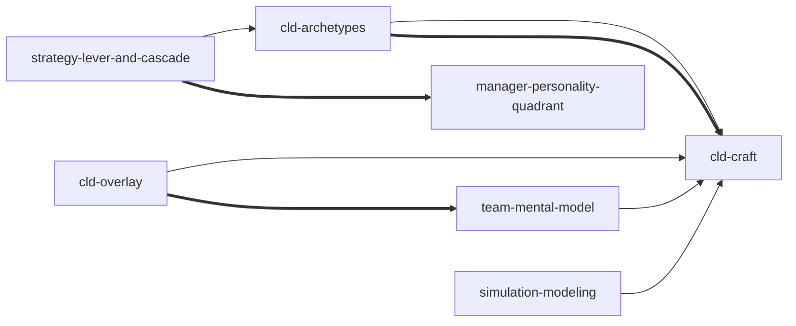

# Systems Thinking Toolkit — Skill Index

Seven functional skills + 1 entry/router, organized around the
prose → CLD translation as the carry-1 alpha. Derived from Dennis
Sherwood's *Seeing the Forest for the Trees* (2002).

## v0.6 restructure summary (cumulative from v0.4)

- **v0.4 Absorb**: `loop-and-link-primitives` (sk01+sk02) → into `cld-craft` Step 11
- **v0.4 Merge**: `limits-to-growth` + `variance-target-action` → `cld-archetypes`
- **v0.4 Split**: `stakeholder-and-team-thinking` → `cld-overlay` (outward) + `team-mental-model` (inward)
- **v0.6 Absorb**: `innovaction-martian-test` (sk13, V1-weak) → into `strategy-lever-and-cascade` Step 5 (Martian-test perturbation now inline)
- **v0.6 Strengthen**: `manager-personality-quadrant` (sk14, V1-weak) → kept with strengthened Boundary disclaimer + "Graduate beyond this skill" cross-refs to Big Five / Hogan / DiSC
- Net: 9 → 8 → 7 functional skills + 1 router; carry-1 (cld-craft) does prose → fully-annotated Mermaid CLD in one invocation

## Skills (grouped by role)

### Carry-1 (prose → Mermaid CLD)
- [`cld-craft`](./skills/cld-craft/SKILL.md) — 12 hygiene rules + fuzzy variable elevation + S/O signing + R/B classification (absorbed `loop-and-link-primitives` into Step 11; emits fully-annotated Mermaid)

### CLD consumers (read Mermaid CLD, do something with it)
- [`cld-archetypes`](./skills/cld-archetypes/SKILL.md) — recognize limits-to-growth (R+B coupling) or V/T/A (B-loop with delay) archetype + apply intervention playbook (merge of v0.2 limits + variance)
- [`cld-overlay`](./skills/cld-overlay/SKILL.md) — multi-stakeholder CLD overlay + straddle-policy finding (split from stakeholder, outward)

### Other tools (CLD-related but distinct output)
- [`simulation-modeling`](./skills/simulation-modeling/SKILL.md) — CLD → stock-flow translation + learning-not-forecast discipline (text-only; v0.5+ Python companion)
- [`strategy-lever-and-cascade`](./skills/strategy-lever-and-cascade/SKILL.md) — lever-vs-outcome reframe + 3-timescale cascade + 3×N scenario table
- [`team-mental-model`](./skills/team-mental-model/SKILL.md) — mental-model harmony + leadership-energy proxies (split from stakeholder, inward; not a CLD producer)

### Auxiliary (V1-weak per Stage 1.5)
- [`manager-personality-quadrant`](./skills/manager-personality-quadrant/SKILL.md) — Gods/Gamblers/Grinders/Guides 2×2 + framing-vs-analysis split (sk14; kept with strengthened Boundary disclaimer per v0.6 — facilitation vocabulary only, not a personality measurement instrument)

### Entry / router
- [`using-systems-thinking-toolkit`](./skills/using-systems-thinking-toolkit/SKILL.md) — intent-uncertainty routing

## Reference graph (v0.4 R3 8-node)

- `-->` depends-on (A presupposes B)
- `-.->` contrasts-with (A and B alternatives; choose by context)
- `===>` composes-with (A and B typically used together; symmetric)

The 14-node original Stage-3 graph (pre-v0.1.0) is preserved at
[`references/INDEX-original.md`](./references/INDEX-original.md). The
9-node v0.2.0 graph (pre-R3) is preserved in `docs/superpowers/audits/`
audit history.

## Recommended learning order

1. [`cld-craft`](./skills/cld-craft/SKILL.md) — foundational; produces the fully-annotated Mermaid CLD that downstream skills consume
2. [`cld-archetypes`](./skills/cld-archetypes/SKILL.md) — depends on (1); recognizes Sherwood archetypes on classified CLD
3. [`cld-overlay`](./skills/cld-overlay/SKILL.md) — depends on (1); multi-perspective extension for stakeholder mediation
4. [`team-mental-model`](./skills/team-mental-model/SKILL.md) — depends on (1); inward team protocol (composes with cld-overlay post-merger)
5. [`strategy-lever-and-cascade`](./skills/strategy-lever-and-cascade/SKILL.md) — depends on (2); scenario planning with archetype-aware lever resetting
6. [`simulation-modeling`](./skills/simulation-modeling/SKILL.md) — depends on (1); precision quantification step

Auxiliary skill (compose with (5)):

7. [`manager-personality-quadrant`](./skills/manager-personality-quadrant/SKILL.md) ⚠ V1-weak

## Audit trail

- **Total skills**: 7 functional + 1 entry/router (v0.6 reduces from v0.4 8+1; absorbed sk13 innovaction-martian-test into strategy-lever-and-cascade Step 5)
- **Source units**: union from all 14 original Stage-3 skills preserved across merged/split/absorbed bodies per spec C9
- **Re-baseline schedule**: v0.4 R3-5 re-baselined on changed skills (cld-craft, cld-archetypes, cld-overlay, team-mental-model); v0.6 changes strategy-lever-and-cascade body so re-baseline pending

## Provenance

- [`references/INDEX-original.md`](./references/INDEX-original.md) — verbatim 14-node Stage-3 graph (pre-v0.1.0)
- [`references/VERIFIED.md`](./references/VERIFIED.md) — Stage-1.5 V1/V2/V3 evidence
- [`references/BOOK_OVERVIEW.md`](./references/BOOK_OVERVIEW.md) — Stage-0 thesis (1-sentence: every system reduces to R+B feedback loops; diagram + find binding constraint + relieve it)
- [`ROADMAP.md`](./ROADMAP.md) — v0.7+ candidates (Python simulator companion / 6 PR #271 audit body fixes / CI desc ↔ skill folder drift check / sk14 graduate-paths formalization)
