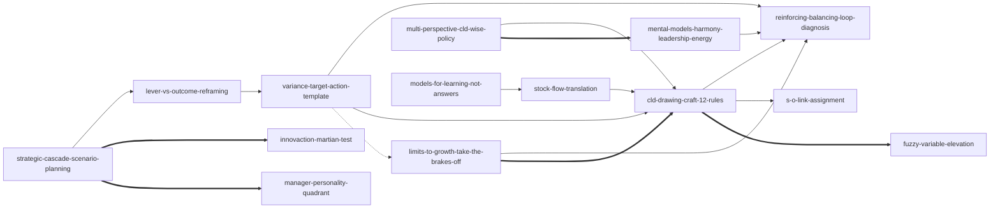

# Seeing the Forest for the Trees — Skill Index (original 14-node, pre-merge)

> **Provenance archive.** This is the verbatim Stage-3 distill output from
> the `tsundoku:book-distill` cache (`~/.tsundoku/cache/distilled/Seeing-the-Forest.../INDEX.md`).
> The 14 skill slugs referenced below are the **pre-merge** names; this
> plugin packages them as 9 merged skills via Profile B (see `../INDEX.md`).
> **Markdown links in this file do NOT resolve in plugin layout** — they
> point to the original cache directory structure. For working plugin
> links, see [`../INDEX.md`](../INDEX.md). For the merge mapping, see
> [`../../docs/superpowers/specs/2026-05-12-systems-thinking-toolkit-v0.1.0-design.md`](../../docs/superpowers/specs/2026-05-12-systems-thinking-toolkit-v0.1.0-design.md) §3.5.

---

# Seeing the Forest for the Trees — Skill Index

> Stage 3 output of the book-distill pipeline. Indexes 14 verified
> atomic skills extracted from Dennis Sherwood's *Seeing the Forest
> for the Trees* (2002) and makes the relations between them explicit.

## Basic info

- **Title**: *Seeing the Forest for the Trees: A Manager's Guide to Applying Systems Thinking*
- **Author**: Dennis Sherwood
- **Published**: 2002, Nicholas Brealey Publishing
- **Source language**: English
- **One-sentence thesis**: Every complex system reduces to a network
  of feedback loops with only two types — reinforcing and balancing —
  and wise management means diagramming this structure, identifying
  the binding constraint, and relieving it rather than pedaling the
  engine harder.

## Skills grouped by topic

### 1. Foundational ontology & diagram primitives

| Slug | Brief |
|---|---|
| [`reinforcing-balancing-loop-diagnosis`](./reinforcing-balancing-loop-diagnosis/SKILL.md) | Diagnose R vs B loops via even-O / odd-O rule; vicious=virtuous structural identity. Foundational. |
| [`s-o-link-assignment`](./s-o-link-assignment/SKILL.md) | Assign S/O labels to causal arrows with reversibility test + Sterman ultimate-test fallback. Foundational. |

### 2. CLD craft

| Slug | Brief |
|---|---|
| [`cld-drawing-craft-12-rules`](./cld-drawing-craft-12-rules/SKILL.md) | The 12 hygiene rules + dangle taxonomy (input / target / rate / output / cloud) for drawing CLDs in a workshop. |
| [`fuzzy-variable-elevation`](./fuzzy-variable-elevation/SKILL.md) | Elevate unmeasured-but-load-bearing variables to first-class nodes; split-fuzzy-variable trick for sign-flipping links. |

### 3. Loop dynamics & intervention

| Slug | Brief |
|---|---|
| [`limits-to-growth-take-the-brakes-off`](./limits-to-growth-take-the-brakes-off/SKILL.md) | Diagnose R-loop braked by B-loop; relieve the binding constraint rather than push the engine. Master archetype. |
| [`variance-target-action-template`](./variance-target-action-template/SKILL.md) | Generic balancing-loop control template + do-nothing-under-oscillation diagnostic. |

### 4. Strategy & multi-stakeholder thinking

| Slug | Brief |
|---|---|
| [`lever-vs-outcome-reframing`](./lever-vs-outcome-reframing/SKILL.md) | Strategy = resetting lever target settings; managers control levers, not outcomes. |
| [`strategic-cascade-scenario-planning`](./strategic-cascade-scenario-planning/SKILL.md) | Three-timescale cascade (in-year / annual / multi-year ambition) + 3×N scenario table that reverse-engineers required levers. |
| [`multi-perspective-cld-wise-policy`](./multi-perspective-cld-wise-policy/SKILL.md) | One CLD per stakeholder; overlay and find a policy beneficial across all perspectives. Stop forcing, start listening. |
| [`mental-models-harmony-leadership-energy`](./mental-models-harmony-leadership-energy/SKILL.md) | Team performance as an emergent property of mental-model harmony sustained by continuous leadership-as-energy-pumping. |

### 5. Quantification (stock-flow & simulation)

| Slug | Brief |
|---|---|
| [`stock-flow-translation`](./stock-flow-translation/SKILL.md) | Translate a qualitative CLD into a quantitative stock-and-flow plumbing diagram ready for simulation. |
| [`models-for-learning-not-answers`](./models-for-learning-not-answers/SKILL.md) | Use simulation for understanding, not point-forecast; calls out the linear-extrapolation-of-exponential trap. |

### 6. Auxiliary (user-override; weak V1)

> Both skills below were retained per user override despite weak V1
> evidence in Stage 1.5 verification. See each SKILL.md's Boundary
> section for prior-art credit and validity caveats.

| Slug | Brief |
|---|---|
| [`innovaction-martian-test`](./innovaction-martian-test/SKILL.md) | Perturbation-based idea generation: Martian-test bullet list of today's features, then perturb one at a time. TRIZ-adjacent. |
| [`manager-personality-quadrant`](./manager-personality-quadrant/SKILL.md) | Gods / Gamblers / Grinders / Guides 2×2 (can-predict × controller-vs-empowerer) for adapting strategy artefacts to executive style. |

## Reference graph

Line styles:

- `-->` depends-on (A presupposes B)
- `-.->` contrasts-with (A and B are alternative options; choice depends on context)
- `===>` composes-with (A and B typically used together)

## Recommended learning order

Topological sort of the `depends-on` sub-graph. Auxiliary skills
(sk13, sk14) sit at the end because they `composes-with` sk08 but
are not depended on by anything; they can be picked up after the
core curriculum is in hand.

1. **`reinforcing-balancing-loop-diagnosis`** — foundational ontology;
   no prerequisites. Unlocks everything else.
2. **`s-o-link-assignment`** — foundational sign discipline; no
   prerequisites.
3. **`cld-drawing-craft-12-rules`** — depends on (1) and (2); the
   workshop-grade drawing craft.
4. **`fuzzy-variable-elevation`** — composes with (3); learn after the
   12 rules so you can recognize when Rule 7 fires.
5. **`limits-to-growth-take-the-brakes-off`** — depends on (1);
   composes with (3). The master archetype.
6. **`variance-target-action-template`** — depends on (1) and (3);
   contrasts with (5) at intervention-philosophy level.
7. **`lever-vs-outcome-reframing`** — depends on (6); the strategy-
   level rename of the V/T/A loop.
8. **`strategic-cascade-scenario-planning`** — depends on (7).
9. **`multi-perspective-cld-wise-policy`** — depends on (3); first
   stakeholder-aware skill.
10. **`mental-models-harmony-leadership-energy`** — depends on (1);
    composes with (9). Pair sk09 + sk10 mentally.
11. **`stock-flow-translation`** — depends on (3); the precision step.
12. **`models-for-learning-not-answers`** — depends on (11); learn
    how to *use* the stock-flow model wisely.
13. **`innovaction-martian-test`** — auxiliary; composes with (8).
14. **`manager-personality-quadrant`** — auxiliary; composes with (8).

## Audit trail

- **Total skills**: 14
- **Total relations**: 17 (unique; each declared once per pair)
  - depends-on: 11
  - contrasts-with: 1
  - composes-with: 5
- **Within Stage 3 discipline range** (target 11-21 for 14 skills): ✅
- **No fake relations**: each relation traces to explicit textual
  evidence in the SKILL.md files and the Stage 1.5 `verified.md`
  cluster cross-references.
- **Topological sort validity**: depends-on sub-graph is acyclic;
  recommended learning order respects every depends-on edge.
- **Mermaid syntax**: validated by inspection — every edge ends with
  a defined node; three line styles applied consistently per the
  relation taxonomy.

## Provenance

- **Pipeline stage**: 3 — Zettelkasten linking
- **Inputs**: 14 SKILL.md files (Stage 2 output), `verified.md` (Stage
  1.5 output), `BOOK_OVERVIEW.md` (Stage 0 output)
- **Source book**: *Seeing the Forest for the Trees: A Manager's
  Guide to Applying Systems Thinking* by Dennis Sherwood, Nicholas
  Brealey Publishing, 2002
- **Source EPUB**: `/Users/kouko/Downloads/Seeing the Forest for the Trees A Managers Guide to Applying Systems Thinking (Sherwood, Dennis) (z-library.sk, 1lib.sk, z-lib.sk).epub`
- **Chapter MD path**: `/Users/kouko/.cache/tsundoku/markdown/Seeing-the-Forest-for-the-Trees-A-Manager's-Guide-to-Applyin/`
- **Distill output path**: `/Users/kouko/.tsundoku/cache/distilled/Seeing-the-Forest-for-the-Trees-A-Manager's-Guide-to-Applyin/`
- **Distilled at**: 2026-05-11
- **Output language**: English (frontmatter, body prose, mermaid node
  labels — book is English-source)
