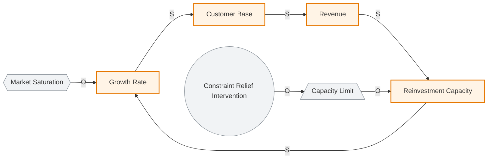
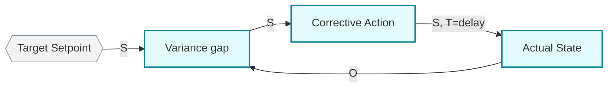

# CLD Archetypes — Limits-to-Growth + Variance/Target/Action

## R — Reading

> "By far the wisest action is to identify the [balancing] loop that is
> acting as the brake, and then to take the brake off. As soon as you do
> that, the [reinforcing] loop kicks back in."
>
> — Dennis Sherwood, Chapter 8

> "The wise manager — and wise boss — knows when to do absolutely
> nothing… because the system is already on its way back toward target,
> and any action will make the swing worse, not better."
>
> — Dennis Sherwood, Chapter 6

## I — Interpretation

Given a classified Mermaid CLD (R/B annotated, links signed S/O), this
skill recognizes which of two Sherwood archetypes is present and runs
the matching intervention playbook. The two archetypes share *no*
prescription: limits-to-growth demands **active relief** of a binding
B-loop; V/T/A often demands **active restraint** while a B-loop
converges. Mis-applying one's playbook on the other's system is
malpractice — hence diagnosis first, then branch.

**Limits-to-growth (R+B coupling).** A growth engine is a reinforcing
loop (more customers → more revenue → more reinvestment → more
customers). Real engines never spin forever: one or more balancing
loops progressively bite as some resource, market slot, or capacity
fills. The dynamic signature is **deceleration despite unchanged
inputs** — growth rate falling each period even though the team is
working at least as hard. The cultural reflex is to **pedal harder**:
more budget, more campaigns, more hires. This pushes against the brake
instead of releasing it, burning cash for diminishing returns.
Sherwood's rule inverts the reflex: **find the binding constraint and
relieve it**, then the growth loop spins back to life under its own
existing momentum, often at a fraction of the cost. The diagnosis has
two halves: (1) confirm the deceleration signature is limits-to-growth
(not coordination failure, demand collapse, or quality regression);
(2) identify *which* of the candidate brakes is actually binding now —
only one or two usually are, and it shifts over time.

**Variance/Target/Action (single B-loop with delay).** A balancing
loop has four canonical nodes: **target** (where you want the metric),
**actual** (where it is), **variance** (target minus actual, or vice
versa), and **action** (the lever movement variance triggers). The
action moves the actual toward the target; when they match, variance
is zero and action stops. This is the generic structure of every
thermostat, every quota system, every monetary-policy committee, every
customer-success playbook. Two things make this loop misbehave:
(1) **time delay between action and actual** — the action moves the
actual, but not immediately; if the operator reads variance before the
prior action has worked through, they over-shoot, variance flips sign,
they correct in the opposite direction, the system oscillates with
growing amplitude. (2) **goal-moving / playbook-changing faster than
the loop can converge** — each adjustment resets the loop before it
finishes its response cycle. Sherwood's counter-intuitive prescription:
when you see oscillation with growing or sustained amplitude, the right
move is often **do nothing for one full feedback cycle** and let the
loop converge. If you must act, attack the *delay* (faster
measurement, faster channel between detection and action), not the
target.

## A1 — Past Application

Seven calibrating cases (3 limits-to-growth + 4 V/T/A) live in
`references/cases.md`: tea/disease/industrial revolution (c12),
provincial car dealership c24 Chapter 13, Easter Island c11 +
Caulerpa algae c04 (limits-to-growth); hotel shower c08, inventory
control manager c09, Bank of England MPC c10, NPS playbook ping-pong
V2-derived (V/T/A).

**MANDATORY — READ INDEX FIRST**: Before classifying which archetype
is present, naming a binding constraint, or recommending "do nothing,"
you MUST read [`references/cases-index.md`](references/cases-index.md)
(~40 lines) which maps user-prose symptoms to the matching case in
`cases.md`. Load the specific case section(s) from
[`references/cases.md`](references/cases.md) on demand by symptom.
**Read `cases.md` end-to-end when** both archetypes are simultaneously
active, the diagnosed brake is itself dynamic, or recommending "do
nothing" as the intervention — case interactions become load-bearing
in those scenarios.

## A2 — Future Trigger ★

### When will the user need this skill?

**Limits-to-growth triggers:**

1. SaaS / B2C company spending more on growth marketing each year but
   topline growth rate is *falling*.
2. Manufacturing or ops team adding capacity but throughput stays flat
   — a downstream constraint is binding.
3. Hiring spree to "scale the team" but per-head productivity is
   dropping — onboarding capacity is the real brake.
4. Investor asking "should we double the ad budget?" when the
   marketing-efficiency curve is already saturating.
5. Post-mortem on a stalled product: was it actually a demand issue,
   or did a constraint elsewhere (sales-cycle, integration partners,
   regulatory approval) bind silently?

**V/T/A triggers:**

1. A KPI is swinging quarter-to-quarter and each intervention seems
   to widen the swing.
2. Designing a new management-control mechanism (quota, OKR,
   inventory rule, retention program) and want to predict whether it
   will oscillate.
3. Diagnosing why a "perfectly reasonable" management response is
   making things worse.
4. Coaching a junior manager who is changing tactics every Monday
   because last Friday's numbers were bad.
5. Reviewing a proposed change to compensation, pricing, or staffing
   that has a long lag between change and visible result.

### Language signals

- **Limits-to-growth**: "growth is slowing despite [more spend / hiring
  / X]", "we need to push harder on [marketing / sales / ads]",
  "diminishing returns on [channel]", "we're saturating" / "the market
  is tapped", "why isn't [more input] giving us more output?"
- **V/T/A**: "metric keeps swinging" / "ping-ponging", "every time we
  change [X] it gets worse", "we keep adjusting", "the numbers go up
  and down", "I don't know if my last move worked yet", "should I act
  now or wait?"

### Internal triage: which archetype?

The two archetypes inside this skill are diagnostically distinct on
their behavioral signature:

- **Deceleration toward** a value (growth rate falling, asymptote
  approaching) → limits-to-growth branch (R-loop coupled to B-loop).
- **Oscillation around** a value (over-shoot, under-shoot, repeat) →
  V/T/A branch (single B-loop with delay).
- **Both at once** (growth decelerating *and* policy responses making
  it worse) → run V/T/A first (stop over-correcting), then
  limits-to-growth on the underlying R+B coupling.

### Distinction from neighboring skills

- vs. `loop-and-link-primitives`: that skill *classifies* whether the
  CLD has R-loops, B-loops, or both; this skill takes the classified
  CLD and recognizes a *named archetype* with a specific intervention
  philosophy. Diverging / vicious-circle systems (R-loop spinning the
  wrong way, numbers running off to infinity) belong to
  `loop-and-link-primitives` R-loop diagnosis, NOT this skill.
- vs. `strategy-lever-and-cascade` (sk07/sk08): lever-vs-outcome
  diagnoses *misclassification* (treating an outcome as a directly-
  pullable lever); this skill diagnoses *which structural archetype*
  drives the misbehavior. They compose — once an archetype is named,
  lever-vs-outcome may govern which lever-target setting to change.
- vs. Theory of Constraints (Goldratt, c14): arrives at the same
  limits-to-growth intervention rule from manufacturing throughput
  analysis. Use TOC when the constraint is a discrete process chain
  with measurable cycle times; use this skill when the constraint is
  interpretive (market saturation, brand permission, talent pool).
- vs. classic PID control theory: same physics as V/T/A, but
  Sherwood's contribution is the *managerial* operationalization —
  "small moves, long intervals, attack the lag" — and the "do nothing"
  cultural permission slip that PID theory takes for granted.

## E — Execution

```
E flow:
  Step 0: classify archetype (R+B coupling? B with delay? both?)
        │
        ├── R+B coupling, deceleration signature → Branch L (limits-to-growth)
        ├── single B with delay, oscillation signature → Branch V (V/T/A)
        ├── both → run Branch V first, then Branch L
        └── neither (diverging / no loop / one-off) → exit (not this skill)
        │
        v
  Branch L — limits-to-growth:
    L1: confirm 3+ periods of decelerating growth rate
    L2: draw central R-loop in ≤ 6 nodes
    L3: enumerate 3-7 candidate B-loops (each named with limiting resource)
    L4: identify the binding brake ("if we doubled [input], would brake absorb the gain?")
    L5: specify constraint-relief intervention (cost / timeline / R-loop prediction)
    L6: name the NEXT binding brake that queues after this one
        │
        v
  Branch V — variance/target/action:
    V0: SPC pre-check (signal vs noise — ±2σ + autocorrelation)
    V1: sketch 4-node loop (target / actual / variance / action)
    V2: estimate feedback delay (number in time units)
    V3: plot 3+ feedback-cycle durations of actual
    V4: classify dysfunction (converging / sustained / growing-amplitude / moving-target)
    V5: if action needed, smallest move (interval ≥ 1.5 × delay)
    V6: communicate the "do nothing" rationale upward
        │
        v
  Both branches end by annotating the Mermaid CLD with %% Archetype: <name>
  + pointing downstream to lever-cascade / simulation as relevant.
```

### Branch L — Limits-to-growth (when deceleration signature confirmed)

1. **Confirm the signature** — completion criterion: a 3+ period
   trajectory showing the growth rate (not absolute number) is
   decelerating; rule out one-off shocks (demand crash, regulatory
   step, competitor entry — those are different problems).
2. **Draw the central R-loop in 6 nodes or fewer** — every node has
   a noun-label and every link has an S/O label. If you can't compress
   to 6 nodes, you're modeling detail complexity not dynamic
   complexity (return to `cld-craft`).
3. **List candidate brakes** — 3-7 candidate B-loops attached to the
   R-loop, each named with its limiting resource (market segment,
   capacity, talent, regulatory headroom, cash, attention, brand
   permission). One will be binding *now* but another will likely
   bind next.
4. **Identify the binding brake** — pick the ONE brake whose relief
   would visibly accelerate the R-loop in the next 2 cycles.
   Diagnostic test: "if we doubled [candidate input], would the
   R-loop spin faster, or would [candidate brake] absorb the gain?"
   If "brake absorbs," that's the binding brake.
5. **Specify the constraint-relief intervention** — a named
   intervention with cost estimate, timeline, and the explicit
   prediction "after this, the R-loop will spin at approximately the
   pre-deceleration rate." Halt condition: if you cannot articulate
   the prediction, you have not identified the constraint — go back
   to L3.
6. **Predict the *next* binding brake** — Sherwood is explicit:
   brakes don't disappear, they queue. Pre-positioning relief for the
   next one prevents the same conversation in 6 months.

#### Branch L worked Mermaid skeleton (copy-paste, fill in names)



Caption: name the binding-brake candidate explicitly, the constraint-relief intervention, and the predicted post-relief R-loop spin rate. Identify the next brake to queue.

### Branch V — Variance/Target/Action (when oscillation signature confirmed)

0. **Pre-check: signal vs noise.** Before V/T/A diagnosis, verify the
   variance is *from a system*, not from random noise. Apply SPC
   (Statistical Process Control) one-pass: if variance falls within
   ±2σ of historic mean and shows no autocorrelation, it is NOISE —
   V/T/A doesn't apply (use noise-filtering / control-chart tooling).
   If variance shows trend, autocorrelation, or clusters > 2σ,
   proceed. Halt condition: cannot compute σ → at least eyeball the
   recent series for cluster / trend / cyclicality before continuing;
   otherwise you risk prescribing "do nothing" against actual signal,
   or "small moves" against actual noise.
1. **Sketch the candidate B-loop in 4 nodes** — target, actual,
   variance, action all named with noun labels; variance direction
   explicitly written (target minus actual or reverse); action's
   effect on actual labeled S or O. If the loop is not balancing
   (odd O-count), you're modeling the wrong structure.
2. **Estimate the feedback delay** — a number in time units for
   "from action to detectable change in actual." For NPS, weeks-to-
   months; for inventory, days-to-weeks; for macro-rates,
   quarters-to-years. Halt: if you can't estimate the delay, you
   don't understand the loop well enough to intervene safely.
3. **Plot the recent trajectory** — 3+ feedback-cycle durations of
   actual values. Look for: convergence (good — let it run),
   sustained oscillation (delay is poorly understood), growing
   oscillation (over-correction — STOP intervening).
4. **Diagnose the dysfunction class** — one of:
   (a) loop is converging fine, manager is impatient → action: wait;
   (b) sustained oscillation → action: lengthen interval between
   moves to ≥1 feedback cycle, reduce move magnitude. **Heuristic:
   new interval ≥ 1.5 × estimated delay between action and observable
   effect.** Below 1.5× = still ping-ponging on stale state; at or
   above 1.5× = at least one full delay-cycle absorbed before the
   next move; (c) growing amplitude → action: do absolutely nothing
   for two cycles, then re-baseline; (d) target keeps moving →
   action: stop moving the target. Halt: if it's "genuinely
   diverging" (not oscillating, just running off to infinity), this
   is not your branch — investigate whether an R-loop has flipped
   (back to `loop-and-link-primitives`).
5. **Specify the smallest move** — if action is needed, name the
   smallest intervention that lets the system respond before the
   next decision point. Sherwood's BoE rule: small moves, long
   intervals, often no move.
6. **Communicate the "do nothing" decision upward** — the rationale
   is documented (this loop is converging / the prior action hasn't
   had time to land yet) so the organization doesn't interpret
   restraint as inaction. Sherwood: "wise boss as well as wise
   manager." **Organizational-politics escalation note:** in
   quarterly-OKR / weekly-review orgs, "do nothing" may be rejected
   as a legitimate action regardless of correctness. Counter-moves:
   (i) reframe as "scheduled non-intervention through cycle N+1"
   with an explicit review date, (ii) attach a falsifiable abort
   trigger ("if amplitude grows by >X% before T, we re-intervene"),
   (iii) escalate the diagnosis, not the inaction — name the loop,
   the delay, and the prior over-correction so the decision is read
   as *informed restraint* not absence. If the org structurally
   cannot tolerate this, the diagnosis still holds; the constraint
   is political, not analytic.

#### Branch V worked Mermaid skeleton (copy-paste, fill in names + delay tag)



Caption: name the concrete delay magnitude (T=...), the dysfunction class (a/b/c/d), the smallest-move action (or scheduled non-intervention), and the falsifiable abort trigger.

### Post-branch — annotate the CLD

Both branches end by editing the source Mermaid block to add an
archetype comment near the loop annotation, e.g.:

```
%% Archetype: limits-to-growth — R-loop braked by B(market-saturation); intervention: relieve B
%% Archetype: V/T/A — single B-loop, ~6mo delay; intervention: do-nothing 2 cycles
```

If the diagnosis triggers a follow-up skill (`strategy-lever-and-cascade`
for which lever to change; `simulation-modeling` if quantitative
confirmation is needed), append a one-line pointer below the comment.
See [`../cld-craft/references/cld-mermaid-emit.md`](../cld-craft/references/cld-mermaid-emit.md)
for the canonical Mermaid annotation convention.

## B — Boundary ★

### Do NOT use when:

- **The system is diverging, not decelerating or oscillating.** A
  vicious R-loop spinning the wrong way (numbers monotonically running
  off) needs `loop-and-link-primitives` R-loop diagnosis and probably
  immediate intervention. "Do nothing" applied here is malpractice;
  "take the brakes off" doesn't apply either (no brake — the engine
  is destroying itself). The vicious-R-loop pattern is easy to
  confuse with limits-to-growth because both involve declining
  numbers.
- **No growth engine exists yet** (limits-to-growth branch).
  Pre-product-market-fit startups don't have a running R-loop to
  brake; pushing more inputs is the right move because the loop isn't
  generating output to brake.
- **The problem is quality, not scale** (limits-to-growth branch).
  Declining NPS or rising churn from a quality regression is a
  different B-loop dynamic — likely a V/T/A oscillation, not
  saturation.
- **The brake genuinely binds and has no relief** (limits-to-growth
  branch). When you've identified the constraint and verified no
  feasible intervention relieves it, "take the brakes off" becomes
  "accept a smaller steady-state and stop burning cash chasing
  growth." The doctrine is *diagnose then act*, not "always relieve."
- **One-off, non-recurring decisions** (V/T/A branch). A go/no-go
  gate on a single project launch has no feedback loop to oscillate;
  V/T/A doesn't apply.
- **The detection lag is genuinely zero** (V/T/A branch). Real-time
  control systems (a thermostat in a tight room) don't oscillate
  noticeably; the cure-by-waiting is unnecessary.
- **The target itself was wrong and is being legitimately revised**
  (V/T/A branch). V/T/A's "stop moving the target" assumes the target
  is sound. If the target was set on a now-invalidated assumption,
  revise it once *clearly*, then run a full cycle before evaluating.

### Author-warned failure modes (Sherwood's counter-examples)

- **ce07** (limits-to-growth) — confusing the fundamental constraint
  with a surface symptom. Easter Islanders saw "we are running out of
  *big* trees" (symptom) and rationed them, when the constraint was
  *all* trees (stock). Surface-symptom diagnosis lets you "relieve"
  the wrong brake and accelerate collapse.
- **ce19** (limits-to-growth) — pedal-harder reflex even when the
  diagnosis is correct. Boards reach for "more budget" because
  spending is legible and constraint-relief is not; the V/T/A loop
  for marketing-spend is easier to defend than the qualitative claim
  that "saturation is binding." Wise diagnosis often loses to legible
  action in the meeting.
- **ce08** (V/T/A) — acting too fast on a time-delayed loop (the
  hotel-shower amplification). The reflex to "do something" before
  the prior action has worked through is the most common over-
  correction failure. Sherwood prescribes the cycle-length wait *even
  when it feels like you're being negligent*.
- **ce31** (V/T/A) — confusing detail complexity (lots of moving
  parts in a spreadsheet) with dynamic complexity (delayed loop
  behavior). A manager who responds to a swinging metric by adding
  more inputs to the spreadsheet treats dynamic dysfunction as a
  precision problem. More precision doesn't shorten the lag; only
  structural changes to the loop do.

### Author's blind spots / period limitations

- **Sherwood overreaches on single-cause attribution** (BOOK_OVERVIEW
  Critical #6) in tea-and-the-industrial-revolution: the
  tea/boiled-water/disease-relief story is contested popular history;
  tannin's antiseptic effect is weak, and tea, sugar, gin
  replacement, and rising real wages all covary with disease decline.
  The book uses systems thinking to debunk single-cause stories
  elsewhere then deploys one here. Use Sherwood's rule, but beware
  the impulse to identify *the* constraint where multiple brakes
  likely co-bind.
- **Pre-platform-economy framing** (Critical #1): 2002 examples
  assume linear addressable-market saturation; on two-sided platforms
  with network effects, limits-to-growth can transition
  discontinuously into "winner-take-most," reversing the
  deceleration signature mid-run.
- **BoE / Greenspan macro examples are period-dated** (Critical #7).
  The MPC under Sir Edward George is a 1997-2003 artifact; post-2008
  unconventional monetary policy, post-2021 inflation regime change,
  and central-bank credibility crises all postdate the example. Use
  the *structural* lesson (small moves, long intervals) without
  inheriting the institutional confidence.
- **Manager-as-protagonist framing** (Critical #3): both procedures
  assume one decision-maker can authorize the intervention. Where
  the brake lives in another org (regulator, partner, supplier) or
  the timescale crosses quarterly review cadence, the procedure
  produces a diagnosis the organization may be structurally unable
  to act on.
- **No engagement with stochastic noise** (V/T/A branch). Real
  metrics have both endogenous oscillation and exogenous noise;
  Sherwood treats oscillation as cleanly endogenous. In practice the
  manager's job starts with separating signal from noise — which
  Sherwood under-serves. Pair with basic SPC / control-chart
  literacy (V/T/A Step 0 above).

### Easily-confused neighboring methodologies

- **Theory of Constraints (Goldratt, c14)**: Same intervention rule
  as limits-to-growth from manufacturing throughput analysis. TOC is
  quantitative and process-step specific; Sherwood's version is
  qualitative and applies to fuzzy multi-loop business systems. Use
  TOC when you have a discrete process chain with measurable cycle
  times; use Sherwood when the constraint is interpretive.
- **Senge's "Limits to Success" archetype** (*The Fifth
  Discipline*): same limits-to-growth archetype, more abstract
  framing. Sherwood gives sharper intervention guidance.
- **Conventional growth-marketing optimization**: A/B testing channel
  mix is pedaling-harder at higher resolution; useful only after
  ruling out that a non-marketing constraint is binding.
- **PID control theory**: V/T/A is informally PID with P-only
  control + lag awareness. PID adds integral and derivative terms
  Sherwood ignores. For high-stakes industrial control, use PID; for
  management decisions, Sherwood's coarser version is usually
  right-sized.
- **Statistical Process Control (Shewhart / Deming)**: SPC tells you
  whether a metric is within-control-limits (don't act) vs
  out-of-control (act). It is the empirical complement to V/T/A's
  structural diagnosis — V/T/A explains *why* a system might
  oscillate; SPC tells you *whether* the observed variation is noise
  vs signal. Use both.
- **Lean / Kanban WIP limits**: a different way to attack the same
  V/T/A oscillation problem (cap WIP so the system can't be
  perturbed faster than it converges).

## Related skills

- **depends-on `loop-and-link-primitives`** — you must already
  distinguish R from B (even-O / odd-O), sign each link S/O, and
  recognize whether a CLD has a coupled R+B archetype or a single
  B-with-delay structure, before this skill's archetype router can
  branch correctly. Diverging-R-loop diagnosis also lives in
  `loop-and-link-primitives`, not here.
- **composes-with `cld-craft`** — archetype recognition reads off a
  cleanly-drawn CLD; cld-craft's 12 rules + fuzzy-variable elevation
  + Mermaid emission convention produce the diagram on which both
  branches operate. Annotating the CLD post-diagnosis (the
  `%% Archetype: ...` comment) follows
  `cld-craft/references/cld-mermaid-emit.md`.

## Audit metadata

> Source-unit codes (f08/f09/f10/p13/p14/p15/p21/p22/p27/p30/ce07/ce08/ce19/ce31/c08/c09/c10/c11/c12/c14/c24/c27/g11/g12/g18/g21/g22/g44/g45) refer to Stage-1.5 verified.md entries. See `<plugin-root>/references/VERIFIED.md`.

- **Verification status**: V1 ✓ (multi-domain: plumbing, ops mgmt, central banking, SaaS deceleration, manufacturing throughput, multi-lever strategy) / V2 ✓ (novel SaaS deceleration question + NPS swing diagnosis) / V3 ✓ (both counter-cultural rules: "take the brakes off" cross-validated by Goldratt independent discovery; "do nothing" cross-validated by SPC + PID + endogenous-oscillation recognition)
- **Source units merged**: f08, f09, f10, p13, p14, p15, p21, p22, p27, p30, ce07, ce08, ce19, ce31, c08, c09, c10, c11, c12, c14, c24, c27, g11, g12, g18, g21, g22, g44, g45
- **Distilled at**: 2026-05-11
- **Polished at**: 2026-05-12 (Phase A standalone polish on both sources)
- **Merged at**: 2026-05-12 (v0.4 R3-1 Profile B merge: `limits-to-growth-take-the-brakes-off` (sk05) + `variance-target-action-template` (sk06) → `cld-archetypes`)
- **Output language**: body — English; metadata — English
