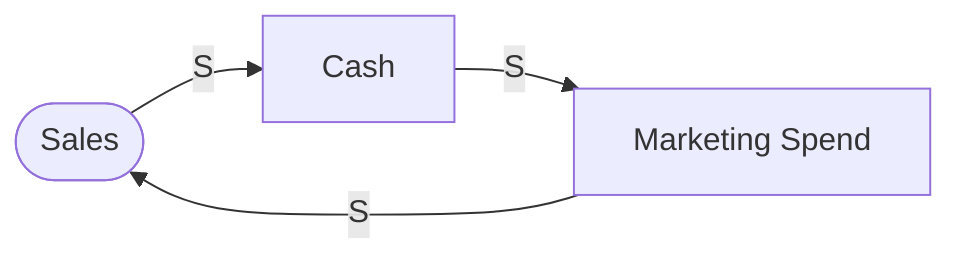
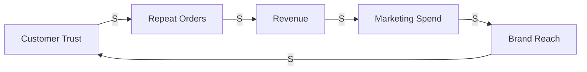
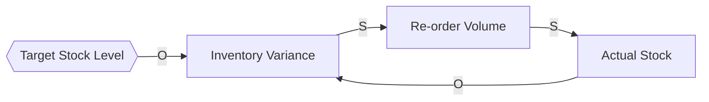
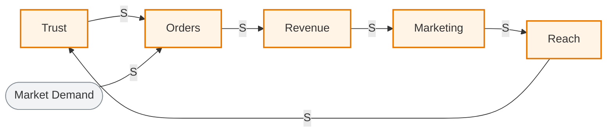
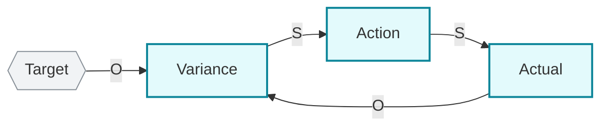
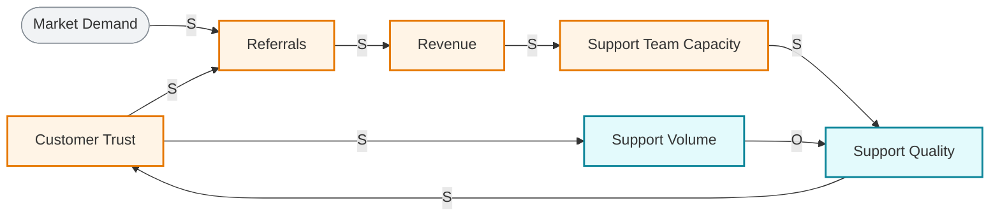

# CLD Mermaid Emission Reference

Canonical Mermaid syntax for emitting causal loop diagrams as the
output artifact of `cld-craft`. Adapted from the obsidian plugin's
`obsidian-mermaid-visualizer/flow/circular-flow.md` (provenance) plus
CLD-specific conventions Sherwood's 12 hygiene rules require:

- **Every edge MUST have an S (Same-direction) or O (Opposite-direction) label** — the load-bearing primitive that lets downstream `loop-and-link-primitives` classify the loop
- **Closed loops get an inline `%%` comment annotating R or B** plus the O-count that justifies the classification
- **Dangle types map to distinct node shapes** so the boundary discipline (Rule 1) is visible at-a-glance
- **R-loops and B-loops use distinct color themes** so virtuous/vicious spin is readable without running a classifier

## When this reference applies

This file fires whenever `cld-craft` is invoked to produce a diagram
artifact, either from prose input or from an existing CLD sketch.
The agent reads this file before emitting any Mermaid block.

## Canonical CLD Mermaid syntax

CLD Mermaid is a `flowchart LR` (preferred) or `flowchart TD` (acceptable
when many loops stack vertically) with these CLD-specific edge labels:

The `%%` comment line is **mandatory** for every closed loop in the diagram.
It tells the reader (and `loop-and-link-primitives`) which loop is which
type plus the structural justification.

## Configuration

- **Layout**: `flowchart LR` (left-right) by default — CLDs read left-to-right like English text. Use `TD` only when 3+ stacked loops would crowd horizontally.
- **Node text**: always quote with `[...]` or shape-specific brackets; quote literal display text with `"..."` when it contains spaces or punctuation
- **Edge style**: solid `-->` for all causal arrows. Do NOT use dashed `-.->` for "feedback" edges — in a CLD, every edge IS causal; the loop closure is topological, not a special edge style
- **Edge labels MUST be `|S|` or `|O|`** — single-letter, capitalized. Anything else (e.g. `|same|`, `|+|`, `|-|`) is non-conformant
- **Add `|S, T=delay|` or `|O, T=delay|`** when delay matters (T = qualitative tag like `short` / `weeks` / `years`)

## Dangle taxonomy → node shapes

Per `cld-craft` Rule 1 (dangle discipline), every variable on the boundary
of the diagram is one of 5 dangle types. CLD Mermaid maps them to
distinct shapes:

| Dangle type | Sherwood meaning | Mermaid shape | Example |
|---|---|---|---|
| **input** | External driver that spins a loop | stadium `([text])` | `([Market Demand])` |
| **target** | Set-point for a B-loop (the "T" in V/T/A) | hexagon `{{text}}` | `{{Target Margin 25%}}` |
| **rate** | Throttle on a flow speed | parallelogram `[/text\]` | `[/Hiring Rate\]` |
| **output** | Result that exits the system | circle `((text))` | `((Quarterly EPS))` |
| **cloud** | Boundary marker for source/sink outside scope | asymmetric `>text]` | `>Regulatory Regime]` |
| (internal) | Regular state-noun node (not a dangle) | rectangle `[text]` | `[Cash Reserves]` |

Sherwood Rule 5/6: every node name MUST be a **state noun** (CASH RESERVES,
TEAM MORALE), never a verb (CUT COSTS, INCREASE MORALE).

## Loop classification annotation

After drawing closed loops, count O-labels per loop and add a `%%` comment:

For a balancing loop:

The comment must include:
1. **Loop type**: R or B
2. **(For R only)**: virtuous / vicious spin if known from the prose
3. **Traversal path**: nodes in order
4. **O-count**: integer, used to justify the classification (even=R, odd=B)

## R-loop vs B-loop color theme

Use Mermaid `style` declarations to color-code loop membership. R-loops
get the warm palette (red / orange — connotes momentum, virtuous OR
vicious); B-loops get the cool palette (green / blue — connotes control,
goal-seeking). Dangles stay neutral gray.

For B-loops:

## Worked example: complete CLD from prose

**Prose input (user-supplied)**:
> "Our customer trust has been growing for 2 years; the more people
> trust us, the more they refer friends, which grows revenue, which
> funds our customer support team, which keeps trust high. But trust
> growth is starting to slow — I think we're hitting a ceiling because
> our support team is overloaded; quality is dropping which threatens
> trust."

**CLD emit**:

Note this example demonstrates:
- 2 closed loops (1 R + 1 B) sharing the `Trust` node
- 1 input dangle (`Market Demand`) shown as stadium
- R-loop nodes orange-themed, B-loop nodes blue-themed
- Comment names BOTH loops plus identifies the **limits-to-growth archetype** (which `cld-craft` should also flag when both R and B couple on a shared node)
- Quality node is colored blue (B-loop) but it also touches the R-loop — when a node is shared, the convention is **color by the loop that contains its outgoing edge of greater leverage**; here Quality → Trust is the B-loop's brake on the R-loop

## Worked example: zh-TW input (English nodes + zh-TW caption)

Per `cld-craft` SKILL.md "Language handling policy": when user input is
Traditional Chinese, Mermaid node names stay **English state-nouns**
(downstream pattern-match) and the caption stays in the user's
language. R / B / S / O notation stays English.

**Prose input (Traditional Chinese)**:
> "我是個 YouTube 創作者，過去半年觀看數一直在掉。我把產量從每週 2 支
> 提到 3 支，希望演算法多推一點，但每支的觀看數反而下降。我發現自己
> 越來越無感，剪片時心不在焉，但又不敢慢下來 — 演算法會懲罰不規律的頻道。"

**CLD emit**:

```mermaid
flowchart LR
    Cadence[Publishing Cadence /wk] -->|O| Prep[Topic Preparation Quality]
    Prep -->|S| Quality[Video Quality]
    Quality -->|S| Views[Views per Video]
    Views -->|O| Anxiety[Channel-Decline Anxiety]
    Anxiety -->|S| Cadence
    Belief{{Belief: 3 videos/wk required}} -->|S| Cadence
    %% R-loop (vicious spin): Cadence → Prep (O) → Quality → Views → Anxiety (O) → Cadence — O-count = 2 → reinforcing
    %% Belief is a pseudo-target DANGLE — no inbound edge from Views; classifies as Case B5 (algorithm-belief pseudo-target) per cld-archetypes/references/cases.md

    style Cadence fill:#fff4e6,stroke:#e67700,stroke-width:2px
    style Prep fill:#fff4e6,stroke:#e67700,stroke-width:2px
    style Quality fill:#fff4e6,stroke:#e67700,stroke-width:2px
    style Views fill:#fff4e6,stroke:#e67700,stroke-width:2px
    style Anxiety fill:#fff4e6,stroke:#e67700,stroke-width:2px
    style Belief fill:#f1f3f5,stroke:#868e96,stroke-width:1px
```

**Caption (zh-TW, matching user input)**:

- **行為訊號 (Behavioral signature)**: `monotone divergence` — 觀看數無煞車的下行（每週複利下降，無收斂跡象）。
- **R-loop（強化迴路，目前惡性轉向）**: Publishing Cadence → Topic Preparation Quality (O) → Video Quality → Views per Video → Channel-Decline Anxiety (O) → Publishing Cadence — O-count = 2 → **reinforcing**。這正是用戶說的「做得越多越糟」。
- **偽目標 dangle**: `Belief: 3 videos/wk required` 看起來像 B-loop 的 target，但沒有從 Views 回流的更新邊 — 屬於 **Case B5 pseudo-target dangle**。對應的介入是 **質疑信念**，不是「無為而治」也不是「解除約束」。
- **翻轉觸發候選**: (a) 直接減產到 2 支/週（打斷 Cadence → Prep 的 O-link）；(b) 質疑「演算法獎勵規律」這個 belief（這是 dangle 不是事實）；(c) 加入觀察 cadence — 把信念降格為「待驗證假設」並設置回流邊。

**Why English node names + zh-TW caption**:
- Node IDs are ASCII for Mermaid compatibility (no spaces in IDs)
- Downstream `cld-archetypes` Step-0 router reads English behavioral-signature templates (`monotone divergence` triggers the "NOT this skill — return to cld-craft for R-loop intervention" path)
- The user's deliverable (caption) is zh-TW because the user is the audience; English caption would force them to mentally retranslate

## Error prevention (CLD-specific)

| ❌ Wrong | ✅ Right | Reason |
|---|---|---|
| Edge label `\|+\|` or `\|-\|` | `\|S\|` or `\|O\|` | Sherwood's convention; downstream parser expects S/O |
| Edge label `\|same\|` or `\|opposite\|` | `\|S\|` or `\|O\|` | Single-letter convention; cleaner visual |
| Dashed feedback edge `-.->` | Solid edge `-->` for all causal links | All CLD edges ARE causal; no special "feedback" style |
| Node text is a verb (`Cut Costs`) | State-noun (`Cost Level`) | Sherwood Rule 5/6 |
| Loop with no `%%` annotation | Annotate every closed loop with R/B + O-count | Required for human + downstream skill readability |
| Mixed dangle shapes (all rectangles) | Use shape per dangle type | Sherwood Rule 1 (boundary discipline) requires dangle visibility |
| 8+ dangles + narrow scope | Narrow scope OR aggregate (Rule 4) | See `cld-craft` Step 2 halt condition |
| Closed loop has no return arrow | Must close the loop visibly | Otherwise it's an open chain, even-O/odd-O undefined |

## Compatibility

- **Mermaid v11.4.1+** required (covers GitHub, GitLab, Obsidian ≥1.5, Notion, Confluence, HackMD, Docusaurus, MkDocs)
- All shapes used (`[ ]`, `([ ])`, `{{ }}`, `[/ \]`, `(( ))`, `> ]`) work in v11.4.1
- Solid edge labels `-->|S|` work in all versions
- `style` declarations work in all versions
- `%%` comments work in all versions but **note: some renderers strip them** — for downstream parsers (loop-and-link-primitives), keep the same info also as a Markdown caption below the block

## Provenance

This file is adapted from `obsidian/skills/obsidian-mermaid-visualizer/flow/circular-flow.md`
in the same monkey-skills repository. CLD-specific conventions (S/O edge
labels, R/B annotation, dangle shapes, R/B color theme) are original to
`cld-craft` and reflect Sherwood, *Seeing the Forest for the Trees*
(Nicholas Brealey, 2002) Chapters 5-8.
