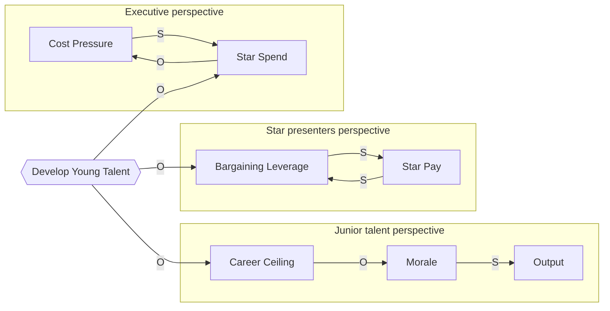

# CLD Overlay (Multi-Perspective Wise Policy)

## R — Reading

> "A powerful way of identifying such policies and actions is by drawing causal loop diagrams from the perspectives of both parties and seeing if there are any policies that straddle both beneficially."
>
> — Dennis Sherwood, Chapter 9 (the outward / wise-policy claim)

> "Both diagrams are right. The trick is not to decide which is wrong; it is to find what is invisible from inside either one."
>
> — Dennis Sherwood, Chapter 9 (paraphrase of the straddle insight, ce16/ce26)

## I — Interpretation

When two-to-four groups clash repeatedly, the surface dispute is rarely the actual disagreement. Each side's mental model is internally consistent **within its own frame**; what looks like irrationality from across the table is rationality conditioned on a different causal map. The standard managerial response — adjudicate, compromise, or escalate to a senior decision-maker — fails because all three operate at the position level while the disagreement lives at the **causal-belief** level underneath.

Sherwood's multi-perspective CLD move refuses the single-diagram trap. Each group draws its **own** causal loop diagram of the situation independently, before any joint session. Differences in causal beliefs become visible **on paper** rather than as accusations across a meeting room. The facilitator then searches the *union* of diagrams for a policy or new variable that, if added, improves at least two of them beneficially — what Sherwood calls a **"straddle."**

A straddle is rarely the compromise midpoint. It is usually a third option neither side proposed because their original CLD did not contain it. The famous TV "talent problem" workshop (c15, see `references/cases.md`) is the gold-standard exemplar: each of three stakeholder groups (executives / star presenters / juniors) had an internally consistent CLD that contained no exit from the recurring fight. Only when all three were laid on the same table did "develop young talent" appear as a node that simultaneously broke the executive cost-spiral, relieved junior career-ceiling frustration, and trumped star bargaining leverage. The wise policy was **structurally absent** from every participant's individual mental model.

The wisdom is not in adjudicating who is right. Both CLDs are right within their own frame; the higher-leverage intervention lives only in the intersection the multi-perspective view reveals. The facilitator's job is to surface mental models, not arbitrate them. Mediation by judgement fails; mediation by CLD facilitation succeeds (ce16). The buyer-contractor case (c20/c21 — utility outsourcing + Railtrack/Balfour Beatty in `references/cases.md`) shows the same pattern at organizational scale: two adversarial R-loops spinning vicious in the same direction (buyer squeezes price → contractor cuts corners → quality drops → buyer squeezes harder) can be re-converted to virtuous mode only by introducing a **shared variable** (joint long-term value, asset reliability) visible only from the overlay.

At n=2 the protocol still applies — the theater-vs-dinner couple case (c17) shows that even between two individuals, surface-level negotiation without CLD-level surfacing just rotates which party is unhappy. The same machinery operates: two CLDs surfaced separately, then overlaid to find a policy ("dinner before theater" / time-axis split) that neither original CLD contained.

This skill is **structurally paired** with `team-mental-model`. Outward conflict between groups (this skill) and inward harmony within a team (`team-mental-model`) share the mental-model-surfacing machinery but target different intervention points. Use them in sequence for post-merger / cultural-change scenarios: this skill first to surface between-group differences; `team-mental-model` second to sustain convergence among the integrated team.

## A1 — Past Application

The three cases that calibrate the straddle-finding move — TV "talent problem" three-perspective workshop (c15), utility outsourcing + Railtrack/Balfour Beatty (c20, c21), and theater-vs-dinner couple at n=2 (c17) — are detailed in `references/cases.md`.

**MANDATORY — READ ENTIRE FILE**: Before facilitating a multi-stakeholder overlay workshop, you MUST read [`references/cases.md`](references/cases.md) (~65 lines) for the gold-standard straddle-discovery pattern (c15), the real-world failure case showing what happens when the straddle exists on paper but is never operationalized (Railtrack), and the n=2 interpersonal boundary where outward and inward protocols share the same artifact.

## A2 — Future Trigger ★

### When will the user need this skill?

1. Two departments (Engineering vs Product, Sales vs Operations, Risk vs Growth) have been fighting for months and the CEO's mediation keeps failing.
2. M&A integration where acquired company and acquiring company keep talking past each other on roadmap or culture.
3. Vendor-customer relationships sliding into adversarial mode (procurement squeeze, scope-creep, missed SLAs).
4. Cross-functional initiative blocked because each function sees a different binding constraint.
5. Recurring family / partnership / co-founder disputes where the same fight loops monthly.
6. A senior leader keeps "adjudicating" between two groups and the dispute always returns within a quarter.
7. Compromise solutions have been tried (split the budget, alternate weeks, rotate ownership) and nobody is happy.
8. Post-merger team formation — run this skill first, then hand to `team-mental-model` to sustain.

### Language signals

- "they keep arguing about X" / "same fight every quarter / every retro"
- "we've tried compromise and nobody is happy"
- "stop forcing, start listening"
- "each side accuses the other of being short-sighted"
- "we need a wise policy" / "we have a deadlock"
- "engineering vs product" / "sales vs ops" / "risk vs growth"
- "the M&A integration isn't gelling"
- "the buyer keeps squeezing us / the contractor keeps cutting corners"

### Distinction from neighboring skills

- vs. `cld-craft`: That skill teaches the craft of drawing one CLD well; this skill assumes that craft and adds the multi-CLD overlay + straddle-search move. Every CLD this skill produces (one per stakeholder) must satisfy `cld-craft` Rule 8 (S/O signing) and Rule 10 (recognized as real by its drawing group).
- vs. `team-mental-model` (paired sibling): That skill handles **inward** team-building among people whose mental models can be harmonized (negotiate convergence + sustain). This skill handles **outward** conflict resolution between groups whose mental models structurally differ (find a straddle). Same machinery (mental-model surfacing via CLDs), opposite goal: convergence-negotiation vs straddle-discovery.
- vs. `loop-and-link-primitives`: Foundational ontology (R vs B classification + S/O signing). This skill's "synchronized R-loops spinning vicious in the same direction" diagnostic (Protocol step 4) depends on the R/B loop ontology that skill defines.
- vs. `strategy-lever-and-cascade` (sk07): sk07 is for a single decision-maker conflating KPIs with controls; this skill is for multiple decision-makers conflating their CLDs.

## E — Execution

```
E flow:
  2-4 stakeholder groups in observable conflict?
        │
        ├── no → wrong skill (single decision-maker → strategy-lever-and-cascade)
        │
        v
  Step 1: identify stakeholders (halt if "the market" or "leadership")
        │
        v
  Step 2: convene each group SEPARATELY → one CLD per group (cld-craft)
        │
        v
  Step 3: surface causal beliefs, not positions
        │
        v
  Step 4: OVERLAY diagrams → search for straddle
        │
        ├── straddle found → Step 5: test against each CLD
        │       │
        │       v
        │   Step 6: joint validation session
        │       │
        │       v
        │   Step 7: operationalize or hand off to team-mental-model
        │
        └── no straddle → Step 8: halt — possibly genuinely zero-sum (see Boundary)
```

When this skill activates, follow these steps:

1. **Identify the stakeholders** — list 2-4 specific groups in observable conflict. Each group must be nameable as a specific human group (a team, a department, a customer segment, two specific individuals). Halt conditions:
   - **"The market" / "leadership" / "the business" is not a stakeholder.** These are abstractions that cannot draw a CLD. Replace with the specific humans inside them, or this skill does not apply.
   - **Key stakeholders absent from the room** (customers, regulators, unions, downstream users) — see Boundary. Drawing CLDs only from internal perspectives produces an internally elegant straddle that breaks on contact with the missing parties.
   - Completion criterion: each stakeholder is named, has at least 2 humans available to participate, and has a clear stake the others recognize.

2. **Convene each group separately** — never start with a joint session. Each group draws their own CLD of the situation independently, applying `cld-craft` (12 hygiene rules + fuzzy-variable elevation). Separation is load-bearing: joint drafting reverts to political negotiation and erases the mental-model gap that contains the actual insight.
   - Each diagram must satisfy `cld-craft` Rule 8 (S/O signing in pen, not in a cleanup pass) and Rule 10 (recognized as real by the drawing group).
   - Completion criterion: one CLD per stakeholder, each satisfying Rule 8 and Rule 10 internally, with the drawing group's signatures or recorded agreement that the diagram captures their view.

3. **Surface mental models, not positions** — facilitator asks "what causes what" questions, not "what do you want" questions. Each CLD should show causal beliefs the group treats as obvious. Probe for fuzzy variables (Rule 7 of `cld-craft`) the group may want to omit because they cannot measure them; these are usually the load-bearing links.
   - Completion criterion: each CLD includes at least one fuzzy variable the group considers obviously true; positional language ("we want X", "they should do Y") has been translated into causal language ("X causes Y") on the diagram.

4. **Overlay the diagrams on a shared canvas.** Lay all CLDs on one table or wall (or one Mermaid `flowchart` with subgraphs labeled per stakeholder — see Mermaid emission note below). Look for three signatures:
   - **(a) Shared nodes with conflicting S/O labels** — both sides see the same variable but disagree on its causal sign. This is the highest-yield zone for a straddle.
   - **(b) Nodes appearing in one CLD but missing from others** — a load-bearing variable for one group is invisible to others. The straddle often inhabits the union, not the intersection.
   - **(c) Loops spinning the same direction across diagrams** — synchronized R-loops are the "force" pattern (buyer squeezes ↔ contractor cuts corners). Both sides reinforcing the same vicious dynamic without knowing it.
   - Completion criterion: a single overlay artifact (paper, whiteboard, or Mermaid block) exists with all stakeholder CLDs visible simultaneously, and the three signatures above have been annotated where they appear.

5. **Search for the straddle (per evaluation round).** Identify candidate policies, levers, or new variables that, if added to the overlay, would improve at least two of the CLDs beneficially. Test each candidate against each CLD in turn — trace its effect through each diagram's loops.
   - A straddle is **not** the compromise midpoint; it is usually a third option no individual CLD contained.
   - **Per-round generation discipline**: in each evaluation round, **generate ≥3 distinct candidates** before picking any to advance. Forcing 3 candidates prevents premature commitment to the first "feels right" option.
   - Completion criterion: ≥1 candidate per round has been traced through all stakeholder CLDs and predicted to leave each diagram beneficially altered; the surviving candidate is documented as a new node (or new policy variable) added to the overlay.

6. **Validate with all groups jointly.** Only now bring the groups together to evaluate the candidate straddle against their own diagrams. Acceptance criterion: each group recognizes the policy as beneficial within their CLD (`cld-craft` Rule 10 — diagram must be recognized as real by its author). If any group rejects the candidate, return to Step 5 with the rejection feedback as new input.
   - Completion criterion: every participating stakeholder group has signed off on the straddle as beneficial within their own CLD (or surfaced a specific objection that becomes a new node).

7. **Operationalize or hand off.** A straddle that exists on paper but is never operationalized is no different from no straddle at all (the Railtrack/Balfour Beatty inverse case, c21). Either:
   - **Operationalize directly**: assign owners, set review cadence, instrument the straddle's load-bearing nodes for measurement.
   - **Hand off to `team-mental-model`**: when the conflict was a precursor to a longer-term team-formation problem (post-merger / cross-functional initiative becoming a permanent team), this skill's output is the input to the inward protocol. The straddle is the values-causality starting point.
   - Completion criterion: a written operational plan exists, OR a documented hand-off to `team-mental-model` with the overlay artifact as starting input.

8. **Halt condition — no straddle exists.** If **≥3 full evaluation rounds** (each per Step 5 producing its own ≥3 candidates) yield no policy that improves any 2 CLDs jointly, the dispute may be **genuinely zero-sum**. Do not manufacture a fake straddle to look successful. Possible diagnoses:
   - Fixed-resource zero-sum (budget split, headcount allocation) — see Boundary.
   - Absent stakeholders — return to Step 1.
   - Power asymmetry sanitized as "wise policy" — see Boundary.
   - The "fight" is actually a values disagreement, not a causal-belief disagreement.

### Mermaid emission note (v0.3+)

This skill produces a multi-CLD overlay artifact. Each individual CLD MUST follow the canonical CLD Mermaid conventions:

- **Every edge labelled `|S|` (same direction) or `|O|` (opposite)** — no `|+|`, `|-|`, `|same|`, `|opposite|` variants
- **Every closed loop annotated with a `%%` comment**: `%% <R|B>-loop (<spin if R>): <traversal> — O-count = <N> → <reinforcing|balancing>`
- **Dangle node shapes**: input `([...])`, target `{{...}}`, rate `[/...\]`, output `((...))`, cloud `>...]`; internal rectangles `[...]`
- **R-loop nodes warm palette** (`fill:#fff4e6,stroke:#e67700`); **B-loop nodes cool palette** (`fill:#e3fafc,stroke:#0c8599`); dangles neutral gray

(Full convention with worked examples + axes / threshold tagging for delay-edges: see [`../cld-craft/references/cld-mermaid-emit.md`](../cld-craft/references/cld-mermaid-emit.md). The 4 bullets above capture the load-bearing rules; the reference adds depth for split-fuzzy + delay-tagged edges.)

For the **overlay** emission, use Mermaid `subgraph` blocks — one subgraph per stakeholder, each subgraph containing that stakeholder's full CLD. Cross-subgraph annotations on the three overlay signatures (shared-node-conflicting-S/O, one-side-only nodes, synchronized R-loops) use comment lines outside the subgraphs.



Below the Mermaid block, add a Markdown caption that names: (a) each stakeholder subgraph and the loop type they show, (b) the three overlay signatures observed, (c) the straddle node and which CLDs it improves.

## B — Boundary ★

### Do NOT use this skill when:

- **The dispute is zero-sum on a fixed resource** (budget split, headcount allocation between rival teams with no slack, fixed-pool bonus allocation). A straddle requires a third dimension that doesn't exist here. Sherwood's pedagogy quietly assumes there is always slack; in austerity, often there isn't. Mis-applying this skill to zero-sum produces "wise policy" as a euphemism that obscures rather than resolves.
- **Key stakeholders are absent from the room** — customers, regulators, unions, downstream users, future employees. Drawing CLDs only from internal perspectives produces an internally elegant straddle that breaks on contact with the missing parties (BOOK_OVERVIEW Critique #5: missing-stakeholders trap).
- **Single decision-maker problem** — if one person holds authority and the others are advisors, this is not a multi-perspective problem; it is a `strategy-lever-and-cascade` (sk07) problem about that one person's CLD.
- **Power asymmetry is the actual cause** — when one party can simply impose, the "wise policy" framing sanitizes a power play. Surface the power dynamic first; do not pretend it is a mental-model gap.
- **The disagreement is values-based, not causal-belief-based** — two parties disagreeing on "should we maximize growth or sustainability" will not be resolved by a better diagram. Mental-model surfacing assumes shared values with divergent causal maps.

### Author-warned failure modes

- **CEO-as-mediator anti-pattern (ce16)**: a senior leader adjudicating right/wrong instead of surfacing mental models will reproduce the same fight on the next quarterly cycle. Sherwood is explicit: mediation by judgement fails; mediation by CLD facilitation succeeds.
- **Forcing the single consensus CLD**: a facilitator who insists on "one diagram" reverts the workshop to political negotiation and erases the mental-model gap that contains the actual insight. The separate-then-overlay sequence is load-bearing — never start joint.
- **Compromise-as-straddle confusion**: a midpoint compromise (split the budget, alternate weeks) is not a straddle; it is the same fight on a slower clock. A real straddle is a third option no individual CLD contained.
- **Paper-only straddle (Railtrack inverse case, c21)**: a straddle that exists on the diagram but is never instrumented or owned will be eroded by quarter-end pressure within 6 months. Operationalization (Step 7) is mandatory.

### Author's blind spots / period limitations

- **Power-and-politics sanitization** (BOOK_OVERVIEW Critique #2): Sherwood treats the buyer-contractor "wise redefinition" as if both leaders will act in long-term mutual interest. Real procurement runs on individual commissions, year-end bonuses, and career incentives — never drawn into the CLDs. If the actor's compensation is misaligned with the CLD's success metric, the wise policy is structurally undeliverable no matter how elegant the diagram.
- **Missing-stakeholders trap** (BOOK_OVERVIEW #5): Sherwood's TV-talent and theater-dinner cases include all relevant stakeholders by construction. In real corporate work, customers, regulators, unions, downstream teams, future-employees are typically absent — the CLD set is incomplete, and a "straddle" of the incomplete set can harm the absent parties.
- **Consultant-rescue narrative arc** (BOOK_OVERVIEW): every Sherwood case ends with the workshop succeeding. There are no documented failed engagements where multi-perspective CLDs surfaced the conflict and the parties still refused to move. The base-rate of success implied by the book is likely overstated.
- **"Wise policy" hand-wave on genuine zero-sum**: when the underlying conflict is structurally zero-sum (M&A redundancy, layoff target distribution, fixed-pool bonus allocation), the language of "wise policy" can become a euphemism. Name zero-sum as zero-sum; this skill does not apply.

### Easily-confused neighboring methodologies

- **Negotiation / BATNA / Getting to Yes** (Fisher & Ury): focuses on interests-vs-positions distinction; Sherwood adds the structural-causal-belief layer below interests.
- **Soft Systems Methodology** (Checkland): much more developed multi-stakeholder framework with explicit power analysis; Sherwood's version is a managerial-craft subset.
- **Stakeholder analysis matrices** (Mendelow grid, power-interest): identifies stakeholders but does not surface their causal beliefs.
- **Mediation / arbitration**: third party adjudicates between positions; this skill's facilitator surfaces causal beliefs and refuses to adjudicate.

## Related skills

- **depends-on `cld-craft`** — every stakeholder CLD this skill overlays must be drawn with the 12 hygiene rules + fuzzy-variable elevation discipline. Without that craft, the overlay degenerates into mutual incomprehension rather than surfacing genuine mental-model differences. Step 2 explicitly invokes `cld-craft`.
- **depends-on `loop-and-link-primitives`** — the "synchronized R-loops spinning vicious in the same direction" diagnostic (Step 4 signature c) depends on the R/B loop ontology. Without the even-O / odd-O classifier, the facilitator cannot recognize the force pattern.
- **composes-with `team-mental-model`** — paired sibling from the same Chapter 9 source. Use this skill first for between-group conflict (find a straddle); hand off to `team-mental-model` for sustained within-team convergence on the straddle's values-causality. Post-merger and cultural-change scenarios typically need both in sequence.

## Audit metadata

> Source-unit codes (f11/p33/ce16/c15/c17/c20/c21/g04/g05/g06) refer to Stage-1.5 verified.md entries. See `<plugin-root>/references/VERIFIED.md`.

- **Verification status**: V1 ✓ / V2 ✓ / V3 ✓
- **Source units merged**: f11, p33, ce16, c15, c17, c20, c21, g04, g05, g06
- **Distilled at**: 2026-05-11
- **Split at**: 2026-05-12 (split from `stakeholder-and-team-thinking` v0.3.0; OUTWARD protocol → `cld-overlay`, INWARD protocol → `team-mental-model`)
- **Output language**: body — English; metadata — English
