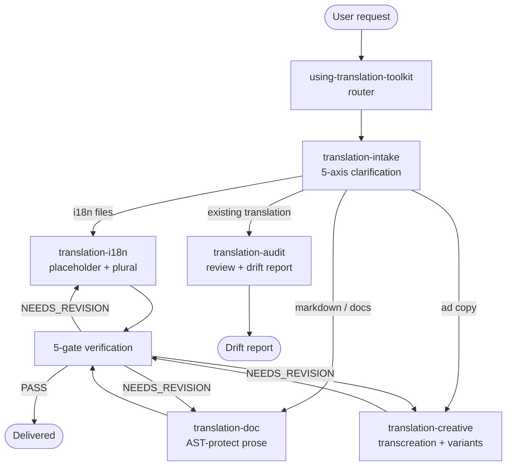

# translation-toolkit

> EN / JA / ZH-TW / ZH-CN 向け高品質 translation plugin — 6 skills、bundled CC-BY glossary（約 10K+ entries）、5-gate verification。

Read this in: [English](README.md) | **日本語** | [繁體中文](README.zh-TW.md)

 

## What it does

translation-toolkit は、3 つのユースケース — **i18n strings**（PO / JSON / XLIFF / Android XML / iOS .strings）、**technical docs**（Markdown / MDX / RST、AST protection あり）、**ad copy**（brand voice + cultural variants 付き transcreation）— にわたって、4 locales（`en-US` / `ja-JP` / `zh-TW` / `zh-CN`）の高品質翻訳を提供する。bundled CC-BY-compatible glossary（約 10K+ term-pair entries、Mozilla Pontoon / GNOME / JLT / NAER ほか open localization corpora 由来）と、placeholder integrity / glossary compliance / round-trip back-translation / register preservation / untranslatability handling をカバーする 5-gate verification suite を同梱。pipeline は router 駆動で、`using-translation-toolkit` を単一の entry point として intent を明確化し、適切な specialist skill へ dispatch する。

## 6 skills 構成

| Skill | 役割 |
|---|---|
| `using-translation-toolkit` | **Router** — intent（use case × source locale × target locale × tone × format）を明確化し、適切な specialist skill へ dispatch。 |
| `translation-intake` | **Layer 1 intake** — 翻訳作業の前に 5 axes（use case / source / target / register / format）を明確化、欠落 axis があれば block。 |
| `translation-i18n` | **i18n strings** — PO / JSON / XLIFF / Android XML / iOS .strings、placeholder integrity、plural forms、ICU MessageFormat preservation。 |
| `translation-doc` | **Technical docs** — Markdown / MDX / RST / AsciiDoc、code fences / links / tables / inline HTML を AST protect、prose のみ翻訳。 |
| `translation-creative` | **Transcreation** — ad copy / headlines / slogans、brand-voice anchors + cultural-variant lenses + slot あたり N candidate variants。 |
| `translation-audit` | **既存翻訳の review** — 完成翻訳を 5-gate suite で score、drift report + fix patches を発行。 |

## 4-tier glossary fallthrough

Term resolution は 4 layer を順に walk し、最初の hit が wins、すべての hit を audit trail に log する。

```
L1: Project glossary (<repo>/docs/i18n/glossary-{tgt}.md) — user repo override
        │ miss
L2: Bundled glossary (skill-internal, ~10K+ CC-BY entries from Pontoon/GNOME/JLT/NAER/...)
        │ miss
L3: Web search (default ON)
        │ miss / disabled
L4: LLM fallback (audit-trail flagged)
```

- **L1 — Project glossary**: `<repo>/docs/i18n/glossary-{en,ja,zh-TW,zh-CN}.md` の repo-local override。User-authored、最高優先度。プロジェクト固有の慣習（例：monkey-skills の「`skill` / `plugin` / `agent` は JA / ZH-TW prose でも英語のまま」rule）を吸収する設計。
- **L2 — Bundled glossary**: plugin に同梱される約 10K+ pair。CC-BY-compatible only、provenance を per entry で記録。Mozilla Pontoon / GNOME translation memory / Japan Localization Terminology（JLT）/ NAER（台灣國家教育研究院 雙語詞彙）由来。license + attribution は per entry、full ledger は `NOTICES.md`。
- **L3 — Web search**: bilingual queries（EN + target-locale native phrasing）での WebSearch。default ON、offline / air-gapped scenarios では `--no-web` で per-run disable 可。
- **L4 — LLM fallback**: L1-L3 がすべて miss した場合、agent が翻訳を提案するが、audit trail に `glossary_resolution: "llm_fallback"` として flag し、reviewer が canonical anchor を持たなかった term を識別できるようにする。

## 5-gate verification

すべての翻訳 pass は配信前に 5 つの gate を通る。Gate は skill-team conventions に沿って SELF / MUST / SHOULD で tier 分け。

| # | Gate | Tier | 内容 |
|---|---|---|---|
| 1 | **Placeholder integrity** | MUST | すべての `{name}` / `%s` / `%(named)s` / `<tag>` / ICU `{count, plural, ...}` が target に同 count + arity で出現。Mismatch → block。 |
| 2 | **Glossary compliance** | MUST | L1 / L2 の binding rule を持つすべての term が canonical target に解決される。Drift → block。 |
| 3 | **Back-translation** | SHOULD | 独立 agent による target → source の round-trip、semantic delta を score。High delta → flag、block ではない。 |
| 4 | **Register preservation** | SHOULD | tone / formality / honorific level が intake の `register` axis に一致。ja-JP 敬語 layer / zh-TW 您-vs-你 / EN formal-vs-casual を check。 |
| 5 | **Untranslatability handling** | SHOULD | Source-bound terms（固有名詞、equivalent のない法律 term、JA cognate のない CJK 漢語）は preserve-with-gloss または escalate、silent invention は禁止。 |

## 対応 locale

| Code | Locale | Notes |
|---|---|---|
| `en-US` | English (US) | Default lingua franca。en-GB / en-AU variants は input として受理するが、brief で指定がなければ en-US output に normalize。 |
| `ja-JP` | Japanese | Default register は です・ます。敬語 layer（尊敬語 / 謙譲語 / 丁寧語）は intake で negotiate。Tech terms は英語のまま保持（`skill` / `plugin`、スキル / プラグイン ではない）。 |
| `zh-TW` | Traditional Chinese (Taiwan) | Mainland calques を reject（軟件 → 軟體、程序 → 程式）。NAER 雙語詞彙が L2 anchor。 |
| `zh-CN` | Simplified Chinese (Mainland) | GB convention。technical terminology は CNCTST（全国科学技术名词审定委员会）に整合（該当 term がある場合）。 |

Cross-locale pair（4 locale 間の any-to-any）対応。en↔{ja,zh-TW,zh-CN} は first-class、ja↔{zh-TW,zh-CN} は relay-with-flag mode。

## Pipeline flow



## Install

```bash
# Claude Code 内で monkey-skills marketplace を enable した状態で
/plugin install translation-toolkit@monkey-skills
```

Plugin は self-contained — bundled glossary + scripts は plugin directory 内に同梱。Network access は optional L3 web-search tier にのみ必要、offline / air-gapped 環境では `--no-web` で disable する。

## Usage

すべての翻訳作業は以下の slash command から開始：

```
/using-translation-toolkit
```

3 つの intake shape、いずれも同一 entry point から routed：

| Shape | Trigger | Path |
|---|---|---|
| **Shape A** — ゼロから翻訳 | 「この PO file を ja-JP に翻訳して」「この README を zh-TW に localize」 | intake → i18n / doc / creative → 5-gate → deliver |
| **Shape B** — 既存翻訳の audit | 「この ja 翻訳を en source に対して review」 | intake（audit branch）→ translation-audit → drift report |
| **Shape C** — project glossary 拡張 | 「これら 10 term を project glossary に追加」 | intake → glossary L1 patch → 過去翻訳の optional re-run |

Use case が曖昧でない場合は direct skill invocation も支援（例：「この XLIFF に translation-i18n を実行」）。

## Project glossary 連携

呼び出し元 repo に以下の file がある場合、bundled L2 glossary より優先：

- `docs/i18n/glossary-en.md`
- `docs/i18n/glossary-ja.md`
- `docs/i18n/glossary-zh-TW.md`
- `docs/i18n/glossary-zh-CN.md`

monkey-skills 自体は repo PR #150 でこれら path に glossary を ship 済み。同 convention に従う他 repo は zero-config で integration が effective。

## Status

- **Version**: 0.1.0（initial scaffold、2026-05-06）
- **License**: MIT（plugin code）+ bundled glossary は per-entry license（CC-BY-3.0 / CC-BY-4.0 / CC-BY-SA-4.0 / public-domain — `NOTICES.md` 参照）
- **Stability**: Pre-release。Skill skeletons は v0.1.0 plan の subsequent task（A2-A5）で land 予定。

## Reference

- Design spec: [`docs/superpowers/specs/2026-05-06-translation-toolkit-design.md`](../docs/superpowers/specs/2026-05-06-translation-toolkit-design.md)
- Glossary licensing ledger: `NOTICES.md`（task A2 で land）

## Contributing

PR は `https://github.com/kouko/monkey-skills` から歓迎。Conventions：

- **Bundled glossary entries** は per entry で provenance + license の記録が必須。CC-BY-compatible only — incompatible license の entry は reject。
- **Skill structure** は monkey-skills convention に従う：flat skill directory、`<subfolder>/` 内に nested subfolder を作らない。Hook enforcement の詳細は repo `CLAUDE.md` 参照。
- **Commit prefixes**: `feat(translation-toolkit)` または `chore(translation-toolkit)` — CC CI whitelist。

## License

MIT — repository root の [LICENSE](../LICENSE) 参照。Bundled glossary entries は original の CC-BY-* / public-domain license を retain、full ledger は `NOTICES.md`。
