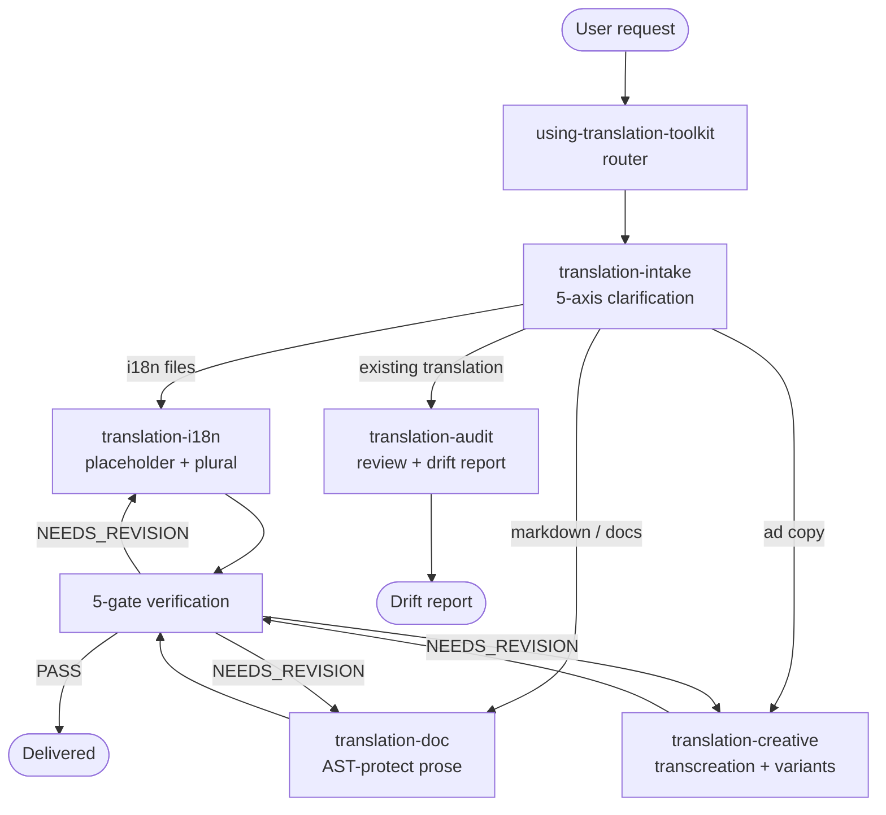

# translation-toolkit

> High-quality translation plugin for EN / JA / ZH-TW / ZH-CN — 6 skills, bundled CC-BY glossary (~10K+ entries), 5-gate verification.

Read this in: **English** | [日本語](README.ja.md) | [繁體中文](README.zh-TW.md)

 

## What it does

translation-toolkit produces high-quality translations across 3 use cases — **i18n strings** (PO / JSON / XLIFF / Android XML / iOS .strings), **technical docs** (Markdown / MDX / RST with AST protection), and **ad copy** (transcreation with brand voice + cultural variants) — for 4 locales (`en-US` / `ja-JP` / `zh-TW` / `zh-CN`). It ships with a bundled CC-BY-compatible glossary of roughly 10K+ term-pair entries (sourced from Mozilla Pontoon, GNOME, JLT, NAER, and other open localization corpora) and a 5-gate verification suite that covers placeholder integrity, glossary compliance, round-trip back-translation, register preservation, and untranslatability handling. The pipeline is router-driven: a single `using-translation-toolkit` entry point clarifies intent, then dispatches to the right specialist skill.

## 6 skills overview

| Skill | Role |
|---|---|
| `using-translation-toolkit` | **Router** — clarifies intent (use case × source locale × target locale × tone × format), dispatches to the right specialist skill. |
| `translation-intake` | **Layer 1 intake** — clarifies the 5 axes (use case / source / target / register / format) before any translation work begins; blocks on missing axes. |
| `translation-i18n` | **i18n strings** — PO / JSON / XLIFF / Android XML / iOS .strings; placeholder integrity, plural forms, ICU MessageFormat preservation. |
| `translation-doc` | **Technical docs** — Markdown / MDX / RST / AsciiDoc; AST-protect code fences, links, tables, and inline HTML so only prose is translated. |
| `translation-creative` | **Transcreation** — ad copy / headlines / slogans with brand-voice anchors, cultural-variant lenses, and N candidate variants per slot. |
| `translation-audit` | **Review existing translations** — score a finished translation against the 5-gate suite; emit drift report + fix patches. |

## 4-tier glossary fallthrough

Term resolution walks four layers in order; the first hit wins, all hits log to the audit trail.

```
L1: Project glossary (<repo>/docs/i18n/glossary-{tgt}.md) — user repo override
        │ miss
L2: Bundled glossary (skill-internal, ~10K+ CC-BY entries from Pontoon/GNOME/JLT/NAER/...)
        │ miss
L3: Web search (default ON)
        │ miss / disabled
L4: LLM fallback (audit-trail flagged)
```

- **L1 — Project glossary**: repo-local overrides at `<repo>/docs/i18n/glossary-{en,ja,zh-TW,zh-CN}.md`. User-authored, highest priority. Designed to absorb project conventions (e.g., monkey-skills' rule that `skill` / `plugin` / `agent` stay English in JA / ZH-TW prose).
- **L2 — Bundled glossary**: ~10K+ pairs shipped inside the plugin. CC-BY-compatible only; provenance recorded per entry. Sourced from Mozilla Pontoon, GNOME translation memory, the Japan Localization Terminology (JLT), and NAER (台灣國家教育研究院 雙語詞彙). License + attribution per entry; full ledger in `NOTICES.md`.
- **L3 — Web search**: WebSearch with bilingual queries (EN + target-locale native phrasing). Default ON; disable per-run with `--no-web` for offline / air-gapped scenarios.
- **L4 — LLM fallback**: when L1-L3 all miss, the agent proposes a translation but flags the entry as `glossary_resolution: "llm_fallback"` in the audit trail so reviewers know which terms had no canonical anchor.

## 5-gate verification

Every translation pass runs through five gates before delivery. Gates are tiered SELF / MUST / SHOULD per skill-team conventions.

| # | Gate | Tier | What it checks |
|---|---|---|---|
| 1 | **Placeholder integrity** | MUST | Every `{name}`, `%s`, `%(named)s`, `<tag>`, ICU `{count, plural, ...}` appears in target with same count + arity. Mismatch → block. |
| 2 | **Glossary compliance** | MUST | Every term from L1 / L2 with a binding rule resolves to its canonical target. Drift → block. |
| 3 | **Back-translation** | SHOULD | Round-trip target → source via independent agent; semantic delta scored. High delta → flag, not block. |
| 4 | **Register preservation** | SHOULD | Tone / formality / honorific level matches the intake's `register` axis. ja-JP 敬語 layer / zh-TW 您-vs-你 / EN formal-vs-casual checked. |
| 5 | **Untranslatability handling** | SHOULD | Source-bound terms (proper nouns, legal terms with no equivalent, CJK 漢語 with no JA cognate) are either preserved-with-gloss or escalated; never silently invented. |

## Locales supported

| Code | Locale | Notes |
|---|---|---|
| `en-US` | English (US) | Default lingua franca; en-GB / en-AU variants accepted as input but normalized to en-US output unless brief specifies. |
| `ja-JP` | Japanese | Default register: です・ます; 敬語 layer (尊敬語 / 謙譲語 / 丁寧語) negotiated at intake. Tech terms preserved as English (`skill` / `plugin` / not スキル / プラグイン). |
| `zh-TW` | Traditional Chinese (Taiwan) | Mainland calques rejected (軟件 → 軟體, 程序 → 程式). NAER 雙語詞彙 is the L2 anchor. |
| `zh-CN` | Simplified Chinese (Mainland) | GB convention; technical terminology aligned with CNCTST (全国科学技术名词审定委员会) where present. |

Cross-locale pairs (any-to-any across the 4) are supported; en↔{ja,zh-TW,zh-CN} are first-class, ja↔{zh-TW,zh-CN} go through a relay-with-flag mode.

## Pipeline flow



## Install

```bash
# In Claude Code, with monkey-skills marketplace enabled
/plugin install translation-toolkit@monkey-skills
```

The plugin is self-contained — bundled glossary + scripts ship inside the plugin directory. Network access is required only for the optional L3 web-search tier; disable with `--no-web` if running in an offline / air-gapped environment.

## Usage

Start any translation work with the slash command:

```
/using-translation-toolkit
```

Three intake shapes, all routed through the same entry point:

| Shape | Trigger | Path |
|---|---|---|
| **Shape A** — translate from scratch | "Translate this PO file to ja-JP" / "Localize this README to zh-TW" | intake → i18n / doc / creative → 5-gate → deliver |
| **Shape B** — audit existing translation | "Review this ja translation against the en source" | intake (audit branch) → translation-audit → drift report |
| **Shape C** — extend project glossary | "Add these 10 terms to the project glossary" | intake → glossary L1 patch → optional re-run on prior translations |

Direct skill invocation is also supported when the use case is unambiguous (e.g., "run translation-i18n on this XLIFF").

## Project glossary integration

If the calling repo has any of these files, they take precedence over the bundled L2 glossary:

- `docs/i18n/glossary-en.md`
- `docs/i18n/glossary-ja.md`
- `docs/i18n/glossary-zh-TW.md`
- `docs/i18n/glossary-zh-CN.md`

monkey-skills itself ships glossaries at these paths (per repo PR #150). Other repos following the same convention get free integration.

## Status

- **Version**: 0.1.0 (2026-05-06)
- **License**: MIT (plugin code) + per-entry licenses for bundled glossary (CC-BY-3.0 / CC-BY-4.0 / CC-BY-SA-4.0 / public-domain — see [`NOTICES.md`](NOTICES.md))
- **Stability**: First release. All 6 skills shipped; bundled glossary covers ~10K+ EN-pivot entries plus a curated JA↔ZH-TW manual seed (~80+ entries).

## Reference

- Design spec: [`docs/superpowers/specs/2026-05-06-translation-toolkit-design.md`](../docs/superpowers/specs/2026-05-06-translation-toolkit-design.md)
- Implementation plan: [`docs/superpowers/plans/2026-05-06-translation-toolkit-v0.1.0.md`](../docs/superpowers/plans/2026-05-06-translation-toolkit-v0.1.0.md)
- Glossary licensing ledger: [`NOTICES.md`](NOTICES.md)

## Contributing

PRs welcome via `https://github.com/kouko/monkey-skills`. Conventions:

- **Bundled glossary entries** require provenance + license recorded per entry. CC-BY-compatible only — entries with incompatible licenses are rejected.
- **Skill structure** follows monkey-skills convention: flat skill directory, no nested subfolders inside `<subfolder>/`. See repo `CLAUDE.md` for hook enforcement.
- **Commit prefixes**: `feat(translation-toolkit)` or `chore(translation-toolkit)` — CC CI whitelist.

## License

MIT — see [LICENSE](../LICENSE) at the repository root. Bundled glossary entries retain their original CC-BY-* / public-domain licenses; full ledger in `NOTICES.md`.
