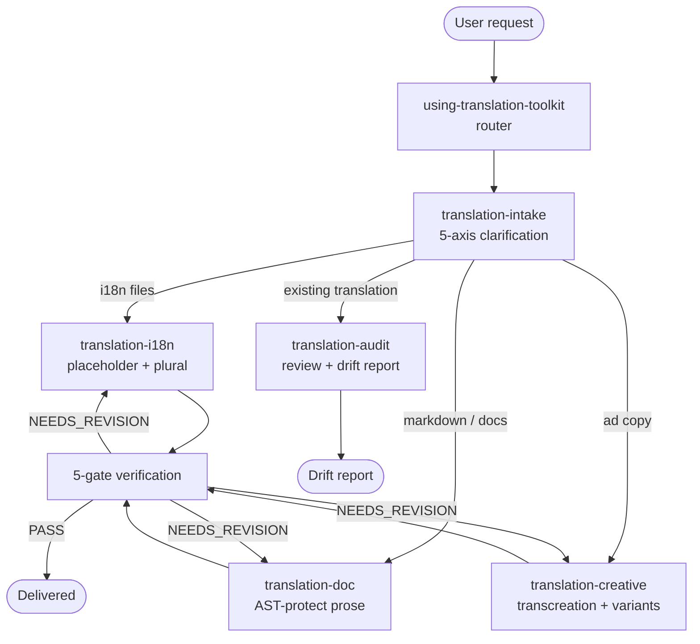

# translation-toolkit

> EN / JA / ZH-TW / ZH-CN 高品質 translation plugin — 6 skills、bundled CC-BY glossary（約 10K+ entries）、5-gate verification。

Read this in: [English](README.md) | [日本語](README.ja.md) | **繁體中文**

 

## What it does

translation-toolkit 在 3 種使用情境 — **i18n strings**（PO / JSON / XLIFF / Android XML / iOS .strings）、**technical docs**（Markdown / MDX / RST，附 AST protection）、**ad copy**（含 brand voice + cultural variants 的 transcreation）— 提供 4 個 locale（`en-US` / `ja-JP` / `zh-TW` / `zh-CN`）的高品質翻譯。內建 CC-BY-compatible glossary（約 10K+ term-pair entries，來源包含 Mozilla Pontoon、GNOME、JLT、NAER 等 open localization corpora），以及涵蓋 placeholder integrity、glossary compliance、round-trip back-translation、register preservation、untranslatability handling 的 5-gate verification suite。Pipeline 採 router 驅動：以 `using-translation-toolkit` 作為單一 entry point，先釐清意圖再 dispatch 至對應的 specialist skill。

## 6 skills 總覽

| Skill | 角色 |
|---|---|
| `using-translation-toolkit` | **Router** — 釐清 intent（use case × source locale × target locale × tone × format），dispatch 至對應 specialist skill。 |
| `translation-intake` | **Layer 1 intake** — 翻譯前先釐清 5 axes（use case / source / target / register / format），缺少 axis 即 block。 |
| `translation-i18n` | **i18n strings** — PO / JSON / XLIFF / Android XML / iOS .strings；placeholder integrity、plural forms、ICU MessageFormat preservation。 |
| `translation-doc` | **Technical docs** — Markdown / MDX / RST / AsciiDoc；以 AST 保護 code fences、links、tables、inline HTML，僅翻譯 prose。 |
| `translation-creative` | **Transcreation** — ad copy / headlines / slogans，附 brand-voice anchors、cultural-variant lenses，每 slot 提供 N 個 candidate variants。 |
| `translation-audit` | **檢視既有翻譯** — 以 5-gate suite 為完成翻譯評分，產出 drift report + fix patches。 |

## 4-tier glossary fallthrough

Term 解析依序 walk 4 個 layer，第一個命中者勝出，所有命中皆寫入 audit trail。

```
L1: Project glossary (<repo>/docs/i18n/glossary-{tgt}.md) — user repo override
        │ miss
L2: Bundled glossary (skill-internal, ~10K+ CC-BY entries from Pontoon/GNOME/JLT/NAER/...)
        │ miss
L3: Web search (default ON)
        │ miss / disabled
L4: LLM fallback (audit-trail flagged)
```

- **L1 — Project glossary**：repo 本地 override，路徑為 `<repo>/docs/i18n/glossary-{en,ja,zh-TW,zh-CN}.md`。User-authored，最高優先權。設計目的是吸收專案慣例（例如 monkey-skills 規定 `skill` / `plugin` / `agent` 在 JA / ZH-TW prose 內維持英文）。
- **L2 — Bundled glossary**：plugin 內附約 10K+ pair。僅限 CC-BY-compatible，逐筆記錄 provenance。來源涵蓋 Mozilla Pontoon、GNOME translation memory、Japan Localization Terminology（JLT）與 NAER（台灣國家教育研究院 雙語詞彙）。License + attribution 逐筆登錄，完整 ledger 在 `NOTICES.md`。
- **L3 — Web search**：以 bilingual queries（EN + target-locale 母語表達）執行 WebSearch。預設啟用，offline / air-gapped 情境可用 `--no-web` 在單次執行停用。
- **L4 — LLM fallback**：當 L1-L3 全部 miss 時，agent 會提出翻譯，但會在 audit trail 標記 `glossary_resolution: "llm_fallback"`，讓 reviewer 知道哪些 term 沒有 canonical anchor。

## 5-gate verification

每一次翻譯交付前都會通過 5 個 gate。Gate 依 skill-team conventions 分為 SELF / MUST / SHOULD 三層。

| # | Gate | Tier | 檢查項目 |
|---|---|---|---|
| 1 | **Placeholder integrity** | MUST | 每個 `{name}`、`%s`、`%(named)s`、`<tag>`、ICU `{count, plural, ...}` 都需在 target 以同樣的 count + arity 出現。Mismatch → block。 |
| 2 | **Glossary compliance** | MUST | L1 / L2 中具有 binding rule 的 term 都必須對應到 canonical target。Drift → block。 |
| 3 | **Back-translation** | SHOULD | 由獨立 agent 執行 target → source 的 round-trip，計算 semantic delta。差異過大 → flag，但不 block。 |
| 4 | **Register preservation** | SHOULD | tone / formality / honorific level 與 intake `register` axis 一致。檢查 ja-JP 敬語 layer、zh-TW 您 vs 你、EN formal vs casual。 |
| 5 | **Untranslatability handling** | SHOULD | Source-bound terms（專有名詞、無 equivalent 的法律 term、無日文 cognate 的 CJK 漢語）採 preserve-with-gloss 或 escalate，禁止靜默捏造。 |

## 支援 locale

| Code | Locale | 備註 |
|---|---|---|
| `en-US` | English (US) | 預設 lingua franca。en-GB / en-AU variants 可作為 input，但若 brief 未指定則 normalize 為 en-US output。 |
| `ja-JP` | Japanese | 預設 register 為 です・ます。敬語 layer（尊敬語 / 謙譲語 / 丁寧語）於 intake 階段協商。Tech terms 維持英文（`skill` / `plugin`，不寫成 スキル / プラグイン）。 |
| `zh-TW` | Traditional Chinese (Taiwan) | 拒絕中國大陸寫法（軟件 → 軟體、程序 → 程式）。NAER 雙語詞彙為 L2 anchor。 |
| `zh-CN` | Simplified Chinese (Mainland) | 採 GB 慣例。技術術語在有對應條目時與 CNCTST（全国科学技术名词审定委员会）對齊。 |

支援 cross-locale pair（4 locale 任意對任意）。en↔{ja,zh-TW,zh-CN} 為 first-class，ja↔{zh-TW,zh-CN} 採 relay-with-flag mode。

## Pipeline flow



## Install

```bash
# 在 Claude Code 中、且已啟用 monkey-skills marketplace
/plugin install translation-toolkit@monkey-skills
```

Plugin 為 self-contained — bundled glossary 與 scripts 皆位於 plugin 目錄內。僅在使用 optional L3 web-search tier 時需要 network access；offline / air-gapped 環境可用 `--no-web` 停用。

## Usage

所有翻譯工作皆以此 slash command 起步：

```
/using-translation-toolkit
```

3 種 intake shape，皆共用同一 entry point：

| Shape | Trigger | Path |
|---|---|---|
| **Shape A** — 從零翻譯 | 「將這個 PO file 翻成 ja-JP」「將這份 README 在地化為 zh-TW」 | intake → i18n / doc / creative → 5-gate → deliver |
| **Shape B** — 審視既有翻譯 | 「以 en source 為基準審視這份 ja 翻譯」 | intake（audit branch）→ translation-audit → drift report |
| **Shape C** — 擴充 project glossary | 「將這 10 個 term 加入 project glossary」 | intake → glossary L1 patch → 對既有翻譯 optional re-run |

當 use case 明確時亦可直接呼叫 specialist skill（例如「對這份 XLIFF 跑 translation-i18n」）。

## Project glossary 整合

若呼叫端 repo 具備下列任一 file，皆優先於 bundled L2 glossary：

- `docs/i18n/glossary-en.md`
- `docs/i18n/glossary-ja.md`
- `docs/i18n/glossary-zh-TW.md`
- `docs/i18n/glossary-zh-CN.md`

monkey-skills 本身已依 repo PR #150 規範在上述路徑提供 glossary。其他依循同 convention 的 repo 可享 zero-config 整合。

## Status

- **Version**：0.1.0（2026-05-06）
- **License**：MIT（plugin code）+ bundled glossary 採逐筆 license（CC-BY-3.0 / CC-BY-4.0 / CC-BY-SA-4.0 / public-domain — 詳見 [`NOTICES.md`](NOTICES.md)）
- **Stability**：First release。6 個 skill 全數 ship；bundled glossary 涵蓋 EN-pivot 約 10K+ entries，外加 curated JA↔ZH-TW manual seed（約 80+ entries）。

## Reference

- Design spec：[`docs/superpowers/specs/2026-05-06-translation-toolkit-design.md`](../docs/superpowers/specs/2026-05-06-translation-toolkit-design.md)
- Implementation plan：[`docs/superpowers/plans/2026-05-06-translation-toolkit-v0.1.0.md`](../docs/superpowers/plans/2026-05-06-translation-toolkit-v0.1.0.md)
- Glossary licensing ledger：[`NOTICES.md`](NOTICES.md)

## Contributing

歡迎透過 `https://github.com/kouko/monkey-skills` 發 PR。Conventions：

- **Bundled glossary entries** 必須逐筆登錄 provenance + license。僅接受 CC-BY-compatible，license 不相容的 entry 一律 reject。
- **Skill structure** 遵循 monkey-skills convention：flat skill directory，`<subfolder>/` 內不得再開 subfolder。Hook enforcement 細節見 repo `CLAUDE.md`。
- **Commit prefixes**：僅限 `feat(translation-toolkit)` 或 `chore(translation-toolkit)` — CC CI whitelist。

## License

MIT — 詳見 repository root 的 [LICENSE](../LICENSE)。Bundled glossary entries 保留原 CC-BY-* / public-domain license，完整 ledger 於 `NOTICES.md`。
